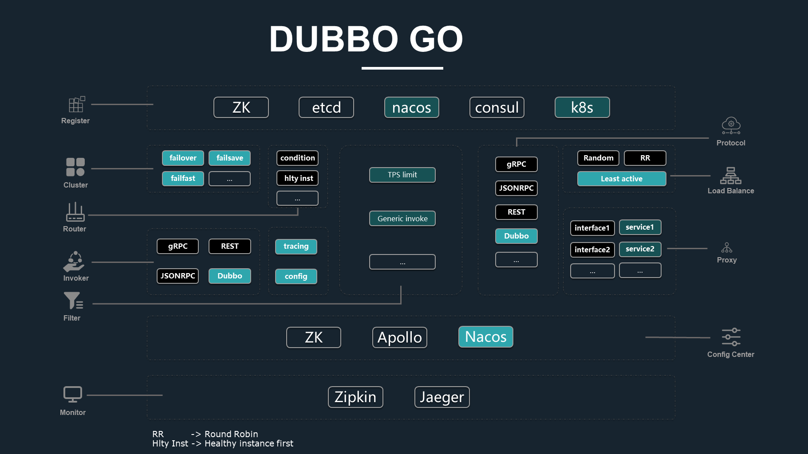
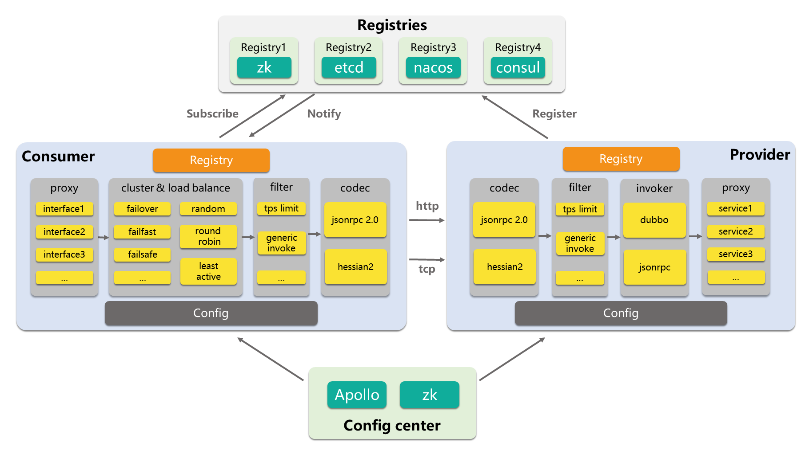

# Apache Dubbo-go [中文](./README_CN.md) #

[](https://travis-ci.org/apache/dubbo-go)
[](https://codecov.io/gh/apache/dubbo-go)
[](https://pkg.go.dev/github.com/apache/dubbo-go?tab=doc)
[](https://goreportcard.com/report/github.com/apache/dubbo-go)


---

Apache Dubbo Go Implementation to bridge the gap between java and go.


## License

Apache License, Version 2.0

## Release note ##

[v1.5.5 - Jan 5, 2021](https://github.com/apache/dubbo-go/releases/tag/v1.5.5)

[v1.4.5 - Nov 18, 2020](https://github.com/apache/dubbo-go/releases/tag/v1.4.5)

[v1.5.4 - Nov 1, 2020](https://github.com/apache/dubbo-go/releases/tag/v1.5.4)

[v1.5.3 - Sep 23, 2020](https://github.com/apache/dubbo-go/releases/tag/v1.5.3)

[v1.5.1 - Aug 23, 2020](https://github.com/apache/dubbo-go/releases/tag/v1.5.1)

[v1.5.0 - July 24, 2020](https://github.com/apache/dubbo-go/releases/tag/v1.5.0)

[v1.4.0 - Mar 17, 2020](https://github.com/apache/dubbo-go/releases/tag/v1.4.0)

[v1.3.0 - Mar 1, 2020](https://github.com/apache/dubbo-go/releases/tag/v1.3.0)

[v1.2.0 - Nov 15, 2019](https://github.com/apache/dubbo-go/releases/tag/v1.2.0)

[v1.1.0 - Sep 7, 2019 the first release after transferred to apache](https://github.com/apache/dubbo-go/releases/tag/v1.1.0)

[v1.0.0 - May 29, 2019 compatible with dubbo v2.6.5](https://github.com/apache/dubbo-go/releases/tag/v1.0.0)

## Project Architecture ##

Both extension module and layered project architecture is according to Apache Dubbo (including protocol layer, registry layer, cluster layer, config layer and so on), the advantage of this arch is as following: you can implement these layered interfaces in your own way, override the default implementation of dubbo-go by calling 'extension.SetXXX' of extension, complete your special needs without modifying the source code. At the same time, you are welcome to contribute implementation of useful extension to the community.



If you want to know more about dubbo-go, please visit this reference [Project Architecture design](https://github.com/apache/dubbo-go/wiki/dubbo-go-V1.0-design)

## Feature list ##

Finished List:

- Role
    * Consumer
    * Provider

- Transport
    * HTTP
    * TCP

- Codec
    * JsonRPC V2
    * Hessian V2
    * [json for grpc](https://github.com/apache/dubbo-go/pull/582)

- Protocol
    * Dubbo
    * Jsonrpc2.0
    * [gRPC](https://github.com/apache/dubbo-go/pull/311)
    * [RESTful](https://github.com/apache/dubbo-go/pull/352)

- Router
    * [Condition router](https://github.com/apache/dubbo-go/pull/294)
    * [Health check router](https://github.com/apache/dubbo-go/pull/389)

- Registry
    * ZooKeeper
    * [etcd v3](https://github.com/apache/dubbo-go/pull/148)
    * [nacos](https://github.com/apache/dubbo-go/pull/151)
    * [consul](https://github.com/apache/dubbo-go/pull/121)
    * [k8s](https://github.com/apache/dubbo-go/pull/400)

- Dynamic Configure Center & Service Management Configurator
    * Zookeeper
    * [apollo](https://github.com/apache/dubbo-go/pull/250)
    * [nacos](https://github.com/apache/dubbo-go/pull/357)

- Cluster Strategy
    * Failover
    * [Failfast](https://github.com/apache/dubbo-go/pull/140)
    * [Failsafe/Failback](https://github.com/apache/dubbo-go/pull/136)
    * [Available](https://github.com/apache/dubbo-go/pull/155)
    * [Broadcast](https://github.com/apache/dubbo-go/pull/158)
    * [Forking](https://github.com/apache/dubbo-go/pull/161)

- Load Balance
    * Random
    * [RoundRobin](https://github.com/apache/dubbo-go/pull/66)
    * [LeastActive](https://github.com/apache/dubbo-go/pull/65)
    * [ConsistentHash](https://github.com/apache/dubbo-go/pull/261)

- Filter
    * Echo Health Check
    * [Circuit break and service downgrade](https://github.com/apache/dubbo-go/pull/133)
    * [TokenFilter](https://github.com/apache/dubbo-go/pull/202)
    * [AccessLogFilter](https://github.com/apache/dubbo-go/pull/214)
    * [TpsLimitFilter](https://github.com/apache/dubbo-go/pull/237)
    * [ExecuteLimitFilter](https://github.com/apache/dubbo-go/pull/246)
    * [GenericServiceFilter](https://github.com/apache/dubbo-go/pull/291)
    * [Auth/Sign](https://github.com/apache/dubbo-go/pull/323)
    * [Metrics filter](https://github.com/apache/dubbo-go/pull/342)
    * [Tracing filter](https://github.com/apache/dubbo-go/pull/335)

- Invoke
    * [generic invoke](https://github.com/apache/dubbo-go/pull/122)

- Monitor
    * Opentracing API
    * [Prometheus](https://github.com/apache/dubbo-go/pull/342)

- Tracing
    * [For jsonrpc](https://github.com/apache/dubbo-go/pull/335)
    * [For dubbo](https://github.com/apache/dubbo-go/pull/344)
    * [For grpc](https://github.com/apache/dubbo-go/pull/397)

- Metadata Center
    * [Nacos](https://github.com/apache/dubbo-go/pull/522)
    * [Zookeeper](https://github.com/apache/dubbo-go/pull/633)
    * [Etcd](https://github.com/apache/dubbo-go/blob/9a5990d9a9c3d5e6633c0d7d926c156416bcb931/metadata/report/etcd/report.go)
    * [Consul](https://github.com/apache/dubbo-go/pull/633)

- Service discovery
    * [Nacos](https://github.com/apache/dubbo-go/blob/9a5990d9a9c3d5e6633c0d7d926c156416bcb931/registry/nacos/service_discovery.go)
    * [Zookeeper](https://github.com/apache/dubbo-go/blob/9a5990d9a9c3d5e6633c0d7d926c156416bcb931/registry/zookeeper/service_discovery.go)
    * [Etcd](https://github.com/apache/dubbo-go/blob/9a5990d9a9c3d5e6633c0d7d926c156416bcb931/registry/etcdv3/service_discovery.go)

You can know more about dubbo-go by its [roadmap](https://github.com/apache/dubbo-go/wiki/Roadmap).



## Document

[dubbo-doc](http://dubbo.apache.org/zh/blog/) or [dubbo-go-doc-list](http://alexstocks.github.io/html/dubbogo.html)

## Quick Start

[dubbo-go-samples](https://github.com/apache/dubbo-go-samples) gives many examples to  tell u how to use dubbo-go. Please read the [dubbo-samples/golang/README.md](https://github.com/apache/dubbo-go-samples/blob/master/README.md) carefully to learn how to dispose the configuration and compile the program.

## Running unit tests

### Run

```bash
make verify
```

### Verify license

```bash
make license
```

### Run unit test

```bash
make test
```

## Build

Please move to [dubbo-samples/golang](https://github.com/dubbogo/dubbo-samples)

## Contributing

If you are willing to do some code contributions and document contributions to [Apache/dubbo-go](https://github.com/apache/dubbo-go), please visit [contribution intro](https://github.com/apache/dubbo-go/blob/master/contributing.md).

## Community

If u want to communicate with our community, pls scan the following  [dubbobo Ding-Ding QR code](https://mmbiz.qpic.cn/mmbiz_jpg/yvBJb5IiafvnHVBdtia30dxA2hKotr9DEckWsZ7aOJcDWDaSVMGwLmYv8GRgIQtqb4C2svicp8nVkMmGy7yKC5tyA/640?wx_fmt=jpeg&tp=webp&wxfrom=5&wx_lazy=1&wx_co=1) or search our commnity DingDing group code 31363295.

<div>
<table>
  <tbody>
  <tr></tr>
    <tr>
      <td align="center"  valign="middle">
        <a href="http://alexstocks.github.io/html/dubbogo.html" target="_blank">
          
        </a>
      </td>
    </tr>
    <tr></tr>
  </tbody>
</table>
</div>

If u want to visit the wechat group, pls add my wechat AlexanderStocks.

We welcome the friends who can give us constructing suggestions instead of known-nothing.

## Benchmark

Benchmark project [dubbo-go-benchmark](https://github.com/dubbogo/dubbo-go-benchmark).

About dubbo-go benchmarking report, please refer to [dubbo benchmarking report](https://github.com/apache/dubbo-go/wiki/Benchmark-test-of-dubbo) & [jsonrpc benchmarking report](https://github.com/apache/dubbo-go/wiki/Benchmark-test-of-jsonrpc).

## [User List](https://github.com/apache/dubbo-go/issues/2)

If you are using [apache/dubbo-go](https://github.com/apache/dubbo-go) and think that it helps you or want do some contributions to it, please add your company to to [the user list](https://github.com/apache/dubbo-go/issues/2) to let us know your needs.


<div>
<table>
  <tbody>
  <tr></tr>
    <tr>
      <td align="center"  valign="middle">
        <a href="" target="_blank">
          
        </a>
      </td>
      <td align="center"  valign="middle">
        <a href="" target="_blank">
          
        </a>
      </td>
      <td align="center"  valign="middle">
        <a href="" target="_blank">
          
        </a>
      </td>
      <td align="center"  valign="middle">
        <a href="https://github.com/mosn" target="_blank">
          
        </a>
      </td>
      <td align="center"  valign="middle">
        <a href="" target="_blank">
          
        </a>
      </td>
    </tr>
    <tr></tr>
    <tr>
      <td align="center"  valign="middle">
        <a href="http://www.j.cn" target="_blank">
          
        </a>
      </td>
      <td align="center"  valign="middle">
        <a href="https://www.genshuixue.com/" target="_blank">
          
        </a>
      </td>
      <td align="center"  valign="middle">
        <a href="http://www.51h5.com" target="_blank">
          
        </a>
      </td>
      <td align="center"  valign="middle">
        <a href="https://www.zto.com" target="_blank">
          
        </a>
      </td>
      <td align="center"  valign="middle">
        <a href="https://www.icsoc.net/" target="_blank">
          
        </a>
      </td>
    </tr>
    <tr></tr>
    <tr>
      <td align="center"  valign="middle">
        <a href="http://www.mgtv.com" target="_blank">
          
        </a>
      </td>
      <td align="center"  valign="middle">
        <a href="http://www.dmall.com" target="_blank">
          
        </a>
      </td>
    </tr>
    <tr></tr>
  </tbody>
</table>
</div>
