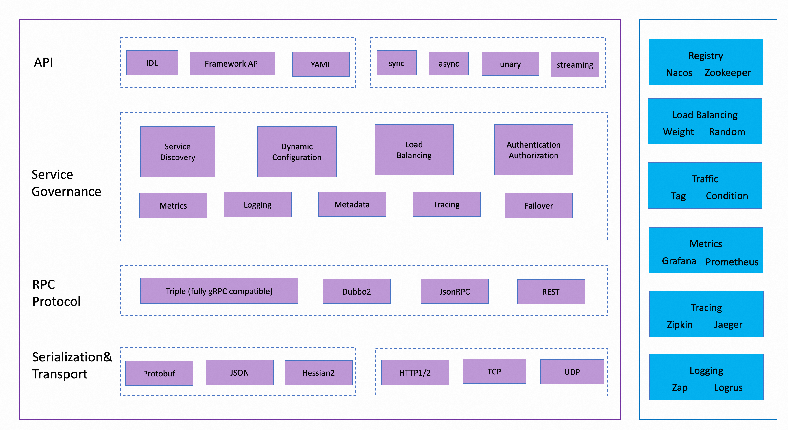

# Apache Dubbo for Golang

[](https://travis-ci.org/apache/dubbo-go)
[](https://codecov.io/gh/apache/dubbo-go)
[](https://pkg.go.dev/github.com/apache/dubbo-go?tab=doc)
[](https://goreportcard.com/report/github.com/apache/dubbo-go)


---

Apache Dubbo is an easy-to-use Web and RPC framework that provides multiple
language implementations(Go, [Java](https://github.com/apache/dubbo), [Rust](https://github.com/apache/dubbo-rust), [Node.js](https://github.com/apache/dubbo-js), [Web](https://github.com/apache/dubbo-js)) for communication, service discovery, traffic management,
observability, security, tools, and best practices for building enterprise-ready microservices.

Dubbo-go is the Go implementation of [triple protocol](https://dubbo.apache.org/zh-cn/overview/reference/protocols/triple-spec/)(a fully gRPC compatible and HTTP-friendly protocol) and the various features for building microservice architecture designed by Dubbo. 

Visit [the official website](https://dubbo.apache.org/) for more information.

## Getting started

You can learn how to develop a dubbo-go RPC application step by step in 5 minutes by following our [Quick Start](https://github.com/apache/dubbo-go-samples/tree/main/helloworld) demo. 

It's as simple as the code shown below, you define a service with Protobuf, provide your own service implementation, register it to a server, and start the server.

```go
func (srv *GreetTripleServer) Greet(ctx context.Context, req *greet.GreetRequest) (*greet.GreetResponse, error) {
	resp := &greet.GreetResponse{Greeting: req.Name}
	return resp, nil
}

func main() {
	srv, _ := server.NewServer(
		server.WithServerProtocol(
			protocol.WithPort(20000),
			protocol.WithTriple(),
		),
	)

	_ := greet.RegisterGreetServiceHandler(srv, &GreetTripleServer{})

	if err := srv.Serve(); err != nil {
		logger.Error(err)
	}
}
```

After the server is up and running, call your service via cURL:

```shell
curl \
    --header "Content-Type: application/json" \
    --data '{"name": "Dubbo"}' \
    http://localhost:20000/greet.GreetService/Greet
```

Or, you can start a standard dubbo-go client to call the service:

```go
func main() {
	cli, _ := client.NewClient(
		client.WithClientURL("127.0.0.1:20000"),
	)

	svc, _ := greet.NewGreetService(cli)

	resp, _ := svc.Greet(context.Background(), &greet.GreetRequest{Name: "hello world"})
	
	logger.Infof("Greet response: %s", resp.Greeting)
}
```

See the [samples](https://github.com/apache/dubbo-go-samples) for detailed information on usage. Next, learn how to deploy, monitor and manage the traffic of your dubbo-go application by visiting the official website.

## Features



- **RPC Protocols**: Triple, gRPC compatible and HTTP-friendly
- **Service Discovery**: Nacos, Zookeeper, Etcd, Polaris-mesh, Consul.
- **Load Balance**: Adaptive, Random, RoundRobin, LeastActive, ConsistentHash
- **Traffic Management**: traffic split, timeout, rate limiting, canary release
- **Configuration**: yaml file, dynamic configuration(Nacos, Zookeeper, etc.).
- **Observability**: metrics(Prometheus, Grafana) and tracing(Jaeger, Zipkin).
- **HA Strategy**: Failover, Failfast, Failsafe/Failback, Available, Broadcast, Forking

## Ecosystem
- [Console](https://github.com/apache/dubbo-kubernetes), under development
- [Samples](https://github.com/apache/dubbo-go-samples)
- [Interoperability with Dubbo Java](https://dubbo-next.staged.apache.org/zh-cn/overview/mannual/golang-sdk/tutorial/interop-dubbo/)
- [Protoc-gen-go-triple](https://github.com/dubbogo/protoc-gen-go-triple/)

## Contributing

Please visit [CONTRIBUTING](./CONTRIBUTING.md) for details on submitting patches and the contribution workflow.

## Contact

- [DingTalk Group](https://www.dingtalk.com/en): 23331795

## [User List](https://github.com/apache/dubbo-go/issues/2)

If you are using [apache/dubbo-go](https://github.com/apache/dubbo-go) and think that it helps you or want to contribute code for Dubbo-go, please add your company to [the user list](https://github.com/apache/dubbo-go/issues/2) to let us know your needs.


<div>
<table>
  <tbody>
  <tr></tr>
    <tr>
      <td align="center"  valign="middle">
        <a href="" target="_blank">
          
        </a>
      </td>
      <td align="center"  valign="middle">
        <a href="" target="_blank">
          
        </a>
      </td>
      <td align="center"  valign="middle">
        <a href="" target="_blank">
          
        </a>
      </td>
      <td align="center"  valign="middle">
        <a href="https://github.com/mosn" target="_blank">
          
        </a>
      </td>
      <td align="center"  valign="middle">
        <a href="" target="_blank">
          
        </a>
      </td>
    </tr>
    <tr></tr>
    <tr>
      <td align="center"  valign="middle">
        <a href="http://www.j.cn" target="_blank">
          
        </a>
      </td>
      <td align="center"  valign="middle">
        <a href="" target="_blank">
          
        </a>
      </td>
      <td align="center"  valign="middle">
        <a href="" target="_blank">
          
        </a>
      </td>
      <td align="center"  valign="middle">
        <a href="https://www.zto.com" target="_blank">
          
        </a>
      </td>
      <td align="center"  valign="middle">
        <a href="" target="_blank">
          
        </a>
      </td>
    </tr>
    <tr></tr>
    <tr>
      <td align="center"  valign="middle">
        <a href="http://www.mgtv.com" target="_blank">
          
        </a>
      </td>
      <td align="center"  valign="middle">
        <a href="" target="_blank">
          
        </a>
      </td>
      <td align="center"  valign="middle">
        <a href="http://www.ruubypay.com" target="_blank">
           
        </a>
      </td>
      <td align="center"  valign="middle">
          <a href="https://www.dingtalk.com" target="_blank">
             
          </a>
      </td>
      <td align="center"  valign="middle">
          <a href="https://www.autohome.com.cn" target="_blank">
             
          </a>
      </td>
    </tr>
    <tr></tr>
    <tr>
      <td align="center"  valign="middle">
        <a href="https://www.mi.com/" target="_blank">
          
        </a>
      </td>
      <td align="center"  valign="middle">
        <a href="https://opayweb.com/" target="_blank">
          
        </a>
      </td>
      <td align="center" valign="middle">
        <a href="" target="_blank">
          
        </a>
      </td>
      <td align="center" valign="middle">
        <a href="" target="_blank">
          
        </a>
      </td>
      <td align="center" valign="middle">
        <a href="" target="_blank">
          
        </a>
      </td>
    </tr>
    <tr></tr>
  </tbody>
</table>
</div>

[See more user cases](https://github.com/apache/dubbo-go/issues/2)

## License

Apache Dubbo-go software is licensed under the Apache License Version 2.0. See the LICENSE file for details.
