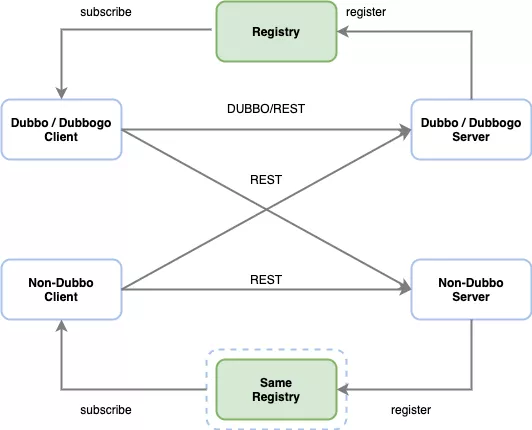
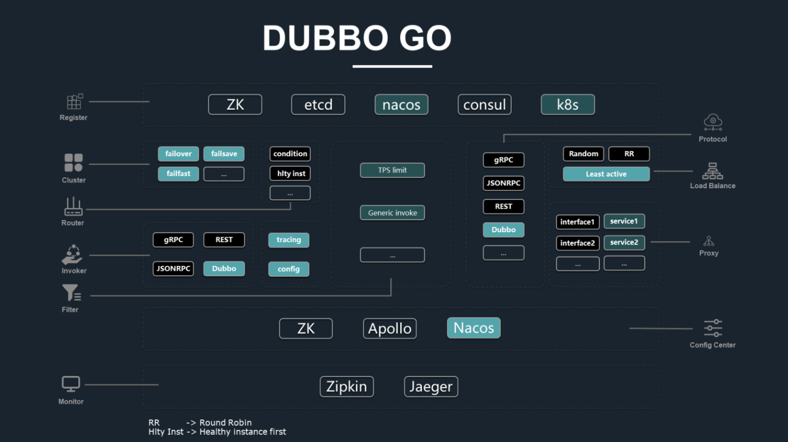
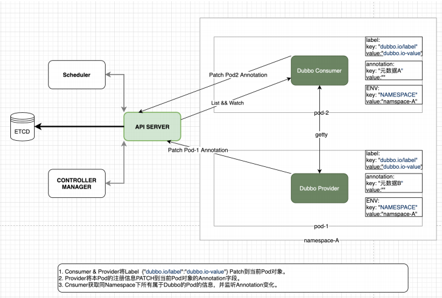

# [Go 版本入 Dubbo 生态一周年：已和 Spring Cloud、gRPC 互通](https://www.oschina.net/question/4489239_2316774)

去年 5 月，阿里开源的高性能 RPC 框架 Dubbo 从 ASF 毕业并晋升顶级项目，同时，还宣布 Go 语言版本的 Dubbo-go 正式加入 Dubbo 官方生态。

经过一年的发展， Dubbo-go 在技术和社区运营方面都已经有了不错的成绩。Dubbo-go 是 Dubbo 的完整 Go 语言实现，在功能实现和技术路径上与 Dubbo 有不同程度的对标，项目团队预计很快便可以追平 Java 版的功能。当然，也是因为基于 Go 语言开发，Dubbo-go 更易上手，未来或将反哺 Dubbo 的云原生化。

Dubbo-go 近期还实现了 REST 协议以及 gRPC 的支持，打通了 Spring Cloud 和 gRPC 生态，再加上与 Java Dubbo 的互通，应用场景广泛。因此，它被其开发者叫做“all-in-one”的 RPC 框架。

目前 Dubbo 官方已经投入人力参与 Dubbo-go 的开发，阿里集团今年完成 HSF 和 Dubbo 的融合后，会在集团内逐步推广使用 Dubbo-go。

开源中国采访了当前正在开发中的 v1.5 版本的主要推进者邓明，回顾 Dubbo-go 的过往，尤其是最近一年的发展情况，并展望项目未来的发展。

## Dubbo-go 过去发展回顾

**OSCHINA：**
作为项目主要推动者之一，可以简单回顾下 Dubbo-go 的发展历程吗？

**Dubbo-go 邓明：**

首先，个人代表社区，借助贵方平台，感谢 Dubbo-go 的使用者、曾经合作过的各个媒体平台以及 Dubbo 官方过去一年来对我们项目的关注，Dubbo-go 目前的发展离不开各方力量的帮助。

实际上，在 Dubbo-go 加入 Dubbo 官方生态之前，已经发展了两年。它最早由其创始人于雨在 2016 年 5 月构建，同年 9 月发布并开源的。如下时间轴图清晰记录了 Dubbo-go 的前世今生。

**OSCHINA：**
在去年项目刚加入 Dubbo 官方生态的时候，有开发团队成员说，Dubbo-go 当时还没能发挥出 Go 语言的优势，功能完整性还要完善。作为一个为解决 Go 项目与 Java & Dubbo 项目互通的项目，经过一年的发展，项目现在能发挥出 Go 语言的优势了吗，为什么？

**Dubbo-go 邓明：**

和去年比起来，在发挥 Go 语言自身优势上，有了很大的提高。

Go 语言协程的个数上限比 Java 线程数目多。Go 语言的协程只运行在用户态，初始堆栈小且可伸缩，而 Java 线程启动因用户态系统态之间切换带来的额外成本被线程池抹平，所以只有在较大并发需求的场景下（核数限制的情况下，Java 线程池中最大线程数被限制），才会发挥优势。Dubbo 中类似的场景：异步处理网络和协议化的处理。我们在网络库 Getty 中加入了协程池，实现了网络收发和逻辑处理的解耦。

另外，Go 语言上手速度确实比 Java 快好几个数量级，只要搭好具有良好扩展性的架子，社区 contributor 培养的成本比 Java 低很多。得益于此，Dubbo-go 的功能和性能将很快追平 Java。

\***\*OSCHINA：**
\*\*关于 Dubbo-go 在 Java 和 Go 运行时的兼容互通和功能一致目标，目前进展如何？

**Dubbo-go 邓明：**

目前，Dubbo-go 已经完全对齐 Dubbo v2.6.x，正在全力开发 v1.5.0 版本可以全面对齐 v2.7.x。

Dubbo v2.7.5 之后开始支持应用维度的服务注册，这也是 v1.5.0 计划支持的核心特性。

可以剧透一下，目前 v1.5.0 版本的 Dubbo-go 开发工作已经进入了尾声，正处于测试阶段。等 v1.5.0 发布之后，我们会陆续发布几个小版本，用于对齐 Dubbo v2.7.5 之后的版本。可以说，v1.5.x 主要是为了配合 dubbo 的云原生化。

\***\*OSCHINA：**
\*\*Dubbo-go 近期实现了 REST 协议支持，可以和 Spring Cloud 生态互联；年初实现了和 gRPC 的互联，这对 Dubbo-go 有什么意义？

**Dubbo-go 邓明：**

Dubbo-go 在支持了 REST 协议之后，已经可以做到跟绝大部分基于 HTTP 协议的微服务框架进行通信。

[REST 总体设计]

另外一个突出优点是，支持了 gRPC 和 REST 之后，Dubbo-go 就可以考虑和一些公司内部自研的框架进行通信了。通常一些比较大的公司会自研框架，或者深度定制某些开源框架。而只要它们支持 gRPC 或者 HTTP 协议，Dubbo-go 就可以保证与这些框架的无缝衔接。

还有一个优势，REST 协议对前端更友好，可以直接把 Dubbo-go 开发的服务给前端用，而不用加一层协议转换，也避免了前端直接发起 RPC 请求。因此，Dubbo-go 也就可以成为它们在 Go 微服务框架的一个比较优秀的选择。

**OSCHINA：**
1.4 版本中，Dubbo-go 在可观测性方面采用了 tracing 和 metric，metric 的实现参考了 Dubbo 的做法，也做了一些调整，具体是怎么样？

**Dubbo-go 邓明：**

可观测性是衡量一个微服务框架的重要方面。一般可观测性分成 tracing、metric 和 log 三个部分。

在 v1.4 Dubbo-go 之前，tracing 和 metric 是 Dubbo-go 的薄弱环节。为了支持这两个，我们考察了比较多的开源框架的做法。我们发现，因为要考虑对接非常多诸如 zipkin/cat 等监控框架，所以它们往往会设计一整套监控和度量的 API。

Dubbo 也是如此。Dubbo 的 metric 比较依赖阿里内部一个开源的 metric 的项目。这个项目也不是只能给 Dubbo 应用，而是 Java 项目都可以考虑。本质上来说，它定义了一套 API，而后提供了对不同开源框架的适配实现。把握住这一核心之后，我们就要考虑一个问题：要不要自己设计一套 API？我们的答案是 NO，并且选择了 opentracing API 作为我们监控使用的 API。

首先，我们回顾那些自己设计了 API 的开源项目，它们的 API 和 opentracing API 还比较相像。我觉得我设计不出来一个明显比 opentracing API 更加优雅的 API 了。

另外从实现效率上来说，如果我们使用 opentracing API 作为 Dubbo-go 接入 metric 和 tracing 的 API，那么，任何支持 opentracing API 的框架，都可以做到开箱即用。

目前我们正在向社区用户征集监控意见，看社区希望我们在框架内什么地方进一步埋点。我们也得到了很多反馈，下一步就要考虑进一步优化采集的数据。

**OSCHINA：**
Dubbo-go 的开发团队之前介绍，Dubbo-go 首要目的就是解决 Go 项目与 Java & Dubbo 项目的互通问题，同时也为 Go 项目提供了一种 RPC 与微服务开发框架的选择。但从之前的用户使用列表来看，直接把它作为 Go 的一个 RPC 框架来使用的好像并不是特别多，现在情况是这样吗？

**Dubbo-go 邓明：**

这个情况已经有了很大的改善了。最开始的时候，我们的用户大部分都是 Java Dubbo 那里过来的。但是到今年，据我们了解，已经有一些用户已经是直接把 Dubbo-go 作为 RPC 框架。在经过一年的发展以后，即便不考虑和 Dubbo 保持兼容这一特点，Dubbo-go 也可以说一个比较优秀的 Go 语言 RPC 框架。

尤其是在异构系统通信和服务治理方面，我们提供了非常多样化的支持。这是很多别的 RPC 框架所不具备，或者不如我们的。

**OSCHINA：**
总结一下这一年里，Dubbo-go 技术方面值得了解的进展吧？

**Dubbo-go 邓明：**

Dubbo-go 这一年的进步很大，实现了非常多非常重要的特性。

首先要提及的就是支持了很多协议，比如说基于 protobuf 的 gRPC 和 REST。这些协议保证了我们能够与市面上大多数的 RPC 框架进行通信，而且我们在 1.5.0 里面，还扩展支持支持基于 Json 的 gPRC 和 基于 protobuf 的 TCP 通信。

第二则是支持了配置中心。这个功能可以提供给用户极大的配置上的灵活性。

第三则是可观测性上改进，也就是前面提到的 metric 和 tracing。

第四则是现在正在进行的应用注册模型，它能让我们更好地拥抱 k8s 和 servise mesh。为了支持应用注册模型，我们还实现了一个元数据中心，这个元数据中心非常有利于做网关。此外还实现了很多功能，如新的限流算法，负载均衡算法和路由策略等。具体内容，欢迎大家去看我们的 release log。

[Dubbo-go 总体架构图]

Dubbo-go 生态建设
**OSCHINA：**
上个月，Go 官方公布的最新调查报告显示，Go 语言的主要用途包括编写 RPC 服务，其次库和框架方面增量巨大。“竞争对手”变多会影响到 Dubbo-go 原本的计划实施吗，Dubbo-go 和其他同类项目比有什么不同？

**Dubbo-go 邓明：**

我们对 Go 社区的进步感同身受。实际上，Dubbo-go 这一年很多功能的实现，都离不开合作社区的支持。比如说我们提供的基于 Nacos 的配置中心支持，以及现在正在测试基于 Nacos 的应用维度服务注册与发现，都十分依赖 Nacos 的 Go 语言 SDK 支持。

而且我们也注意到，别的 Go 语言的微服务框架在这一年也取得了不错的进步，这是一种很好的鞭策。在 RPC 框架上，一直都是百家齐放百花争鸣局面，迫使我们朝着“人无我有，人有我精”的方向前进。到目前来说，我们感觉我们的竞争优势还是比较明显的：

第一点就是保持了和 Dubbo 的兼容，那么原本的 Dubbo 用户在考虑 Go 语言框架的时候，我们就会是首选；

第二个竞争优势则是支持多协议。这几年一个很明显的趋势就是，一个公司的技术栈难以保持单一，因为不同框架、不同语言会有不同优点。所以 Dubbo-go 也会是那些考虑连接异构系统用户的首选；

第三则是软实力，也就是我们社区自身的优点。我们社区非常有活力，用户有什么问题都能够得到很快的响应；而我们的迭代速度，一直比较快。如果用户觉得自己能够很快获得帮助，那么他们也会倾向选择我们。

**OSCHINA：**
我们了解到，Dubbo-go/getty 是 Dubbo-go 中比较能体现 Go 语言优势的部分，目前已经被解耦出来，可以直接用。Dubbo-go 的其他组成部分会考虑同样解耦吗？

**Dubbo-go 邓明：**

这可以说是一个非常长远和理想化的计划了。我们现在正在做的一件事，是把项目里面用的公共方法、和框架无关的代码抽取出来，做成一个工具类库，也就是 dubbogo-gost 这个项目。

我们注意到，不管是在 Dubbo-go，还是别的框架，这些代码都很类似，比如说对不同类型的数据排序。之前我们找过开源的 lib，但是都不尽如人意，所以我们打算把自己的拿出来，做成类似瑞士军刀一样小巧高效的工具。

另外还要提到 dubbo-go-hessian2 开源仓库。我们可以自豪地说，这个库是 Go 里面对 hessian v2 协议支持最好的开源库。不仅仅是我们在用，阿里和蚂蚁金服也在用。我们也希望吸引更加多用户来使用，帮我们改进。

**OSCHINA：**
Dubbo-go 今年 3 月 25 日的新版本 1.4.0 中“拿出了使用 k8s 作为注册中心的解决方案”，选择性放弃 Service 功能，将元数据直接写入到 Pod 对象的 Annotations 中。为什么做出这个决策，后续有什么落地计划？

**Dubbo-go 邓明：**

在使用 k8s 作为注册中心这个点上，讨论就花了很长的时间。

其实最初考虑的是直接使用 k8s 服务发现模型，后来发现 k8s service 和 Dubbo-go Interface 之间存在一些难以调和的矛盾。比如说 Kubernetes 已经为其承载的服务提供了⼀套服务发现，服务注册，以及服务集群管理机制。⽽ Dubbo-go 也拥有⾃成体系的服务集群管理。

这两个功能点形成了冲突，在无法调和两者的情况下，我们放弃了这个计划，并且提出了现在这个随 1.4.0 版本发布使用的模型。

后续，我们将主要考虑 k8s 本身提供的 CRD + Operator 的方案，毕竟越来越多的 k8s 周边的项目都在以 Operator 作为切入点。Dubbo-go 社区后续的方案将会以 CRD 的形式在 k8s 内注册和发现服务。这样做的原因有很多，首先是为了减少 Dubbo-go 对 kube-apiserver 的直接依赖。其次是为了标准化注册模型，当服务模型以 CRD 的形式存在在 k8s 集群中之后，其他围绕 k8s 的项目可以直接使用这些资源二次开发和拓展。而这种方式更加 CloudNative。

**OSCHINA：**
Dubbo-go 现在在云原生应用上的布局是怎样的？

**Dubbo-go 邓明：**

社区的主要人力正与蚂蚁金服的 mosn 社区展开合作。目前有 5 个人力与 mosn 社区一起在 mosn 中实现 Dubbo 的服务发现、服务注册和基本的 RPC 通信等数据平面的能力，在 istio 层面支持通过 XDS 实现配置下发，以实现 mosn + Dubbo-go 【嵌入 mosn】 + istio 这种 sidecar 形式的云原生方案。已完成的工作已经在多点科技展开测试，近期 mosn 社区同学会在 A2M 大会上公布具体进展。

除了 sidecar 这种 proxy 形式的云原生方案，社区还计划实现 Dubbo-go【应用 sdk】 + istio 这种 proxyless 方式的云原生方案。Java 应用或者 Go 应用通过 istio 的 xDS 协议完成服务注册和发现以及路由分发。或者说，我们力求微服务和云原生共存，可以称之为“双模微服务”。这种“双模微服务”允许标准的 Dubbo-go + sidecar 和 Dubbo-go【应用 sdk】 + istio 两种模式部署的应用共存。这将是 Dubbo-go v1.6 的核心工作。

**OSCHINA：**
Dubbo-go 几乎是刚一诞生就转移到 Apache，并且很快发布了 Apache Dubbo Go v1.1.0，这对社区运营的帮助是什么，可以分享下 Dubbo-go 的运营情况和经验吗？

**Dubbo-go 邓明：**

可以说，Apache 基金会对我们的帮助是很大的。

一方面，Apache 自身的光环十分有助于吸引开发关注和参与；另外一方面，Apache 的一些要求，也让社区运营更加规范。

社区运营需要进一步规范化，透明化，以吸引更加多的人参与。我注意到很多优秀的社区运营做得很好，他们对 issue 的管理很细致，打上了各种标签，做到了对 issue 的轻重缓急的管理。这种标签能够很容易吸引一些打算尝试开源的新人，给社区带来新的血液。

我们尝试使用 milestone 的方式来管理 Dubbo-go 的整体进度。现在也在尝试定期召开社区会议，讨论社区发展方向，重大特性的设计，以及解决争端会议会面向整个社区，想参与的人都可以参与。

Dubbo-go 应用及规划
**OSCHINA：**
Dubbo-go 适合什么样的企业和场景？

**Dubbo-go 邓明：**

我们认为，如果用户需要一款 Go 语言方面 gRPC 框架，可以考虑 Dubbo-go；如果公司有和异构系统通信的需求，Dubbo-go 也是一个比较好的选择。特别是，公司内部还有 Java Dubbo 或者 Spring Clound 之类的应用，那么 Dubbo-go 优势就更加大了。

Dubbo-go 可以说是 " all-in-one " 性质的 RPC 框架，自身包含服务治理等功能，非常省时省力，而且能够降低使用微服务的门槛。

**OSCHINA：**
GitHub 的用户列表中已经有来自 14 家企业的使用记录，Dubbo-go 一般会提供哪些后续支持？

**Dubbo-go 邓明：**

我们一直都快速响应用户的问题，而且积极鼓励用户参与到 Dubbo-go 的开发中来。目前涂鸦智能、携程等几家用户已经成为了社区贡献的主要力量。

有时候用户来做调研，进来社区咨询问题的时候，我们都会笑称他“如果选择了 Dubbo-go，就选择了一个强大的售后团队”。

社区一位很活跃的 Contributor 潘总【github id: pantianying】对我们的热情服务应该深有体会。比如他会提 issue，然后我们也会很快解决像 router、优雅退出功能就是在潘总提出之后，我们很快实现的， 还有早期一次重构之后，也是潘总尝鲜试用。尝鲜版通常有很多 BUG，所以我们都是上班打工，下班给潘总修 BUG，也算是服务周到热情用心了。

额外说下，目前 Dubbo 官方也已经投入人力参与 Dubbo-go 的开发，阿里集团今年完成 HSF 和 Dubbo 的融合后，会在集团内逐步推广使用 Dubbo-go。

**OSCHINA：**
Dubbo-go 下一版本预计什么时候发布，有没有一些长远的发展计划？

**Dubbo-go 邓明：**

当前正在测试的是 v1.5 版本，希望六月份能发出来。v1.6 版本正在设计和规划中，v1.6 是和 Dubbo 3 对齐的，所以也会是一个比较大的版本。

今年我们社区主要集中在两件事上。第一件是云和云原生的支持，现在进行中的 v1.5 和 v1.6 都是围绕这一点的。今年几乎所有大的 feature 都是这方面的。

第二件事，则是进一步提高 Dubbo-go 的文档、注释和代码质量。坦白来说，Dubbo-go 的文档并不是特别好，尤其是用户文档。我们也收到了很多用户的批评正在加强 CI 和自动化测试这块。总而言之，文档与质量这件事是今年的头等大事。

**OSCHINA：**
最后，请介绍一下自己吧。

**Dubbo-go 邓明：**

说起来挺有意思的，就是我本身是业务开发，并不是传统意义上的中间件开发或者基础架构开发。我目前在 eBay 做支付业务的开发。eBay 是一个 WLB 的公司，也就是在 eBay 我才有了足够的业余时间，开始投入到了开源社区中。

Dubbo-go 是我第一个深入参与的开源项目，也是我第一次尝试将个人对分布式系统和微服务治理的理解付诸实践的项目。它是我的第一个“孩子”。

因为工作的关系，我算是 Dubbo-go 社区投入时间最多的人之一，为 Dubbo-go 开发了一些很有意思的特性，也因此成了 Apache committer。另外我还扮演了编辑的角色，帮社区小伙伴写的博客文章把把关，润润色。我也算是 Dubbo-go 的主要管理人员了，比如说 v1.5 这个版本就是主要由我推进的——这大概还是因为我时间比较多。
