# [dubbogo 回顾与展望](https://blog.csdn.net/RA681t58CJxsgCkJ31/article/details/103856203/)

2020-01-06 08:30:00

Dubbo 是阿里于 2011 年开源的一款高性能 RPC 框架，在 Java 生态中具有不小的影响力。2019年5月21日，Dubbo 从 Apache 软件基金会毕业，成为 Apache 顶级项目。目前，毕业后的 Dubbo 项目的生态中已经正式官宣引入了 Go 语言，发布了 Dubbogo 项目。本文即是对 Dubbogo 这一项目的完整回顾与真实展望。由蚂蚁金服中间件技术专家于雨和携程基础中台研发部工程师方银城合作完成。

**01**

**Dubbogo 整体框架**

先介绍一下 dubbogo 的缘起，先看下面这幅图：

       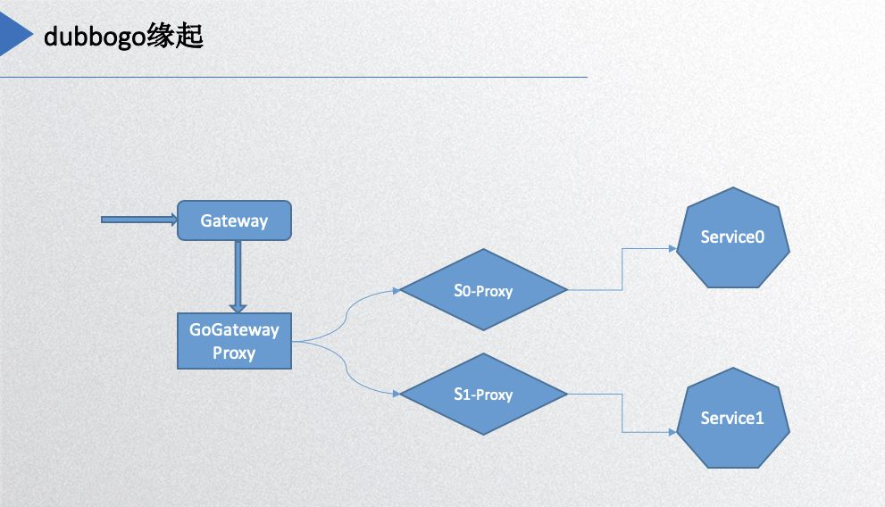      

最右边的 service0 和 service1 是 Dubbo 的服务端，左边的 gateway 是网关，HTTP  请求从网关进来，必须转化成 Dubbo 的协议才能到后面的服务，所以中间加了一层proxy 完成相关功能。基本上每个 service 都需要一个 proxy 去转化协议和请求，所以这个时候 dubbogo 的项目需求就出来了。最初的实现就是以 Dubbo 的 Go 版本作为目标，实现与 Java 版本 Dubbo 的互调。

**Dubbogo 目标**  

     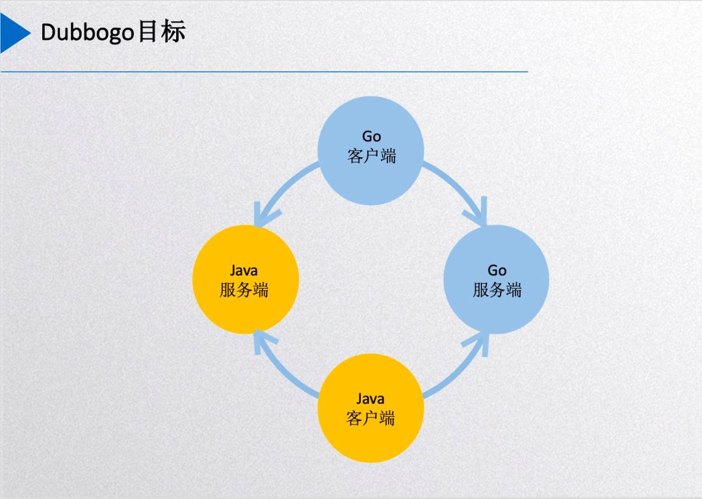        

然后这个图是 dubbogo 的现在达到的目标：用一份 Go 客户端的代码能够在没有任何代理和其他中间件的情况下直接调用其他语言端，主要是Java 服务端的服务和 Go 服务端的服务，而 Go 作为服务端的时候，Java 客户端也可以直接调用 Go 服务端的服务。

**Dubbogo 发展历程** 

       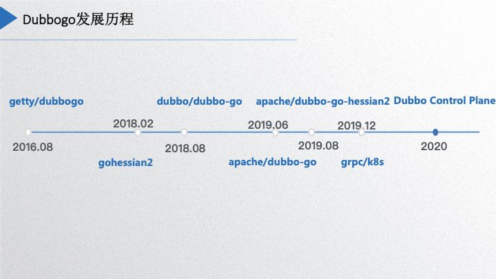      

下面介绍 dubbogo 的整个发展历程，在2016年8月份的时候是于雨构建了 dubbogo 项目，那个时候的 dubbogo 只支持通过 jsonrpc 2.0 协议 进行 HTTP 通信，到 2018 年2 月份支持 hessian2 协议进行 TCP 通信，到 2018 年 5 月项目被 dubbo 官方关注后开始从零重构，于雨 2018 年 8 月份初步重构出一个 0.1 版本。由于我们携程这边的一些需求，2019 年初我和我的同事何鑫铭也开始参与了 dubbogo 项目的重构，同时和于雨一起开始组建社区，在 2019 年 6 月份的时候 dubbogo1.0 版本上线，这个版本的重构是参照了 Dubbo 的整体设计，主体功能都在这个版本里面有呈现，同期该项目进入了 Apache 组织。今年 8 月份由社区同学望哥负责的 Dubbo-go-hessian2 的项目也进了 Apache 组织。到目前为止我们社区有些工作已经和 dubbo 齐头并进，例如对 grpc 和 k8s 的支持，相关代码正在 review 中，年底发布的 v1.3 版本会包含 grpc 支持。预计到2020年，也是明年的目标，希望项目能以全新姿态融入云原生时代。

**Dubbogo 整体设计**

       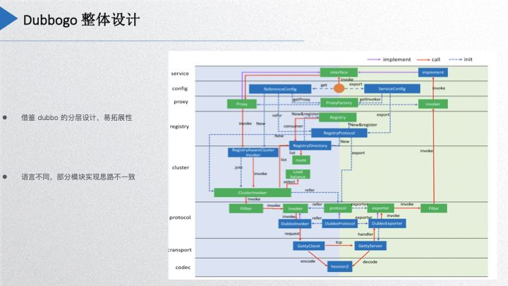      

这个图大家是不是看着很熟悉，是 Dubbo 的整个分层设计图，但是少了 Dubbo 里面的很多东西，因为我们是借鉴了 Dubbo 的分层设计和易拓展性的思想，但是由于 Go 语言和 Java 语言的本质差别决定了我们项目设计不可能完全照搬它，有一些东西就给它简化了，特别是协议层这一块。比如说 Dubbo 里面 SPI 的拓展，在 Go 里面我们是借用了 Go 的非侵入式接口的方式去实现的，由于 Go 禁止 package 循环引用，所以 dubbogo 在代码的分包分层上面也是有严格的规定，这正好跟它的易拓展性的特性结合了起来。

关于代理部分，因为 Java 有动态代理，Go 的反射就没有 Java 的反射那么强大，所以我们这边代理的实现方式也跟它是不一样的。

**Dubbogo 能力大图**  

       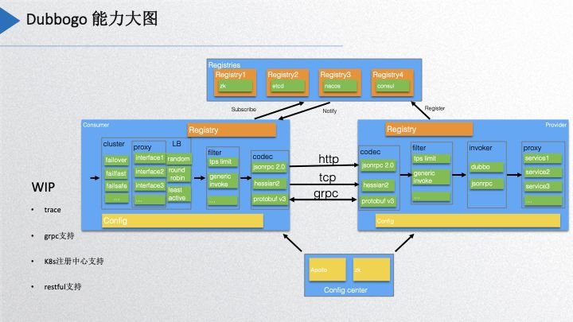      

上面的图是我们当前 dubbogo 项目实现的能力大图，最上层是当前实现的一些注册中心有 zk、etcd、nacos、consul，现在与 k8s 关联的功能正在开发中。配置中心目前是支持 Apollo 和 zookeeper。左边是消费端，消费端这边实现的是有 cluster 的，策略上基本上实现了 dubbo 支持的所有策略。然后还有负载均衡策略，fillter 主要是有一个 tps 的限流还有泛化调用，这两个后面会讲到。编码层现在就是 jsonrpc 2.0 和 hessian2，protobuf v3 正在加紧 review 中。目前社区正在开发中的支持，包括 trace、grpc、k8s注册中心，以及对 restful 的支持。

**关键项目**

       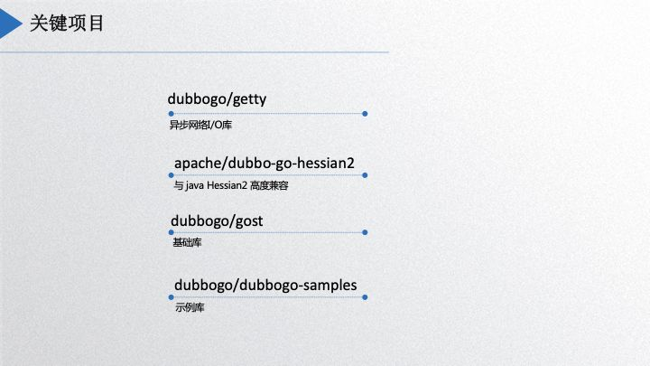      

目前 dubbogo 项目整体由 4 个组成部分。第一个是 getty，一个异步网络 IO 库，是实现 tcp 通信协议最坚实的基础；第二个是 dubbo-go-hessian2，这个是与当前 java hessian2 高度兼容的项目；第三个是 gost，是 dubbogo 的 基础库；最后是 dubbogo 的示例库，目前已经迁移到 https://github.com/apache/dubbo-samples，和 Java 示例合并了。这些都是当前 dubbogo 主要的组成项目。

**02**

**协议实现**

       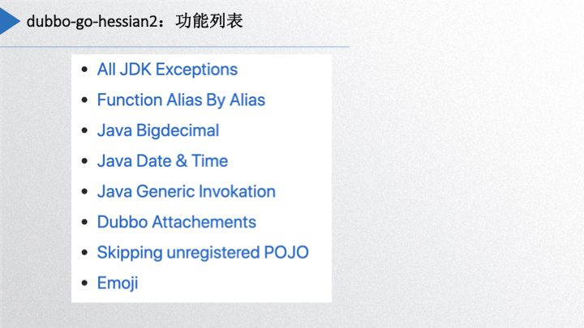      

接下来讲一些具体的实现和部分的功能，上图是 dubbo-go-hessian2 实现，列出来是一些主要的功能列表，第一个是 Java 的 JDK Exceptions 的实现，里面实现了 40 多种的 Java JDK 主要的异常，可以与 Java 的 hessian2 版本互相解编码的支持，支持自动扩展自己实现 exceptions，或者是不常见的 Exceptions；第二个是支持字段名的联名，Go 可序列化的字段是大写字母开头，但是 Java 默认是小写开头的，所以有编码的字段名不一致的问题，这就有别名识别和支持自定义命名。

go-hessian2 还支持 Java 的 bigdecimal、Date、Time、基本类型的包装类型、Generic Invocation、Dubbo Attachements，甚至支持 emoji 表情。

go-hessian2 里面如果要解码和编码用户自定义类型，用户需要自己把它注册进去，前提是支持 go-hessian2 的 POJO interface，才能跟 JAVA 对应类互相解编码。

       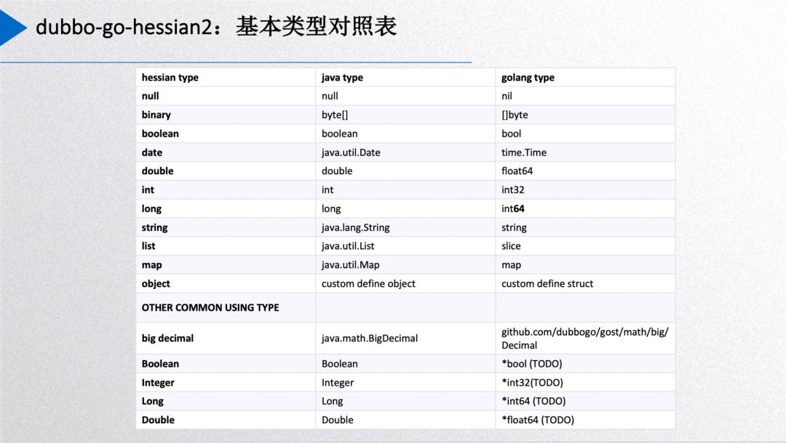      

上面是 go-hessian2 的类型对应表，需要特别点出的是 int，go 这边的 int 类型在不同字长系统下是有不同的大小，可能是 32 位也可能 64位的，而 Java 的 int 是 32 位的，所以我们以 go 语言的 int32 类型对应 Java int 类型。

刚才提到了 Java 的 Class 和 go struct 的对应。上图有一个 go-hessian2 的 POJO 接口定义，每个 Java class 对应到 go struct，则 struct 需要给出 Java ClassName。

       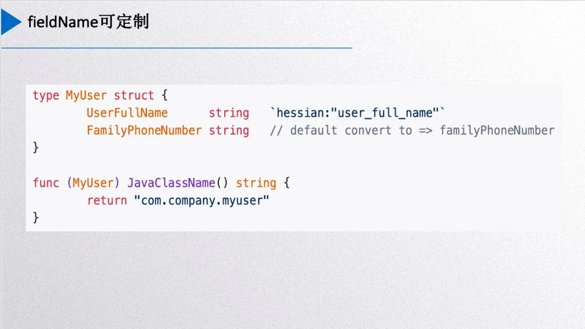      

你也可以加 hessian 标签，解析的时候会把这个字段名用别名写进去，实现自定义 fieldName。默认情况下，go-hessian2 中会自动把 struct field 首字母变成小写作为其 fieldName。

       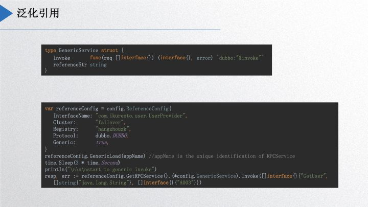      

泛化引用，是 dubbogo 里面比较重要的功能。社区一位同学需要基于 dubbogo 实现网关，收集外部的请求，然后通过泛化引用的形式调用其他 Dubbo 服务，最后自己动手把它实现了。使用时，首先需要在项目里内置一个 GenericService 服务，调用Load，然后就像正常的调用服务一样直接调用，跟 Java 是类似的，Go 客户端可以不知道 Java 的接口定义和类定义，把方法名、参数类型、参数数组以一个 map 的形式传输到 Java 服务端，Java 服务端收到请求后进行识别，把它转换成 POJO 类。

以上是 go-hessian2 一些细节。上文讲到的泛化引用，是把网关作为整个内网 Dubbo 服务的公共消费端，使用的时候只需要知道请求的方法、参数类别，然后就能够调用 Dubbo 的服务。后面主要分享三部分内容：首先是网络引擎、底层网络库这块；其次是服务治理方面的内容，其中包含以 k8s 作为注册中心的一个初步的解决方案；第三部分是互联互通，主要是和 grpc 打通。最后给出一个展望，包含 dubbogo 社区明年的工作内容。

**03**

**网络引擎**

dubbogo 的网络引擎里面分为三层， 如下图所示：

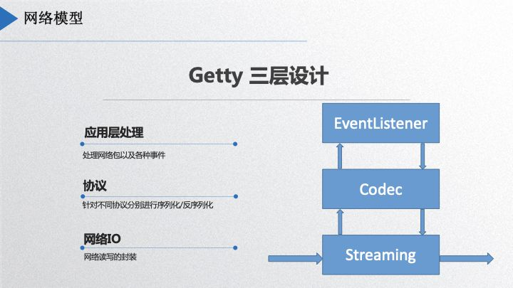

最底层 streaming 处理二进制流，第二层 codec层，进行协议的序列化和反序列化，第三层是 Eventlistener，提供应用使用接口。streaming 层能支持 websocket、TCP、UDP 三种网络通讯协议，这层具有一定的灵活性，今年年初上海有一个同学今年把 KCP 也加进去了，当时说要开源贡献出来，我还在期待中。codec 层可以适用不同协议，用户自定义即可。

       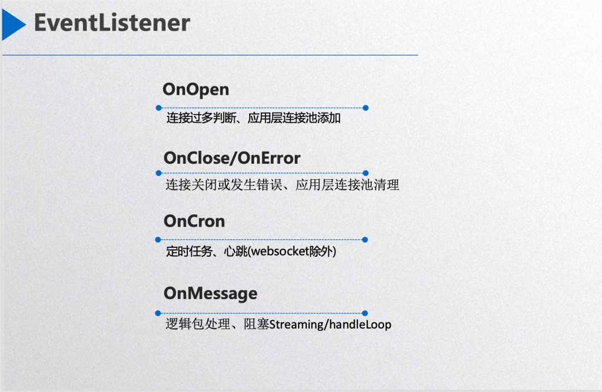

EventListener 对上层暴露了 4 个回调接口。第一个是 OnOpen，网络连接初建成功时被调用，应用层如果判定其为正常连接，则可以把连接 session 存储下来，如果用户判断当前连接过多则返回一个非空的 error，则这个连接会被 dubbogo 关闭。其次是 OnError 事件，当网络连接出错，就会回调到这个接口，在 dubbogo 关闭这个连接之前允许用户做相应处理，如把网络连接 session 从应用层的 session 池中删除。第三个是 OnCron，处理定时任务，如心跳，dubbogo 针对 websocket 协议在底层直接把心跳热任务处理了，针对 tcp 和 udp 协议需要用户在这个回调函数中自己实现。第四个接口是 OnMessage，用作处理一个完整的网络包。可以看到整个回调接口风格跟 websocket 的接口很像。

       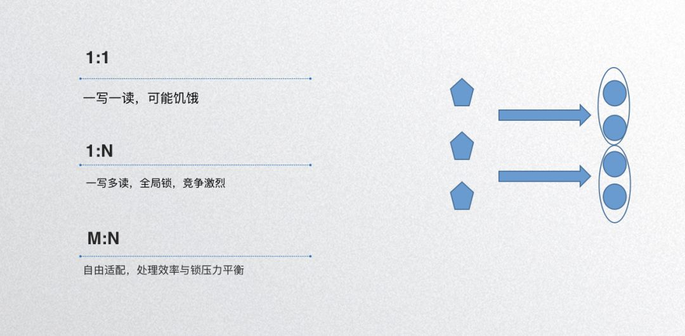      

**协程池**

dubbogo 的 goroutine pool 里有 worker channel 【数量为 M】和逻辑处理 goroutine 【数量为 N】和网络任务【网络包】三种角色，网络解包后把把包按照某种规则放入某个 worker pool，然后逻辑处理 goroutine 从 channel 中读取数据包并执行逻辑处理，其目的是是为了把网络 I/O 与逻辑处理分开。不同的 goroutine pool 设计中，有的 N 大小会变化，有的不变，分别可称之为可伸缩 goroutine pool 和不可伸缩 goroutine pool，可伸缩 goroutine pool 可以对机器资源的使用不可预计。dubbogo 采用了不可伸缩 goroutine pool，其考量是限定其网络资源使用的上限。

另外，dubbogo 的 goroutine pool 不考虑收包后的处理顺序。譬如，dubbogo 服务端收到了 A 和 B 两个网络包，dubbogo 有可能先处理网络包 B，后处理网络包 A。如果客户端的每次请求都是独立的，没有前后顺序关系，则带有不考虑网络包处理顺序是没有问题的。如果有强顺序要求，譬如上层用户关注 A 和 B 请求处理的前后顺序，则可以把 A 和 B 两个请求合并为一个请求，或者把 dubbogo 的 goroutine pool 特性关闭。  

一般情况下，不建议大家自己写 goroutine pool，因为 Go 语言对 goroutine 资源的管理已经非常先进，比如释放一个协程，Go 不会马上销毁掉相关的资源，一旦有创建 goroutine 的需要，马上就可复用这个成本是很低的。什么情况下使用 Goroutine Pool 呢？个人觉得像网络库逻辑处理这类场景下执行同样类型任务场景下确定 goroutine 会被迅速重复使用时可以尝试使用，但是怎么用好还是需要仔细考量，即需要仔细考量 M 与 N 的比例关系。  

假设处理某种网络任务请求，有的请求1秒就处理完了，有的可能10毫秒处理完了，设置 M 与 N 比例为 1:1，这样 1 对 1 造成的后果可能是饥饿，就是有一些队列处理的很快，有的处理很慢，整体负载不均衡，这种情况下就不推荐你用协成池了。

还有一个比例模型是是1：N的，一写多读，比如说所有的请求都交给一个队列，所有逻辑处理 goroutine pool 都消费这个队列，造成的结果是什么呢？因为你只有一个生产者，那你就只有一个队列，多个消费者消费这一个队列，造成的结果是什么呢？因为 go channel 的低效率【整体使用一个 mutex lock】造成消费者 goroutine hang 在锁竞争上，当然其网络包处理顺序更无从保证。

比较均衡的效果就是 M 和 N 都大于 1，dubbogo 的的 goroutine pool 模型中 M 和 N 的取值可以自行配置，其效果是每个 channel 被 N/M 个 goroutine 消费，这种模型类似于 kafka 的 consumer group，其优点是兼顾处理效率和锁压力平衡，可以做到总体层面的任务处理均衡。

## 

**优化改进**

优化改进主要从三个方面入手， 如下图所示：

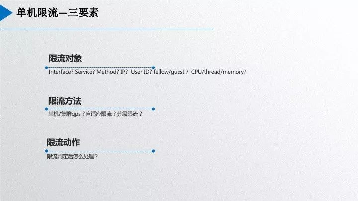

       

1\. 内存池。goroutine pool 是管理对 CPU 资源的分配，内存池就是管理内存资源的分配。我个人反对纯粹为了炫技没有目的地写内存池，其实 Go 的内存管理这块目前优化的很好了。Go 语言初始版本的内存管理使用了谷歌自家的 tcmalloc 库，这个库把应用释放的内存自己先缓存住，待失效期后才释放，那这样造成的结果是什么呢？就是早期的 Go 程序的内存成本很高。假设程序一个 sidecar 程序的资源限制是内存2G，CPU 核数是 2 核，用这样一个内存管理库，内存用完不释放给操作系统，那么没人敢用这个项目，当然最新的 Go 内存管理器是经过完全重构的，虽然也区分不同大小 span 的内存在 P 级别和全局级别进行缓存，但是基本上不用考虑这种内存膨胀不可控的问题了。那么什么情况下使用内存池呢？你确定你的业务有一些对象是频繁的复用则可以尝试使用。 目前大部分内存池技术底层依赖的底座都是 sync.Pool，自己写一个也不难。而且 Go 1.13 之后的 sync.Pool 已经可以做到跨 GC span 不释放缓存对象，非常之好。  

2\. 定时器。Go 语言早期定时器因为整体使用一把大锁的缘故效率极差，当然最新的就相当好了，通过每个 CPU 核下一个定时器的方法【类似于分片锁】分散了竞争压力，但是很多情况下还是有竞争压力，如果对时间精度要求不高个人建议在自己的应用中自己写一个简单的时间轮实现一个定时器，释放 CPU 压力。

3\. 网络写 buffer 合并。写 buffer 合并一般采用 writev，但是 Go 语言的 writev 有内存泄露问题，我这边一个负责 MOSN 开发的同事元总发现的。他先给 Go 语言官方提交了 PR，然后在 MOSN 中把 writev 扔掉自己写了一个简单好用的写 buffer 合并发送实现：通过 for 循环 10 次从发送 channel 中把网络包读取出来然后合并发送，当然循环中间网络发送 channel 没有足够的网络包就通过 \`select-default\` 分支立即退出循环。

**channel 使用**

Go 语言是一个适合处理 IO 密集型任务的语言，不擅长处理 CPU 密集型任务，其内存通信的基础就是 channel。channel 整体的内存基础是一个 ring buffer 数组和一个 lock，外加其他一些读写通知队列等，也是因为一把大锁的缘故，则 buffer 型 channel 如果使用不当则效率不会很高，如每个 channel element 的内存使用过大。channel 还有一个 closed 字段，用于判定 channel 的写是否被关闭掉，Go 语言对其操作是以原子锁方式进行的，很多人以这个字段为基础进行信号通知，如果使用不当很可能造成 for 循环 CPU 100% 的问题，所以在 for-select 循环中特别要谨慎使用，dubbogo 在这方面踩过坑。

**04**

**服务治理**

下面为大家讲一下服务治理，说到服务治理，其实最重要的还是服务发现和服务注册，这块逻辑跟 Dubbo 类似，这次不作展开。下面主要包含两方面的内容，分别是限流算法和优雅退出。

**限流算法**

限流算法首先需要考虑限流的对象，dubbogo 需要考虑 interface 和 method。其次是限流方法，首先需要考虑的是单机限流还是集群限流，单机限流算法很多，譬如常用的固定窗口算法和滑动窗口算法，以及更进一步的自适应限流。限流时一个重要问题就是限流参数是很难配的，譬如线上服务到底需要使用多少机器资源合理，限流窗口的时间窗口时长应该多长合适，其 qps 值设置多少合适呢？这都是 dubbogo 需要解决的问题。先进如谷歌的 BBR 算法，可以在当前的网络环境恶化前不断尝试改进相关参数，直到尝试出一段时间内的最佳参数。还有一些业务形态下的限流，如针对会员和非会员分别设计不同的限流链路。

Dubbo 的限流接口源码如下：

       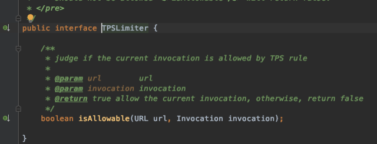      

这个接口抽象是非常漂亮的，第一个是限流 url，第二个服务调用。下面是 Dubbo 的固定窗口限流源码：

       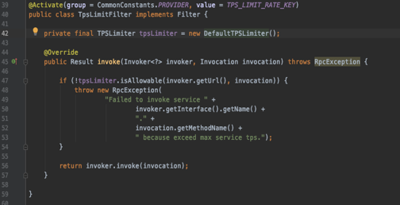      

上面的代码很明显，"private final" 决定了 Dubbo 使用者只能使用期给定的固定窗口限流限算法，无法扩展。

以下是 dubbogo 的限流接口：

       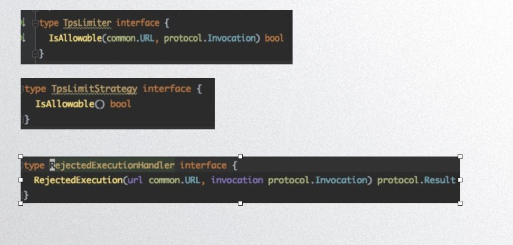      

TpsLimiter 是限流对象，TpsLimitStrategy 是限流算法，RejectedExecutionHandle 是限流动作。

接下来是一个固定窗口算法实现：

       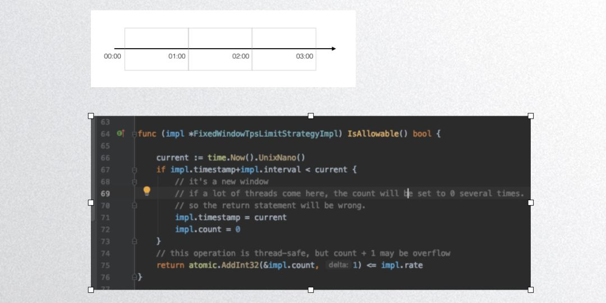       

上图是 dubbogo 的固定窗口算法实现，其非线程安全，大家看一下代码就可以了，不推荐大家用。下图是 dubbogo 的滑动窗口算法实现：

       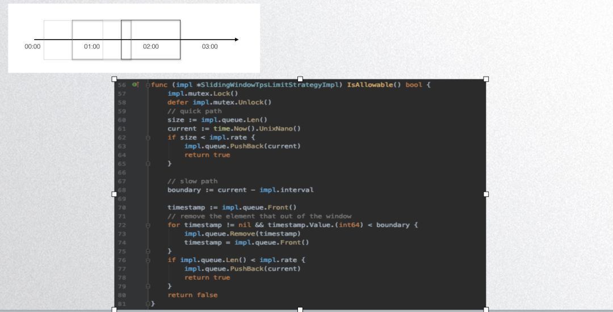        

其基本原理是用一个队列存储一段时间内的请求，然后根据队列长度判定即可。

不管是固定窗口还是滑动窗口，其判定算法简单，麻烦的是其参数设置，如下图：

       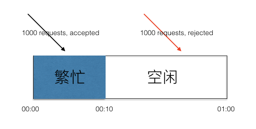       

固定窗口时长精度很难控制。比如说限流一秒 QPS 值 1000，前 100 毫秒来了一千个请求，然后判定算法把请求放过了，而其后 900 毫秒 任何请求都无法处理。一般的处理方法是把时间粒度更精细一些，dubbogo 的时间窗口最小单位是一毫秒，则用户可以把时间窗口设定为 100 毫秒，总体来说一段时间内是很平稳的。下面这个图是我们社区的 commiter 邓明写完博客发出来，行业大佬微信评论如下：

             

图中第一个问题是 qps 和 tps 每个请求成本不同，这个问题怎么处理呢？个人觉得这是一个分级限流问题，在同一个服务下针对不同的请求做不同的分级处理。第二个问题 ”配置了 qps 1000，但是请求过来是10万你还是死“，这个就需要更上层的运维能力进行应对，譬如判定为恶意流量攻击就应该在网关层拦截掉，如果是服务能力不行就扩容。

针对分级限流，dubbogo 目前尚无法在同一个进程内完成，这需要 dubbogo 的配置中心更完善以后进行处理，用户可以通过搭建不同的服务链路处理之。譬如会员/非会员分级，同一个服务针对不同的会员等级搭建相应的链路，在网关层就判定一个 userID 是否是会员，然后发送不同的链路。

dubbogo 的单机熔断是基于 hystrix-go 实现的，其判定参数有最大并发请求数、超时时间、错误率；其次是保护窗口，是熔断时长，熔断多久后进行服务恢复；第三个是保护性动作，就是在保护时间窗口之内执行什么样的动作，具体实现用户自定义。

       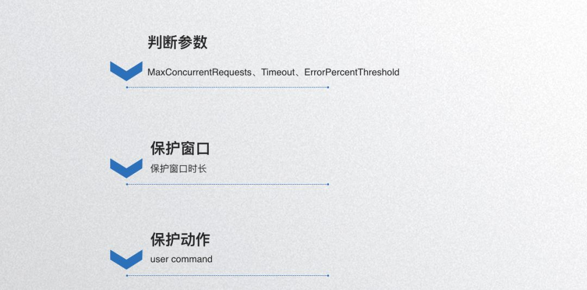       

**优雅退出**

优雅退出也是邓明同学的大作，可以在网络上搜到相关博客。实现优雅退出的步骤有：

1.  告知注册中心，服务即将关闭，此时等待并处理请求；
    
2.  注册中心通知别的客户端，别的客户端停止发送新请求，等待已发请求的响应；
    
3.  节点处理完所有接收到的请求并且返回响应后，释放作为服务端相关的组件和资源；
    
4.  节点释放作为客户端的组件和资源。
    

        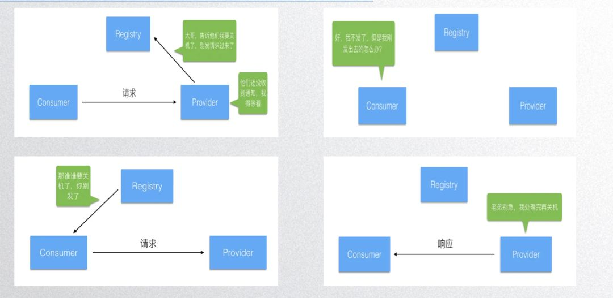       

所以每一步基本上都要给程序一定的时间进行等待，所以等的时间窗口是多少呢？dubbogo 默认每个步骤大概花2秒，总体一个时间窗口是10秒。

       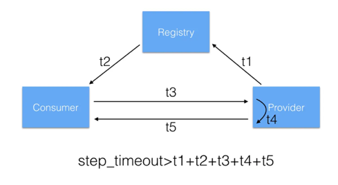      

基本上在别的 RPC 框架里面，可能不太常见到这种处理。

**05**

**Dubbogo 上云  
**

  

dubbogo 作为微服务框架如何适配 k8s，如何部署？dubbogo 本身是一个 RPC 框架，但是其又有了服务治理能力，这部分能力与 k8s 的部分能力有些重合，不可能为了适配 k8s 就彻底抛弃。目前 Dubbo 官方也没有很好的解决方案供我们参考，所以这里我们 dubbogo 先给出一个简单的常识性的实践方案。下面先分析下 dubbogo 的 interface/service 和 k8s service 两者直接的差别。

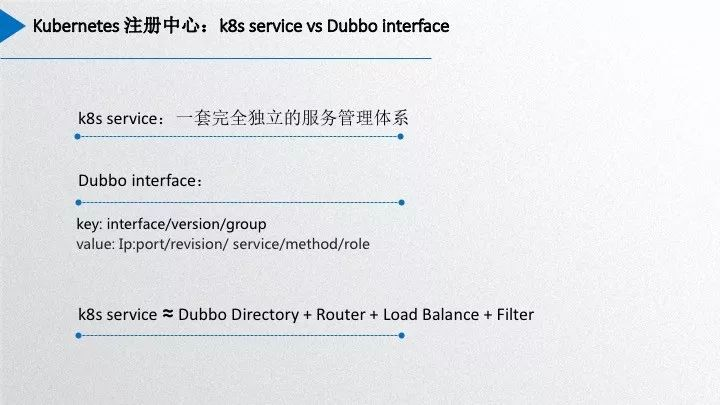

       

k8s service 是许多具有相同服务能力 pod 资源的聚合，它自己的负载均衡算法以及健康检查等功能。而 Dubbo 里面的 interface/service 仅仅是服务 provider 集合，服务治理能力依赖 dubbo 的 directory、router 和 loadbalace 等额外的功能模块。并且Dubbo 服务区分 group/version，还有 provider、consumer 角色等等。Dubbo interface/service 无法与 k8s service 对标，Dubbo interface/service 和其整体服务治理能力才能对标成 k8s service。二者差异这么大，如何将 dubbo 集成到 k8s 中呢？

k8s 提供了 pod/endpoint/service 三层维度的资源。简单的做法，可以通过监听pod/endpoint/service 三层维度资源的事件，作出合理的处理以达到服务治理的目的。目前我们社区成员王翔提交了一个基于监听 pod 事件来实现服务治理的 pr，优点就是不需要引入额外组件，通过监听 k8s 中最细粒度资源 pod 的事件，通过 k8s apiserver 获取 pod 列表，只是通过 apiserver 使用 etcd 的服务注册和服务通知能力，其他继续使用 Dubbo 的服务治理能力。其优点是模型简单，不需要实现额外的模块，几乎不需要对 Dubbo 作出改动，缺点就是其实无法使用 k8s 自己的健康检查能力，需要自己监听很细粒度的 pod 事件来综合处理服务健康、服务上下线等情况，而且还存在没有使用 k8s service 的事件监听能力，每个 consumer 冗余监听一些不必要监听的事件，加大 apiserver 的网络压力。所以其实现目前来看可能还不是最优解，与 k8s 建议的operator 方式也有一定的背离。社区目前还在讨论新方案，寻求 k8s 最优解，大部分人倾向于采用 k8s 社区推荐的 operator 方案，但是其开发和线上维护成本就上升了。后面两种方式会共存，使用者见仁见智。

**06**

**互融互通**

  

关于互融互通，Dubbo 明年有个三个重要目标，其中一个目标是与外面的微服务生态进行互联互通，比如说跟 grpc 互通。目前 dubbo 的 grpc 的解决方案已经开放出来，dubbogo 与 grpc 互通的开发工作也几近完成。

下面左边 dubbogo 的代码生成器工具根据 grpc 的 pb 服务定义文件自动生成的适配 dubbogo 的代码，右边是对应的使用示例。不同于 k8s service 的复杂性，grpc 整体仅仅具有 rpc 能力，没有服务治理能力，所以原始的 grpc 就可以很好的嵌入到 dubbogo 里面，grpc server 的 methodhandler 对我们 dubbogo 来说就是 dubbo invoker，grpc 的一些相关的接口直接跟我们的接口嵌套起来，两个生态就对接起来了。

      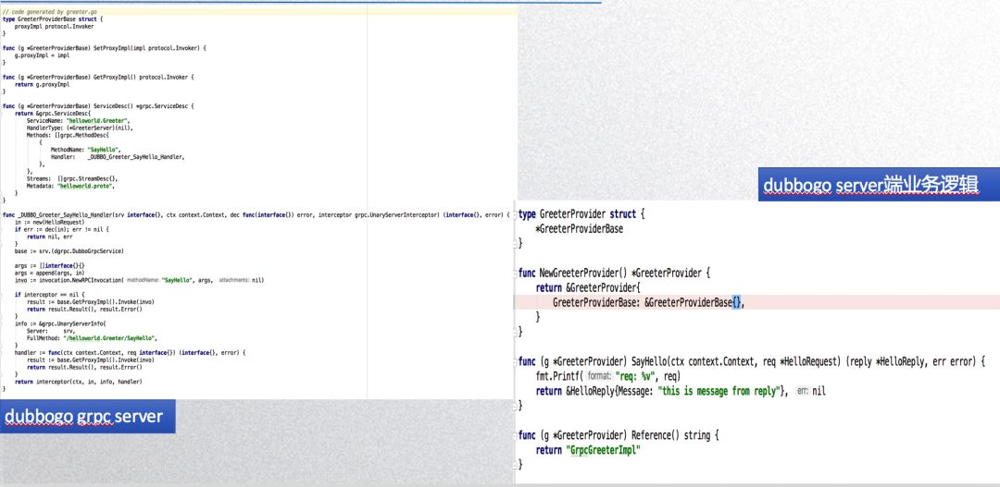

**07**

**展望未来  
**

 

最后就是展望未来，也就是明年的规划。

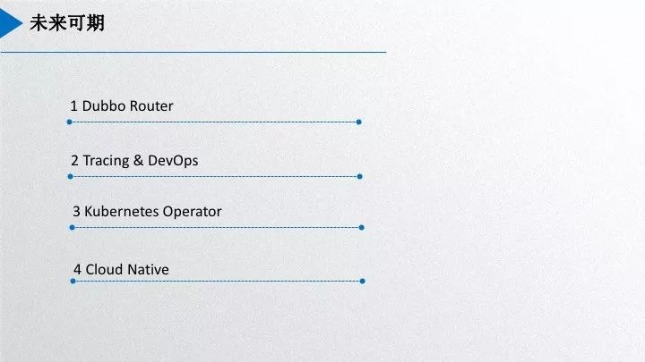

       

明年我们将会很快实现 dubbo router。社区在 8月份已经实现了 router 功能需要的底层的算法模块，但是当时配置中心下发相关的参数的能力还不是很强，所以没有最终完成。最近服务治理配置刚刚支持了 zookeeper 和 apollo，预计很快就可以将 router 的参数通过配置中心下发的形式支持掉。另外，还有 tracing，我们将会引入社区主流的 tracing 方案，以 opentracing 为标准，去集成 opentracing 开源生态的相关能力。第三个是 kubernetes operator，这个就是刚才说的 K8s 的服务调用，我们会基于 operator 的方案做一版新的基于 k8s 的注册中心实现。最后就是云原生生态的融入，即与 istio 的集成，dubbogo 将会成为 dubbo 在 service mesh 生态中的重要角色。

目前 dubbogo 项目，今年是能 run 起来，质量方面还有很多工作要做，功能基本上到明年可与 dubbo 2.7 补齐，目前已经基本够用。目前落地实践的是 3 个比较典型的公司，一个是携程，还有一个是涂鸦智能。

dubbogo 本身是一个 go 语言项目，也期待与其他 go 社区的指正或者需求，一起成长。