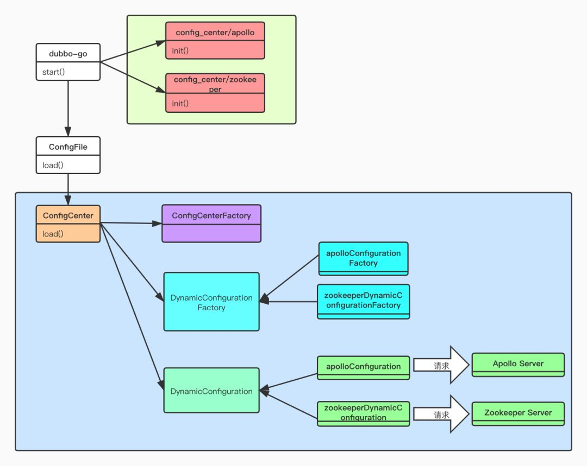
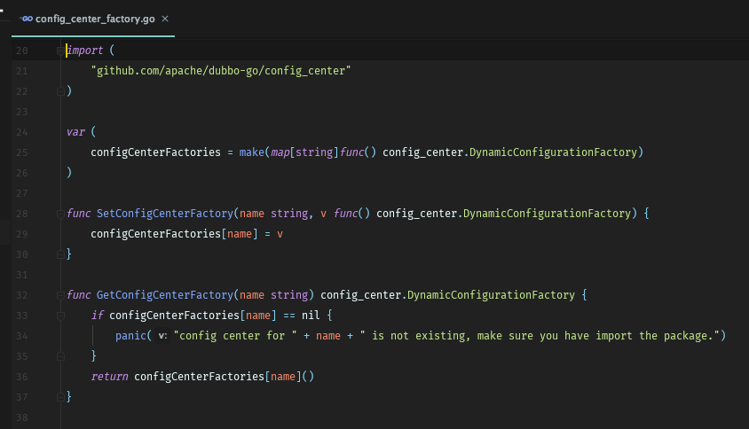
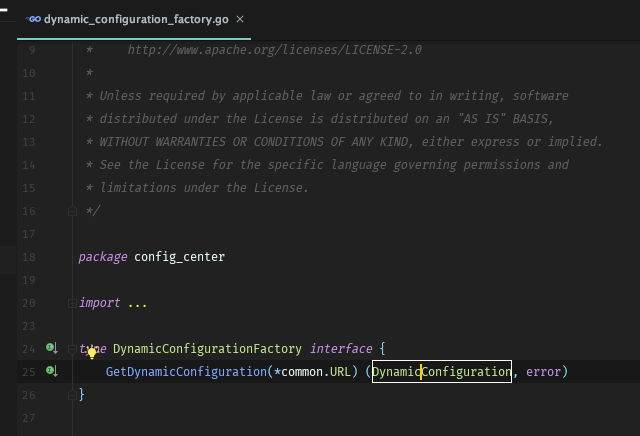
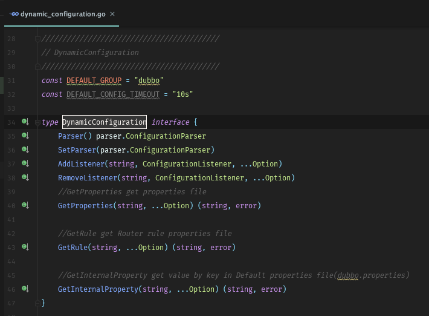
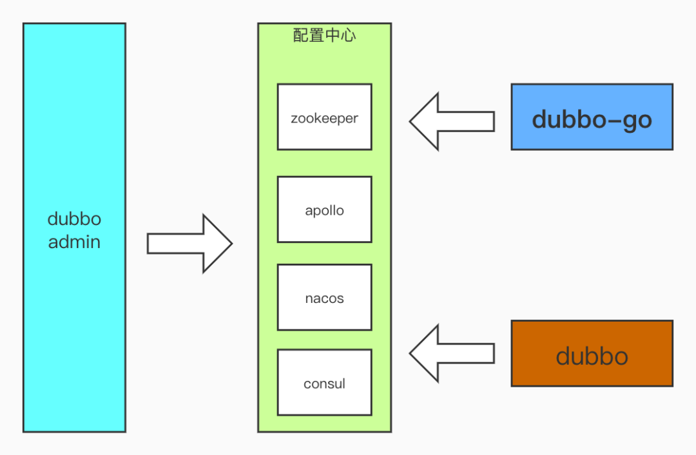
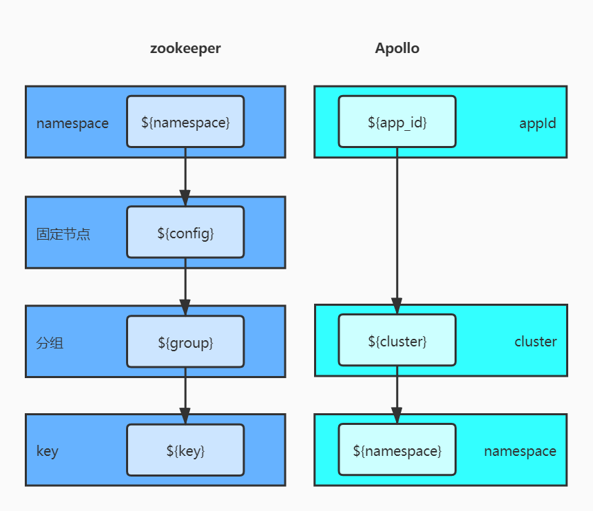
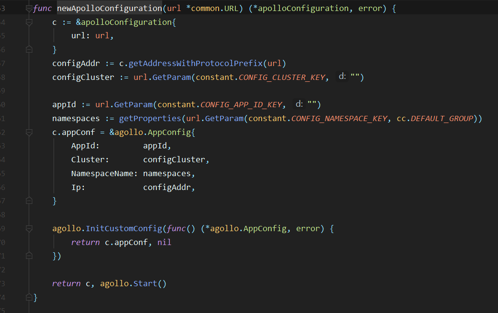
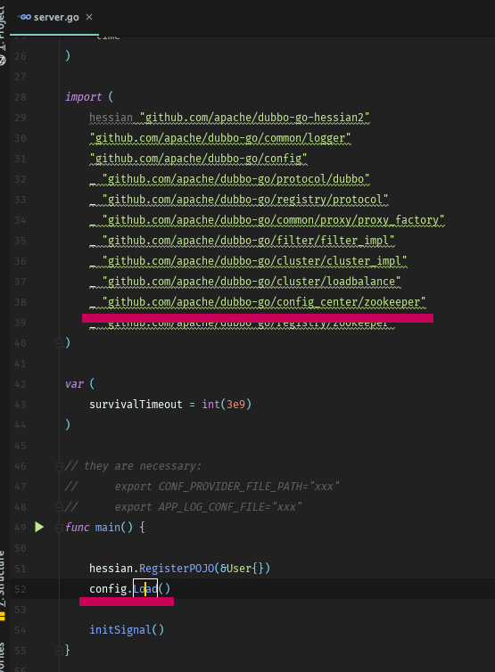

# [dubbo-go 中如何实现远程配置管理？](https://blog.csdn.net/weixin_39860915/article/details/104548947)

2020-02-27 20:00:00

之前在 Apache/dubbo-go（以下简称 dubbo-go ）社区中，有同学希望配置文件不仅可以放于本地，还可以放于配置管理中心里。那么，放在本地和配置管理中心究竟有哪些不一样呢？

放在本地，每次更新需要重启，配置文件管理困难，无法做到实时更新即刻生效。此外，本地文件还依赖人工版本控制，在微服务的场景下，大大的增加了运维的成本与难度。

而配置管理中心提供了统一的配置文件管理，支持文件更新、实时同步、统一版本控制、权限管理等功能。

# **目标**

* * *

基于以上几个背景，可以总结出以下**目标**

*   与 Dubbo 现有的配置中心内的配置文件兼容，降低新增语言栈的学习成本；
    
*   支持多种配置文件格式；
    
*   支持主流配置中心，适应不一样的使用场景，实现高扩展的配置下发；
    

# **配置中心**

* * *

配置中心在 dubbo-go 中主要承担以下场景的职责：

1、作为外部化配置中心，即存储 dubbo.properties 配置文件，此时，key 值通常为文件名如 dubbo.properties , value 则为配置文件内容。

2、存储单个配置项，如各种开关项、常量值等。

3、存储服务治理规则，此时 key 通常按照 “服务名 + 规则类型” 的格式来组织，而 value 则为具体的治理规则。

就目前而言，dubbo-go 首要支持的是 Dubbo 中支持的开源配置中心，包括：

1、Apollo ：携程框架部门研发的分布式配置中心，能够集中化管理应用不同环境、不同集群的配置，配置修改后能够实时推送到应用端，并且具备规范的权限、流程治理等特性，适用于微服务配置管理场景。

2、ZooKeeper ：一个分布式的，开放源码的分布式应用程序协调服务，是 Google 的 Chubby 一个开源的实现，是 Hadoop 和 Hbase 的重要组件。它是一个为分布式应用提供一致性服务的软件，提供的功能包括：配置维护、域名服务、分布式同步、组服务等。

3、Nacos : Alibaba 开源的配置管理组件，提供了一组简单易用的特性集，帮助您实现动态服务发现、服务配置管理、服务及流量管理。

而考虑到某些公司内部有自身的研发的配置中心，又或者当前流行而 Dubbo 尚未支持的配置中心，如 etcd，我们的核心在于设计一套机制，允许我们，也包括用户，可以通过扩展接口新的实现，来快速接入不同的配置中心。

那在 dubbo-go 中究竟怎么实现呢？我们的答案是：**基于动态的插件机制在启动时按需加载配置中心的不同实现。**

实现该部分功能放置于一个独立的子项目中，见：

_https://github.com/apache/dubbo-go/tree/master/config\_center_

## **dubbo-go 设计**

原逻辑为：启动时读取本地配置文件，将其加载进内存，通过配置文件中的配置读取注册中心的信息获取服务提供者，注册服务消费者。

有些读者会有点困惑，不是说好了使用配置中心的，为什么现在又要读取本地配置呢？答案就是，读取的这部分信息分成两部分：

*   使用什么作为配置中心；
    
*   该配置中心的元数据，比如说使用 zookeeper 作为配置中心，那么 zookeeper 的链接信息就是元数据，毕竟我们只有在知道了链接信息之后才能连上 zookeeper；
    

在改造的时候，需要考虑以下的问题：

**1、如何实现支持多个配置中心？如何实现按需加载？**

通过抽象 DynamicConfiguration 让开发者可以快速支持多个配置中心。使用者导入指定的组件包后，在启动阶段将需要的组件加载进内存中，以便给程序按需调用，如下图绿色部分。

**2、配置中心的配置加载阶段在什么时候？**

应在读取配置文件阶段后，读取并解析本地配置文件中配置中心信息。初始化配置中心链接，读取 /dubbo/config/dubbo/dubbo.properties 与 /dubbo/config/dubbo/应用名/dubbo.properties ，并将其加载到内存之中覆盖原有配置，监听其变更，实时更新至内存，如下图蓝色部分:



### **ConfigCenterFactory**

使用者加载对应配置中心模块后，在初始化阶段加入各配置中心模块往其中注册其初始化类。



### **DynamicConfigurationFactory**

整个动态配置中心的关键点就在 DynamicConfigurationFactory 上，其中通过解析内部自定义的 URL ，获取其协议类型，反射其参数，用于创建配置中心的链接。



如：

配置文件中配置：

```css
config_center:
  protocol: zookeeper
  address: 127.0.0.1:2181
  namespace: test
```

dubbo-go 内部会解析为：

```javascript
zookeeper://127.0.0.1:2181?namespace=test
```

在内部传递，用于初始化配置中心链接。  

**PS：**在 dubbo-go 中到处可见这种内部协议，透彻理解这个内部协议对阅读 dubbo-go 代码很有帮助。

### **DynamicConfiguration**

该接口规定了各个配置中心需要实现的功能：

*   配置数据反序列化方式：目前只有 Properties 转换器，参见：DefaultConfigurationParser 。
    
*   增加监听器：用于增加监听数据变化后增加特定逻辑（受限于配置中心 client 端实现）。
    
*   删除监听器：删除已有监听器（受限于配置中心 client 端实现，目前所知 nacos client 没有提供该方法）。
    
*   获取路由配置：获取路由表配置。
    
*   获取应用级配置：获取应用层级配置，如：协议类型配置等。
    



## **实现**

* * *



优先考虑与现有 Dubbo 设计兼容，从而降低使用者的学习成本，dubbo-admin 作为服务提供者实现应用级配置管理， dubbo-go 作为消费端实现配置下发管理功能。下面以 ZooKeeper 为例，对服务提供者与服务消费者进行整体流程分析。

### **如何存储配置管理**

dubbo-admin 配置管理中增加 global 配置，ZooKeeper 中会自动生成其对应配置节点，内容均为 dubbo-admin 中设置的配置。

1、/dubbo/config/dubbo/dubbo.properties 对应全局配置文件。

2、/dubbo/config/dubbo/ 应用名 /dubbo.properties 对应指定应用配置文件。

#### **节点路径**

#### 

上图展示了 dubbo.properties 文件在 ZooKeeper 和 Apollo 中的存储结构：

**ZooKeeper**

*   命名空间 namespace 都为：Dubbo
    
*   分组 group ：全局级别为 dubbo , 所有应用共享；应用级别为应用名 demo-provider ，只对该应用生效
    
*   key : dubbo.properties
    

**Apollo**

*   app\_id : 自由指定，默认：dubbo ，最好与 zookeeper  namespace 一致
    
*   cluster : 自由指定，最好与 zookeeper group 一致
    
*   命名空间 namespace : dubbo.properties
    

ZooKeeper 与 Apollo 最大的不一样就在于 dubbo.properties 所在的节点。

### **实现配置管理中心支持**

以 Apollo 为例，简单的介绍，如何实现支持一个新的配置管理中心。

#### **选择配置管理中心 Client / SDK**

本例中使用的 Apollo Go Client 为：https://github.com/zouyx/agollo 。  

**PS:** 如没找到，自己实现也是可以的哦。

#### **节点路径**

因为每个配置管理中心的存储结构各有特点，导致 Dubbo 在使用外部配置管理中心时，存储配置节点的结构不一样。在 dubbo-configcenter 找到希望支持的配置管理中心，而本例中 Apollo 则在 ApolloDynamicConfiguration.java 。

注释中表明，Apollo namespace = governance (governance .properties) 用于治理规则，namespace = dubbo (dubbo.properties) 用于配置文件。

#### **实现 DynamicConfiguration**

新建创建客户端方法，最好客户端保持为单例。



以下为必须实现的方法，以下方法用于获取配置中心配置。

*   GetInternalProperty：在配置文件（Apollo 为 namespace）中，根据 key 获取对应 value；
    
*   GetRule：获取治理配置文件（Apollo 为 namespace）；
    
*   GetProperties：获取整个配置文件（Apollo 为 namespace）；
    

可选择实现的方法，如不实现，则不能动态更新 dubbo-go 中配置信息。

*   RemoveListener
    
*   AddListener
    

而 Parser & SetParser 使用默认实现即可，默认为 Properties 转换器。

更多信息，参考：dubbo-go-apollo ，详情参考：

_https://github.com/apache/dubbo-go/tree/master/config\_center/apollo_

## **使用方法**

从上面的设计里面，也能大概猜到怎么使用了：



很显然，使用配置中心并不复杂，只需要把对应的依赖引入进来。在包初始化的时候，会创建出来对应的配置中心的实现。比如说加载 ZooKeeper 或者 Apollo 作为配置中心：

**ZooKeeper**

```nginx
_ "github.com/apache/dubbo-go/config_center/zookeeper"
```

**Apollo**

```nginx
_ "github.com/apache/dubbo-go/config_center/apollo"
```

当然仅仅加载还不够，比如说虽然我加载了 zookeeper，但是我还需要知道怎么连上这个配置中心，即前面提到的配置中心的元数据，这部分信息是需要在本地配置出来的。比如说：

**ZooKeeper**

```css
config_center:
  protocol: "zookeeper"
  address: "127.0.0.1:2181"
```

**Apollo**  

如果需要使用 Apollo 作为配置中心，请提前创建 namespace: dubbo.properties，用于配置管理。

```properties
config_center:
  protocol: "apollo"
  address: "127.0.0.1:8070"
  app_id: test_app
  cluster: dev
```

# **总结**

* * *

更加具体的实现，我就不详细论述，大家可以去看源码，欢迎大家持续关注，或者贡献代码。

整个配置中心的功能，麻雀虽小，但五脏俱全。目前并不算是十分完善，但是整个框架层面上来说，是走在了正确的路上。从扩展性来说，是比较便利。目前支持的配置中心还不够丰富，只有 ZooKeeper 与 Apollo ，支持的配置文件格式也只有 properties ，虽然能满足基本使用场景，距离完善还有还长远的路。

**未来计划：**

*   Nacos（等待发布 ）
    
*   etcd（正在开发）
    
*   consul（未支持）
    
*   丰富的文件配置格式，如：yml , xml 等
    

**本文作者：**邹毅贤，Github ID @zouyx，开源爱好者，就职于 SheIn 供应链部门，负责供应链开放平台。

本文缩略图：icon by 用户7388492991