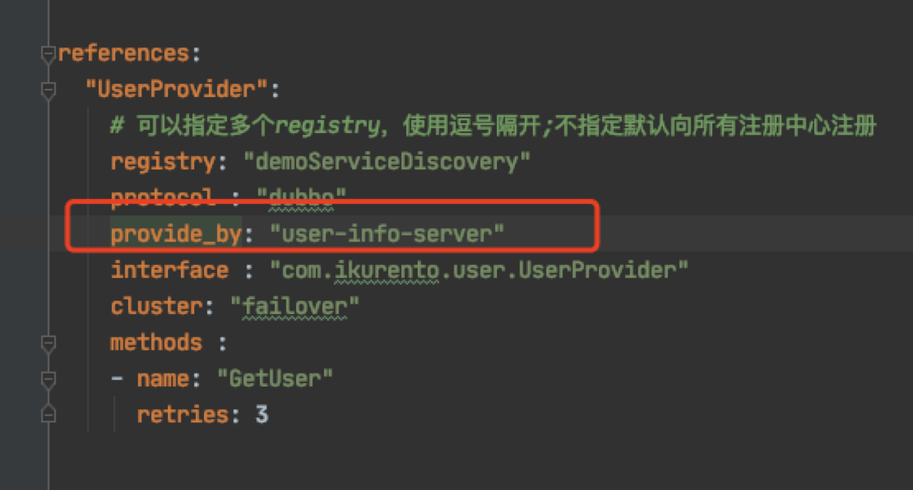
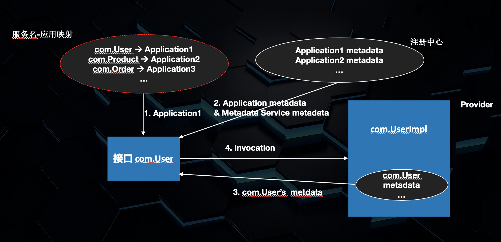
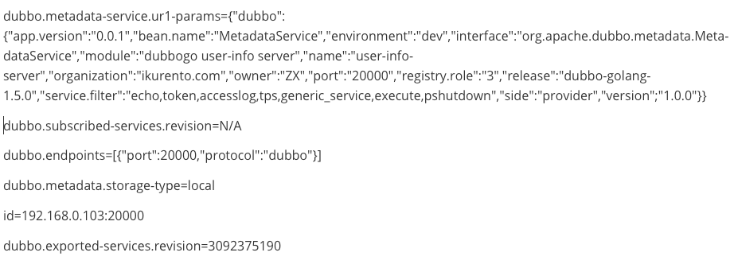

# [Dubbo-go 应用维度注册模型](https://xie.infoq.cn/article/a6a7e05f8a0d26c5f9f9bbd85)

**本文作者：邓明(Github flycash)蒋超(Github @Patrick0308)**

Dubbo 3.0 将至。其最重要的一点就是服务自省，其基础即是应用维度的注册模型，作为目前与 Dubbo 在功能上完全对齐的 Dubbo-go，已于 本年【2020 年】7 月份发布了其 v1.5.0 版本，实现了该模型，为年底实现与 Dubbo 3.0 对齐的新版本奠定了基础。

Dubbo-go 作为 Dubbo 的 Go 语言版本，因跨语言之故，二者针对同一模型的实现必然有较大差异，故本文注重讨论 Dubbo-go 社区自身对该模型的理解和实现，以及其与 Dubbo 之间的差异。

## 1 引语

在 v1.5 以前，Dubbo-go 注册模型都是以服务为维度的，直观的理解可认为其是接口维度。譬如注册信息，按照服务维度模型其示例如下：

```json
"com.xxx.User":[
  {"name":"instance1", "ip":"127.0.0.1", "metadata":{"timeout":1000}},
  {"name":"instance2", "ip":"127.0.0.2", "metadata":{"timeout":2000}},
  {"name":"instance3", "ip":"127.0.0.3", "metadata":{"timeout":3000}},
]
```

这种模式的好处是不言而喻的，简单直观，提供了细粒度的服务控制手段。

而近两年，随着云时代的到来，这种模式就暴露了不足：

主流的注册模型都是应用维度的；

以服务维度来注册，那么规模与服务数量成正比，大规模集群之下，注册中心压力非常大；

## 2 Dubbo-go v1.5.0 的新注册模型

这次 Dubbo-go 支持了新的注册模型，也就是应用维度的注册模型。简单而言，在应用维度注册下，其注册信息类似：

```jsoon
"application1": [
  {"name":"instance1", "ip":"127.0.0.1", "metadata":{}},
  {"name":"instance2", "ip":"127.0.0.2", "metadata":{}},
  {"name":"instanceN", "ip":"127.0.0.3", "metadata":{}}
]
```

在此模式之下，可以看到注册信息将会大幅度减少，集群规模只与实例数量相关。

与此同时，在实现这一个功能的时候，Dubbo-go 还希望保持两个目标：

对用户完全兼容，用户迁移无感知；

保持住原本服务粒度上精细控制的能力——即保留现有的服务维度的元数据；

因此 Dubbo-go 要着力解决以下几点：

目前 Consumer 的配置是以接口为准的，如何根据接口找到该接口对应的应用？例如，用户配置了 com.xxx.User 服务，那么，Dubbo-go 怎么知道这个服务是由哪个应用来提供的呢？

在知道了是哪个应用之后，可以从注册中心拿到应用的注册信息，如实例信息等；那怎么知道 com.xxx.User 服务自身的元数据呢？

为了解决这两个问题，在已有的注册模型的基础上，Dubbo-go 引入两个额外的组件：ServiceNameMapping 和 MetadataService。

前者用于解决服务-应用之间的映射，后者用于获取服务的元数据。

由此，Dubbo-go 的应用维度注册模型就变为：


### 2.1 ServiceNameMapping

ServiceNameMapping 并不复杂。考虑到一般人在 Consumer 侧想要调用一个服务，其十有八九是知道这个服务是哪个应用提供的，于是 Dubbo-go 引入了新的配置项 provideBy



当然，所谓 “十有八九”就是说有些时候确实不知道是服务是谁提供的，所以 Dubbo-go 还支持了基于配置中心的 ServiceNameMapping 实现。Dubbo-go 会用服务名作为 Key 从配置中心里面读出对应的应用名。这意味着, Provider 启动的时候，也会在配置中心将自身的 服务-应用名映射 写入配置中心。

### 2.2 MetadataService

MetadataService 稍微要复杂一点，有 remote 和 local 两种模式。

类似于前面的 ServiceNameMapping，Dubbo-go 提供了基于配置中心的 MetadataService 的实现，即 remote 模式。Provider 启动的时候，就会将服务的元数据写进去。

另外一种模式是 local 模式。Dubbo-go 可以直接将 MetadataService 看做是一个普通的微服务，而后由 Provider 所提供。类似于：



由此带来一个问题：

既然 Dubbo-go 将 MetadataService 看做是一个普通的服务，那么 MetadataService 的元数据，Consumer 该怎么获得呢？这是一个典型的鸡生蛋蛋生鸡的问题。

Dubbo-go 的方案非常简单粗暴，Provider 启动的时候，不仅仅往注册中心里面写入应用本身的信息，还要把它的 MetadataService 信息写入。

这是一个应用的注册信息：



本质上来说，应用维度注册信息 + 服务元数据 = 服务维度注册信息。或者说，应用维度注册，只是一种重新组织这些信息的方式。

## 3 差异与改进

Dubbo-go v1.5.x 对标 Dubbo 2.7.5，可以认为是参照 Dubbo 2.7.5 直接实现其 Go 源码，但是考虑到 Java 和 Go 之间的语言差异，导致二者之间的实现不可能完全对等。

### 3.1 修订版本号 revision 比对

Dubbo v2.7.x 在 MetadataService 注册时，会对其 provider 应用的所有服务接口的 hash 值做为修订版本号写入元数据中心，此 revision 是对所有接口的方法以及其参数总体的计算结果。其目的是减少 consumer 端到注册中心的拉取次数。

在 Go 中用的计算 revision 的 hash 算法与 Java 是不一致的，而且 Go 与 Java 的方法签名信息是不相同的，所以计算出来的 hash 值一定是不一样的。

此不一致会导致如果 Go 应用和 Java 应用同时发布同一个服务的时候，Go 服务和 Java 服务的修订版本号必定是不相同的，Consumer 需要分别缓存这两个修订版本的元数据。

### 3.2 应用注册时机

Dubbo-go v1.5.0 实现时，其中一个考量是全面向后兼容 v1.4.x。Dubbo-go v1.5.x 应用 consumer 既可以调用 Dubbo-go v1.4.x 应用的服务，也可以调用 Dubbo v2.6.x 应用的服务，当然也可以调用其对标的 v2.7.x 应用的服务。

为了达到兼容性，Dubbo-go v1.5.x 实现时面临一个问题：Dubbo-go provider 应用启动时有一个服务启动成功，把应用信息注册到元数据中心之后，就会把实例注册到注册中心，而 Dubbo 2.7.x 的 provider 应用则是在其所有服务接口的信息注册到元数据中心后才会注册实例！

这个问题的后果就是：Dubbo-go v1.5.0 的 provider 每次发布接口到元数据中心的同时，都会触发 Dubbo-go v1.5.0 / Dubbo v2.7.x 的 consumer 应用拉取 Dubbo-go v1.5.0 应用信息，当 provider 发布的服务过多时 consumer 侧性能损耗非常明显！

Dubbo-go 在 v1.5.1 中已经修复了这个问题，provider 在启动时先将其全部服务接口发布到元数据中心，然后注册实例到注册中心，减少了 consumer 拉取元数据的次数。

Dubbo-go 项目地址：[https://github.com/apache/dubbo-go](https://github.com/apache/dubbo-go) Dubbo-go 社区交流群：23331795

### 欢迎加入 dubbo-go 社区

有任何 dubbo-go 相关的问题，可以加我们的钉钉群 23331795 询问探讨，我们一定第一时间给出反馈。

