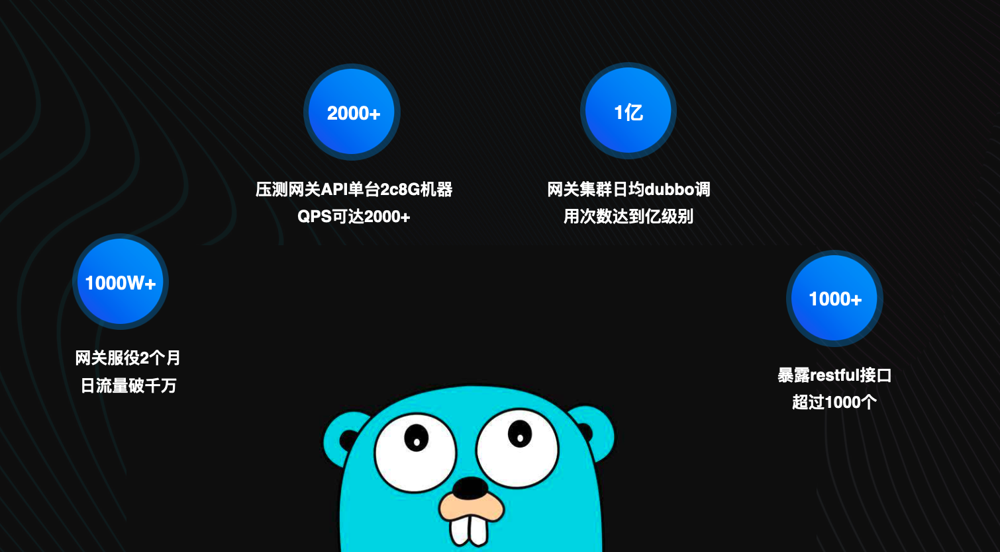
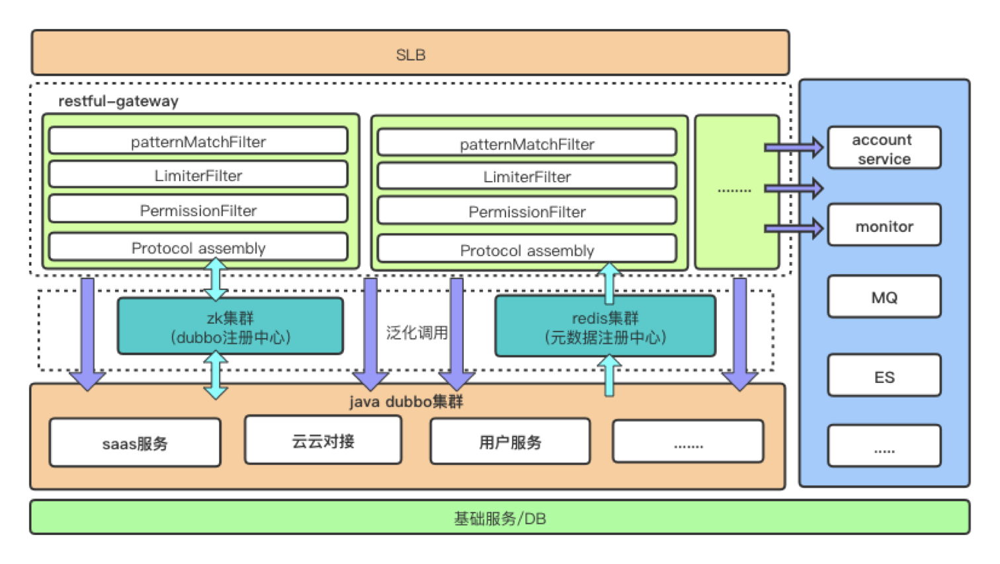
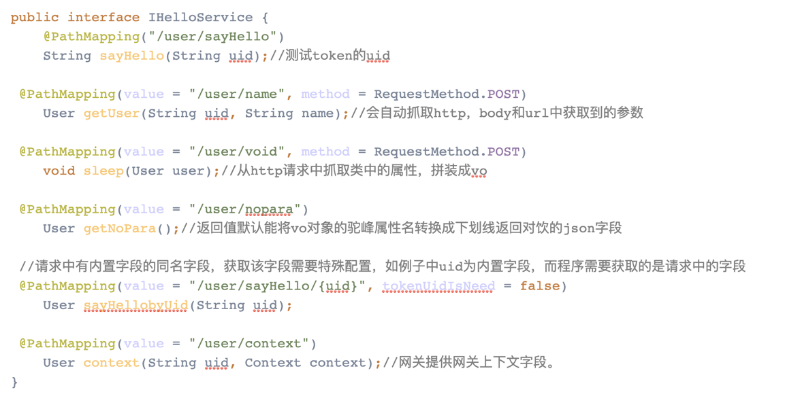

# [涂鸦智能 dubbo-go 亿级流量的实践与探索](https://my.oschina.net/dubbogo/blog/4306343)

dubbo 是一个基于 Java 开发的高性能的轻量级 RPC 框架，dubbo 提供了丰富的服务治理功能和优秀的扩展能力。而 dubbo-go 在 java 与 golang 之间提供统一的服务化能力与标准，是涂鸦智能目前最需要解决的主要问题。本文分为实践和快速接入两部分，分享在涂鸦智能的 [dubbo-go](http://github.com/apache/dubbo-go) 实战经验，意在帮助用户快速接入 dubbo-go RPC 框架，希望能让大家少走些弯路。

另外，文中的测试代码基于 dubbo-go 版本 [v1.4.0](https://github.com/apache/dubbo-go/releases/tag/v1.4.0)。

## dubbo-go 网关实践



dubbo-go 在涂鸦智能的使用情况如上图，接下来会为大家详细介绍落地细节，希望这些在生产环境中总结的经验能够帮助到大家。

### 背景

在涂鸦智能，dubbo-go 已经作为了 golang 服务与原有 dubbo 集群打通的首选 RPC 框架。其中比较有代表性的 open-gateway 网关系统（下文统一称 gateway，开源版本见 [https://github.com/dubbogo/dubbo-go-proxy](https://github.com/dubbogo/dubbo-go-proxy)）。该 gateway 动态加载内部 dubbo 接口信息，以 HTTP API 的形式对外暴露。该网关意在解决上一代网关的以下痛点。

- `通过页面配置 dubbo 接口开放规则，步骤繁琐，权限难以把控。`
- `接口非 RESTful 风格，对外部开发者不友好。`
- `依赖繁重，升级风险大。`
- `并发性能问题。`

### 架构设计

针对如上痛点，随即着手准备设计新的 gateway 架构。首先就是语言选型，golang 的协程调用模型使得 golang 非常适合构建 IO 密集型的应用，且应用部署上也较 java 简单。经过调研后我们敲定使用 golang 作为 proxy 的编码语言，并使用 dubbo-go 用于连接 dubbo provider 集群。provider 端的业务应用通过使用 java 的插件，以注解形式配置 API 配置信息，该插件会将配置信息和 dubbo 接口元数据更新到元数据注册中心（下图中的 redis ）。这样一来，配置从管理后台页面转移到了程序代码中。开发人员在编码时，非常方便地看到 dubbo 接口对外的 API 描述，无需从另外一个管理后台配置 API 的使用方式。


### 实践

从上图可以看到，网关能动态加载 dubbo 接口信息，调用 dubbo 接口是基于 dubbo 泛化调用。泛化调用使 client 不需要构建 provider 的 interface 代码，在 dubbo-go 中表现为无需调用 config.SetConsumerService 和 hessian.RegisterPOJO 方法，而是将请求模型纯参数完成，这使得 client 动态新增、修改接口成为可能。在 [apache/dubbo-sample/golang/generic/go-client](https://github.com/apache/dubbo-samples/tree/master/golang/generic/go-client) 中的有泛化调用的演示代码。

```go
func test() {
	var appName = "UserProviderGer"
	var referenceConfig = config.ReferenceConfig{
		InterfaceName: "com.ikurento.user.UserProvider",
		Cluster:       "failover",
		Registry:      "hangzhouzk",
		Protocol:      dubbo.DUBBO,
		Generic:       true,
	}
	referenceConfig.GenericLoad(appName) // appName is the unique identification of RPCService

	time.Sleep(3 * time.Second)

	resp, err := referenceConfig.GetRPCService().(*config.GenericService).
		Invoke([]interface{}{"GetUser", []string{"java.lang.String"}, []interface{}{"A003"}})
	if err != nil {
		panic(err)
	}
}
```

泛化调用的实现其实相当简单。其功能作用在 dubbo 的 Filter 层中。[Generic Filter](https://github.com/apache/dubbo-go/blob/master/filter/filter_impl/generic_filter.go) 已经作为默认开启的 Filter 加入到 dubbo Filter 链中。其核心逻辑如下：

```go
func (ef *GenericFilter) Invoke(ctx context.Context, invoker protocol.Invoker, invocation protocol.Invocation) protocol.Result {
	if invocation.MethodName() == constant.GENERIC && len(invocation.Arguments()) == 3 {
		oldArguments := invocation.Arguments()

		if oldParams, ok := oldArguments[2].([]interface{}); ok {
			newParams := make([]hessian.Object, 0, len(oldParams))
			for i := range oldParams {
				newParams = append(newParams, hessian.Object(struct2MapAll(oldParams[i])))
			}
			newArguments := []interface{}{
				oldArguments[0],
				oldArguments[1],
				newParams,
			}
			newInvocation := invocation2.NewRPCInvocation(invocation.MethodName(), newArguments, invocation.Attachments())
			newInvocation.SetReply(invocation.Reply())
			return invoker.Invoke(ctx, newInvocation)
		}
	}
	return invoker.Invoke(ctx, invocation)
}
```

Generic Filter 将用户请求的结构体参数转化为统一格式的 map（代码中的 struct2MapAll ），将类（ golang 中为 struct ）的正反序列化操作变成 map 的正反序列化操作。这使得无需 POJO 描述通过硬编码注入 hessain 库。

从上面代码可以看到，泛化调用实际需要动态构建的内容有 4 个，ReferenceConfig 中需要的 InterfaceName 、参数中的 method 、ParameterTypes、实际入参 requestParams。

**那么这些参数是如何从 HTTP API 匹配获取到的呢？**

这里就会用到上文提到的 provider 用于收集元数据的插件。引入插件后，应用在启动时会扫描需要暴露的 dubbo 接口，将 dubbo 元数据和 HTTP API 关联。插件使用方法大致如下，这里调了几个简单的配置作为示例，实际生产时注解内容会更多。


最终获得的 dubbo 元数据如下:

```json
{
    "key": "POST:/hello/{uid}/add",
    "interfaceName": "com.tuya.hello.service.template.IUserServer",
    "methodName": "addUser",
    "parameterTypes": [
        "com.tuya.gateway.Context",
        "java.lang.String",
        "com.tuya.hello.User"
    ],
    "parameterNames": [
        "context",
        "uid",
        "userInfo"
    ],
    "updateTimestamp": "1234567890",
    "permissionDO": {},
    "voMap": {
        "userInfo": {
            "name": "java.lang.String",
            "sex": "java.lang.String",
            "age": "java.lang.Integer"
        }
    },
    "parameterNameHumpToLine": true,
    "resultFiledHumpToLine": false,
    "protocolName": "dubbo"
}
```

Gateway 从元数据配置中心订阅到以上信息，就能把一个 API 请求匹配到一个 dubbo 接口。再从 API 请求中抓取参数作为入参。这样功能就完成了流量闭环。

以上内容，大家应该对此 gateway 的项目拓扑结构有了清晰的认知。我接着分享项目在使用 dubbo-go 过程中遇到的问题和调优经验。19 年初，当时的 dubbo-go 项目还只是构建初期，没有什么用户落地的经验。我也是一边参与社区开发，一边编码公司内部网关项目。在解决了一堆 hessain 序列化和 zookeeper 注册中心的问题后，项目最终跑通了闭环。但是，作为一个核心应用，跑通闭环离上生产环境还有很长的路要走，特别是使用了当时稳定性待测试的新框架。整个测试加上功能补全，整整花费了一个季度的时间，直到项目趋于稳定，压测效果也良好。**单台网关机器（ 2C 8G ）全链路模拟真实环境压测达到 2000 QPS。由于引入了比较重的业务逻辑（单个请求平均调用 3 个 dubbo 接口），对于这个压测结果，是符合甚至超出预期的。**

总结了一些 dubbo-go 参数配置调优的经验，主要是一些网络相关配置。大家在跑 demo 时，应该会看到配置文件最后有一堆配置，但如果对 dubbo-go 底层网络模型不熟悉，就很难理解这些配置的含义。目前 dubbo-go 网络层以 [getty](https://github.com/AlexStocks/getty) 为底层框架，实现读写分离和协程池管理。getty 对外暴露 session 的概念，session 提供一系列网络层方法注入的实现，因为本文不是源码解析文档，在这里不过多论述。**读者可以简单的认为 dubbo-go 维护了一个 getty session 池，session 又维护了一个 TCP 连接池。对于每个连接，getty 会有读协程和写协程伴生，做到读写分离**。这里我尽量用通俗的注释帮大家梳理下对性能影响较大的几个配置含义：

```yaml
protocol_conf:
  # 这里是协议独立的配置，在dubbo协议下，大多数配置即为getty session相关的配置。
  dubbo:
  	# 一个session会始终保证connection_number个tcp连接个数，默认是16，
    # 但这里建议大家配置相对小的值，一般系统不需要如此多的连接个数。
    # 每隔reconnect_interval时间，检查连接个数，如果小于connection_number，
    # 就建立连接。填0或不填都为默认值300ms
    reconnect_interval: 0
    connection_number: 2
    # 客户端发送心跳的间隔
    heartbeat_period: "30s"
    # OnCron时session的超时时间，超过session_timeout无返回就关闭session
    session_timeout: "30s"
    # 每一个dubbo interface的客户端，会维护一个最大值为pool_size大小的session池。
    # 每次请求从session池中select一个。所以真实的tcp数量是session数量*connection_number，
    # 而pool_size是session数量的最大值。测试总结下来一般程序4个tcp连接足以。
    pool_size: 4
    # session保活超时时间，也就是超过session_timeout时间没有使用该session，就会关闭该session
    pool_ttl: 600
    # 处理返回值的协程池大小
    gr_pool_size: 1200
    # 读数据和协程池中的缓冲队列长度，目前已经废弃。不使用缓冲队列
    queue_len: 64
    queue_number: 60
    getty_session_param:
      compress_encoding: false
      tcp_no_delay: true
      tcp_keep_alive: true
      keep_alive_period: "120s"
      tcp_r_buf_size: 262144
      tcp_w_buf_size: 65536
      pkg_wq_size: 512
      tcp_read_timeout: "1s"  # 每次读包的超时时间
      tcp_write_timeout: "5s" # 每次写包的超时时间
      wait_timeout: "1s"
      max_msg_len: 102400     # 最大数据传输长度
      session_name: "client"
```

## dubbo-go 快速接入

前文已经展示过 dubbo-go 在涂鸦智能的实践成果，接下来介绍快速接入 dubbo-go 的方式。

### 第一步：hello world

dubbo-go 使用范例目前和 dubbo 一致，放置在 [apache/dubbo-samples](https://github.com/apache/dubbo-samples) 项目中。在 dubbo-sample/golang 目录下，用户可以选择自己感兴趣的 feature 目录，快速测试代码效果。

```shell
tree dubbo-samples/golang -L 1
dubbo-samples/golang
├── README.md
├── async
├── ci.sh
├── configcenter
├── direct
├── filter
├── general
├── generic
├── go.mod
├── go.sum
├── helloworld
├── multi_registry
└── registry
```

我们以 hello world 为例，按照 dubbo-samples/golang/README.md 中的步骤，分别启动 server 和 client 。可以尝试 golang 调用 java 、 java 调用 golang 、golang 调用 golang 、java 调用 java。dubbo-go 在协议上支持和 dubbo 互通。

我们以启动 go-server 为例，注册中心默认使用 zookeeper 。首先确认本地的 zookeeper 是否运行正常。然后执行以下命令，紧接着你就可以看到你的服务正常启动的日志了。

```shell
export ARCH=mac
export ENV=dev
cd dubbo-samples/golang/helloworld/dubbo/go-server
sh ./assembly/$ARCH/$ENV.sh
cd ./target/darwin/user_info_server-2.6.0-20200608-1056-dev/
sh ./bin/load.sh start
```

### 第二步：在项目中使用 dubbo-go

上面，我们通过社区维护的测试代码和启动脚本将用例跑了起来。接下来，我们需要在自己的代码中嵌入 dubbo-go 框架。很多朋友往往是在这一步遇到问题，这里我整理的一些常见问题，希望能帮到大家。

##### 1. 环境变量

目前 dubbo-go 有 3 个环境变量需要配置。

- `CONF_CONSUMER_FILE_PATH` : Consumer 端配置文件路径，使用 consumer 时必需。
- `CONF_PROVIDER_FILE_PATH`：Provider 端配置文件路径，使用 provider 时必需。
- `APP_LOG_CONF_FILE` ：Log 日志文件路径，必需。
- `CONF_ROUTER_FILE_PATH`：File Router 规则配置文件路径，使用 File Router 时需要。

##### 2. 代码注意点

- 注入服务 : 检查是否执行以下代码

- 客户端
  ```go
  func init() {
  	config.SetConsumerService(userProvider)
  }
  ```
- 服务端
  ```go
  func init() {
  	config.SetProviderService(new(UserProvider))
  }
  ```
- 注入序列化描述 ：检查是否执行以下代码

  ```go
  hessian.RegisterJavaEnum(Gender(MAN))
  hessian.RegisterJavaEnum(Gender(WOMAN))
  hessian.RegisterPOJO(&User{})
  ```

##### 3. 正确理解配置文件

- `references/services` 下的 key ，如下面例子的 "UserProvider" 需要和服务 Reference() 返回值保持一致，此为标识改接口的 key。

  ```yaml
  references:
  "UserProvider":
  registry: "hangzhouzk"
  protocol: "dubbo"
  interface: "com.ikurento.user.UserProvider"
  cluster: "failover"
  methods:
  - name: "GetUser"
  	retries: 3
  ```

- 注册中心如果只有一个注册中心集群，只需配置一个。多个 IP 用逗号隔开，如下：

  ```yaml
  registries:
  "hangzhouzk":
  protocol: "zookeeper"
  timeout: "3s"
  address: "172.16.120.181:2181,172.16.120.182:2181"
  username: ""
  password: ""
  ```

##### 4. java 和 go 的问题

- `go` 和 `java` 交互的大小写 ：golang 为了适配 java 的驼峰格式，在调用 java 服务时，会自动将 method 和属性首字母变成小写。很多同学故意将 java 代码写成适配 golang 的参数定义，将首字母大写，最后反而无法序列化匹配。

### 第三步：拓展功能

dubbo-go 和 dubbo 都提供了非常丰富的拓展机制。可以实现自定义模块代替 dubbo-go 默认模块，或者新增某些功能。比如实现 Cluster、Filter 、Router 等来适配业务的需求。这些注入方法暴露在 dubbo-go/common/extension 中，允许用户调用及配置。

**_本文作者：_**
**潘天颖，Github ID @pantianying，开源爱好者，就职于涂鸦智能。**

## 欢迎加入 dubbo-go 社区

有任何 dubbo-go 相关的问题，可以加我们的钉钉群 23331795 询问探讨，我们一定第一时间给出反馈。


### 最新活动

Dubbo-go ASoC [相关题目](https://github.com/apache/dubbo-go/issues?q=is%3Aissue+is%3Aopen+label%3AASOC2020) ，参加详情 [请点击](https://github.com/apache/dubbo/issues/6203)
