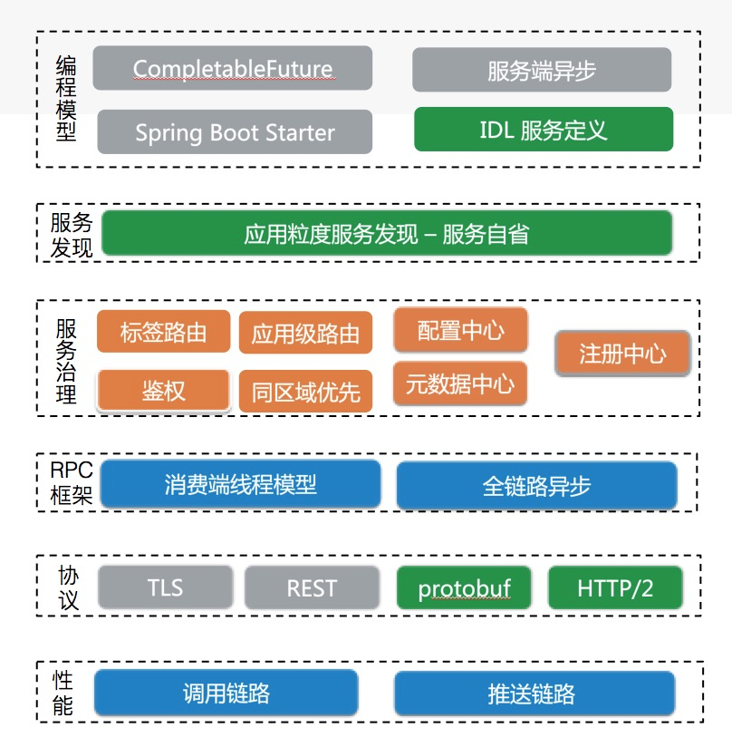
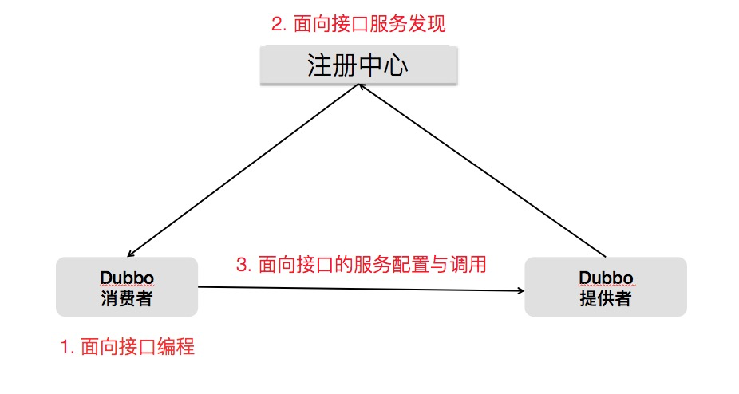

# [都已经十岁的 Apache Dubbo，还能再乘风破浪吗？](https://my.oschina.net/u/3874284/blog/4338792)

纵观中国开源历史，你真的没法找到第二个像 Dubbo 一样自带争议和讨论热度的开源项目。

一方面，2011 年，它的开源填补了当时生产环境使用的 RPC 框架的空白，一发布就被广泛采用；另一方面，它经历了停止维护、重启维护后捐献给 Apache 基金会、接着又以顶级项目的身份毕业。

面对多疑的开发者，在云原生时代，Apache Dubbo 将如何延续当前光芒？

今年是 Dubbo 从 Apache 基金会毕业的一周年，同时也是推进 Dubbo 3.0，即全面拥抱云原生的重要一年。开源中国与 Apaceh Dubbo 共同策划**【Dubbo 云原生之路】**系列文章，和大家一起回顾 Apache Dubbo 社区的发展。系列文章主要涵盖 Dubbo 技术解读、社区、应用案例解析三大部分，之后每周都会和大家见面。

在【阿里巴巴云原生公众号】留言说出与 Apache Dubbo 的故事，点赞排名前十的同学可领取 Dubbo 送出的专属奖品杯子一只；另外由 Apache Dubbo PMC @Chickenlj 随机抽取一名幸运读者，赠送价值 260 元护眼灯一台。下周三开奖。

### 作者简介

**刘军**，花名陆龟，GitHub 账号 Chickenlj，Apache Dubbo PMC，项目核心开发，见证了 Dubbo 重启开源，到从 Apache 基金会毕业的整个过程。现任职阿里云云原生应用平台团队，参与服务框架、微服务相关工作，目前主要在推动 Dubbo 3.0 - Dubbo 云原生。

## 系列开篇：3.0 全面铺开、ASF 毕业一周年

从 2019 年到现在，在 Dubbo 毕业的这一年时间里，Dubbo 社区和产品都取得长足进步，同时 Dubbo 云原生版本 - Dubbo 3.0 的开发工作也已经全面铺开。

社区方面。需要重点提及的有两点：一个是落地与贡献的企业用户进一步增加，主动与社区取得联系的中、大规模公司达 200 多家，如携程、工商银行、瓜子二手车、网联清算、中通等；另一个是以 Dubbo-go 为代表的子社区蓬勃发展。

产品技术演进方面。Dubbo Java 版发布 10 个版本，在多语言、协议、性能、服务治理模型等方面都有深度探索。Dubbo go 发布超过 8 个版本，在功能基本对齐 Java 版本的基础上，一些方向上也已经走在了 Java 版本前面。

值得一提的是，阿里巴巴内部也正在积极推动 Dubbo 社区版本在内部的落地，从今年开始逐步实现以 Dubbo 替换其内部的 HSF 框架。这一方面有利于阿里将其在 HSF 上的丰富服务治理经验回馈输出到社区，另一方面阿里官方的落地也将直接加速 Dubbo 云原生的发展。

在云原生大潮下，3.0 已被正式列为今年 Dubbo 产品建设的核心目标，涉及下一代 RPC 协议、服务治理模型、云原生基础设施适配等多方面的内容。其中，很多方面已经在当前的 2.7 版本中做了前置性探索，如近期发布的基于 HTTP/2 的协议支持、应用级服务发现等，后续工作将以此为基础展开。系列文章也会有对 Dubbo 3.0 Roadmap 及技术方案的详细解析。

## Dubbo 毕业一周年回顾

2017 年 7 月，Dubbo 开源项目被重新激活，2018 年捐献到 Apache 基金会，2019 年 5 月，Dubbo 正式从 Apache 基金会孵化毕业，成为 Apache 顶级项目。接下来，文章分别从社区、子社区、产品三方面介绍 Dubbo 过去一年的成绩。

### 社区一年发布 24 个版本，贡献者已超 300

如果说最开始重新激活是以阿里巴巴为主导的项目维护投入，那自 Dubbo 加入 Apache 起，它就已经开始成为一个社区主导、社区贡献为主的完全开放的基金会项目。

到今天，这一趋势正变得更明显。包括阿里巴巴、携程、工商银行、瓜子二手车、网联清算、中通等在内的互联网、传统企业公司，在 Dubbo 的使用与社区代码贡献上都有投入。Dubbo 社区正变得非常活跃和多样化。

过去一年，Dubbo 社区项目总共发布 24 个版本，发展 Committer/PMC 27 人，其中有 20% 的贡献者是来自于阿里巴巴，80% 以上来自不同组织的开发者或爱好者。

Dubbo 社区组织了超过 10 场线下 meetup 活动，基本覆盖了国内开发者聚集的城市。通过线下或线上直播活动，分享超过 100 个 topic 的演讲，深度讲解 Dubbo 社区最新动态、功能模块开发和近期规划等。主题演讲大多是社区采集方式，由 Dubbo 的深度企业分享实践经验，其中典型的代表包括携程、工商银行、考拉、信用算力等。

从 GitHub 统计数据来看，Dubbo Star 数取得新的里程碑，已超过 3 万，相比重启开源时增长了近 5 倍；贡献者由最初的几十个增长到现在的 300 多个，而这其中有 60 多人已经被提名为 committer，不论是贡献者数量还是 committer 比例都得到很大的提升；Dubbo Java 发布的有 65 个。

上述主要是对 Dubbo Java 项目社区发展的总结，下面将介绍 Dubbo Java 产品方面的进展。

### Dubbo Java 迭代，目前主要维护 3 个大版本

当前社区维护的 Dubbo Java 大版本主要有 3 个，分别是 2.5.x、2.6.x 和 2.7.x。

2.7.x 是社区的主要开发版本，在过去的一年共发布了 8 个版本（2.7.0 - 2.7.7），每个版本都有一些值得关注的特性或功能升级，涵盖从编程模型、服务治理、性能到协议的多个方面的增强；

2.6.x 版本则定位为 bugfix 版本，过去一年共发布了 3 个版本，主要以修复问题和安全漏洞为主，并没有增加太多新的 feature；

2.5.x 版本从 2019 年初开始已宣布 EOF，只做安全修复；而到了下半年已经完全停止了维护。

下面通过一个简要分层模块图，回顾过去一段时间 Dubbo 的技术架构演进，从编程模型、服务治理、传输协议、性能优化等角度切入：

以上很多功能都已被各大厂商落地，用于解决具体的业务问题。我们也期待，接下来这些厂商带来更多关于 Dubbo 实践经验的深度总结。

## Dubbo-go 发展的第五年，正与 Dubbo 齐头并进

除 Dubbo Java 之外，Dubbo 周边也发展出了很多优秀的子项目（子社区），其中包括 Dubbo-spring-boot-project、Dubbo-go 等，这里先着重介绍 Dubbo-go 子社区。

Dubbo-go 项目最早由于雨在 2016 年 5 月构建，同年 9 月发布并开源，如下时间轴图清晰记录了 Dubbo-go 的前世今生。

秉承 "bridge the gap between Java and Go" 天然使命的 Dubbo-go，已经进入第五个年头，也走出了自己独特的发展路径：

- 当前的 v1.4.0 版本已对齐 2.6.x 版本，即将发布的版本将与 v2.7.x【对标 v2.7.5】对齐，而后将会发布对标 Dubbo 3.x 的 v1.6.0 版本；

- 独立维护从底层的 hessian2 协议库 Dubbo-go-hessian2、网络库 getty 到上层对标 Dubbo 的 Dubbo-go 的全套实现；

- 独立的 TCP + Protobuf 和 gRPC + JSON 通信方案也已开发完成【将包含着在版本 v1.5.0 中】；

- 已与 Dubbo/gRPC/Spring Boot 实现互联互通；

- 通过接入 Opentracing 和 Promethus，Dubbo-go 在可观测性等微服务方向的进行了自己独特的探索；

- 已实现了基于 HTTPS 的可信 RPC 调用；

- 已经实现了自己独特的把 Kubernetes 作为注册中心的微服务方案；

Dubbo-go 从最开始 Dubbo 的 Go 语言实现，已发展成为目前 Dubbo 多语言版本中功能最强大者，它的发展离不开背后强大的 Dubbo-go 社区。除了上述 Dubbo-go 的自身特性外，通过跨社区合作，取得了如下成绩：

- 通过与 MOSN 社区合作，已经实现 Dubbo/Dubbo-go 应用可以零成本接入基于 MOSN 实现 Dubbo Mesh，实现微服务和云原生共存的 “双模微服务”；

- 与 sentinel 社区合作，在 Dubbo/Dubbo-go 完整接入 sentinel 的降级和限流方案；

- 与 Apollo 社区合作，在 Dubbo-go 中实现远程配置下发；

- 与 Nacos 社区合作，实现基于 Nacos 的服务发现；

### Dubbo-go 社区 2020 年 Q2 主要目标有：

发布完全对齐 Dubbo 2.7.x 的 v1.5.0 版本；

发布对标 Dubbo 3.0 的 v1.6.0 版本；

在云原生方面继续自己的探索；

继续与兄弟社区保持合作共进态势，扩大自身使用范围；

生产实践上推进在阿里集团，以及更多厂家的落地。

项目（包括子项目）目前已先后在携程、涂鸦智能和蚂蚁金服等公司生产落地。

今年阿里集团完成 HSF 和 Dubbo 的融合后，项目也将在阿里集团双十一战场经受考验。

## 云原生 Dubbo - Dubbo 3.0

3.0 是下一代 Dubbo 架构的代号。一年前，最开始探索 Reactive Stream 之时，社区也曾有过对 Dubbo 3.0 的广泛讨论。而这一次，在云原生大背景下，3.0 代表了更全面的 Dubbo 架构升级，涉及到下一代 RPC 协议、全新的服务治理模型和云原生基础设施适配等。

阿里巴巴是参与 Dubbo 3.0 开发建设的主要力量之一，这款始于阿里的开源项目正重新回归阿里内部落地。

去年开始，阿里巴巴就已经在逐步推动以 Dubbo 替换其内部的 HSF 框架的工作，通过将 Dubbo 与 HSF 两个框架融为一体，并在此基础上发展出适应云原生架构的 Dubbo 版本。Dubbo 重回阿里巴巴的落地是拥抱社区、拥抱云原生、拥抱标准化的一次很好的实践。

阿里巴巴内部 Dubbo 3.0 的落地，对社区也是一个重大利好，这一方面有利于阿里巴巴将其在 HSF 上的丰富服务治理经验回馈输出到社区，另一方面也将直接推动 Dubbo 云原生架构的快速演进。除了阿里巴巴之外，包括斗鱼、工商银行、爱奇艺、斗鱼等厂商也都在参与下一代 Dubbo 3.0 的建设。

下面列出了 Dubbo 3.0 中的三个重要方向，具体的 Roadmap 将在接下来文章中单独说明：

- 下一代 RPC 协议。新协议将提供更丰富的如 Stream、Flow Control 等内置语义，同时将具有更好的扩展性、网关的友好性等；

- 基于应用粒度的服务发现机制。在兼顾 Dubbo 面向接口的易用性与功能性的基础上，解决与 Kubernetes Native Service 适配问题，解决大规模集群下的地址推送性能瓶颈问题；

- 适配云原生基础设施的解决方案。这涉及到 Dubbo 服务与基础设施生命周期对接、Kubernetes Native Service 适配、适应基础设施调度的服务治理规则、适配 Service Mesh 架构的解决方案等；

接下来沿着这三个方面简要展开。

### 下一代 RPC 协议

专注在协议自身来说，下一代的协议主要聚焦在 HTTP/2、Reactive Stream、Flow Control 等方面：

- **Reactive Stream**：Reactive Stream 引入 RPC，带来更丰富的通信语义和 API 编程模型支持，如 Request-Stream、Bi-Stream 等；

- **HTTP/2**：微服务云原生场景下，基于 HTTP/2 构建的通信协议具有更好的通用性和穿透性；

- **Flow Control**：协议内置流控机制，支持类似 Reqctive Stream 的 Request (n) 流控机制。

从解决的业务场景问题上来说，基于新的协议 Dubbo 在框架层面要支持智能决策的负载均衡算法、对 Mesh 和网关更友好、更容易提供多语言实现与互通等。

- **Mesh**：协议对穿透 Mesh 更友好，区分协议头 Metadata 与 RPC Payload，方便完成与 Mesh 的协作，包括流量控制机制、应用层配置协商等；

- **协议通用性**：兼顾通用性与性能，支持协议能在各种设备上运行；

- **多语言支持**：如通过支持 Protobuf 提供了更完善的 跨语言服务定义 与 序列化传输的支持。

### 应用级服务治理

面向接口一直以来都是 Dubbo 框架的优势。一方面它的易用性，为开发者屏蔽了远程调用的存在；另一方面面向接口的地址发现、服务治理带来了更强大的能力，使得整个 Dubbo 治理体系非常强大与灵活。

既然面向接口有如此多的好处，那为什么我们还要探索面向应用的服务治理模式呢？

听起来似乎有些矛盾。其实到底是面向接口，还是面向应用，只是从不同的角度看 Dubbo。我们所聊的“面向接口 -> 面向应用”的改造，主要体现在服务注册、发现层面：

而我们说的面向应用的新模型，主要对第 2 点，即注册中心的数据组织转变为 “面向应用/实例” 粒度。这为我们解决两个问题：

- 在服务发现层面与 Kubernetes Service 等微服务模型对齐；

- 服务发现的数据量将有一个量级的下降，从 “接口数 _ 实例数 ”下降到 “应用数 _ 实例数”。

具体可以参见文章《Dubbo 迈出云原生重要一步 - 应用级服务发现解析》，本系列文章后续也会有对这部分机制和实现的更深度解析。

云原生基础设施
云原生带来了底层基础设施，应用开发、部署和运维等全方位的变化：

基础设施

基础设施调度机制变化，带来运维（生命周期）、服务治理等方面的变化；

服务发现能力下沉， Kubernetes 抽象了 Native Service Discovery。

Service Mesh - 云原生微服务解决方案

- Mesh 为跨语言、sdk 升级等提供了解决方案，Dubbo sdk 要与 Mesh 协作，做到功能、协议、服务治理等多方便的适配；

- Mesh 尚未大规模铺开，且其更适合对流量管控更关注的应用，传统 SDK 的性能优势仍旧存在，两者混部迁移场景可能会长期存在。

从应用场景上，Dubbo 可能的部署环境包括：

不使用 Kubernetes Native Service，Kubernetes 只作为容器编排调度设施，继续使用 Dubbo 自建的服务注册、发现机制；

复用 Kubernetes Native Service，Dubbo 不再关心服务注册，Dubbo Client 负责服务发现与流量分配；

Dubbo sdk 往 Mesh 迁移，一方面要做到适应 Mesh 架构，成为 Mesh 体系下的 RPC 编程和通信方案；另一方面要做到 Dubbo 与 Mesh 架构长期共存，互相打通服务发现和治理体系；

Kubernetes 上与云下混合部署的平滑迁移支持，包括服务发现的统一与网络通信方案的打通。

从 Dubbo 功能划分上，将着重从以下方面提供对云原生基础设施的支持：

- **生命周期**：Dubbo 与 Kubernetes 调度机制绑定，保持服务生命周期与 Pod 容器等生命周期的自动对齐；

- **治理规则**：服务治理规则在规则体、规则格式方面进行优化，如规则体以 YAML 描述、取消过滤规则对 IP 的直接依赖，定义规则特有的 CRD 资源等；

- **服务发现**：支持 K8S Native Service 的服务发现，包括 DNS、API-Server，支持 xDS 的服务发现；

- **Mesh 架构协作**：构建下一代的基于 HTTP/2 的通信协议，支持 xDS 的标准化的数据下发。

新一代的 RPC 协议和应用级服务发现模型将会是这一部分的前置基础。

## 总结与展望

作为系列文章开篇，我们在这里对 Dubbo 过去一年的成绩做了简要的总结与回顾，包括 Dubbo 社区、产品迭代的发展。接下来我们会看到更多来自深度 Dubbo 用户的落地经验分享，Dubbo-go 子社区的发展故事等。更重要的，我们也对下一代云原生 Dubbo - Dubbo 3.0 做了展望，后续关于 Dubbo 3.0 Roadmap、方案设计与进展解析等也将在此系列中发布。

在【阿里巴巴云原生公众号】留言说出与 Apache Dubbo 的故事，点赞排名前十的同学可领取 Dubbo 送出的专属奖品杯子一只；另外由 Apache Dubbo PMC @Chickenlj 随机抽取一名幸运读者，赠送价值 260 元护眼灯一台。下周三开奖。
