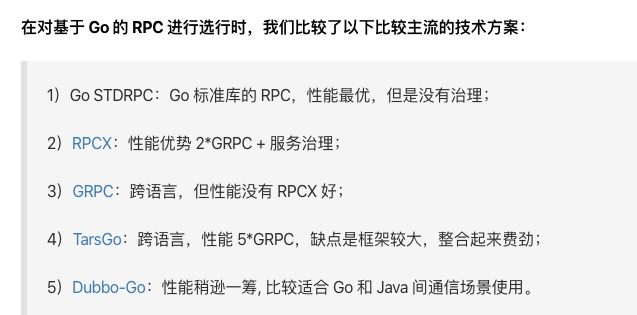
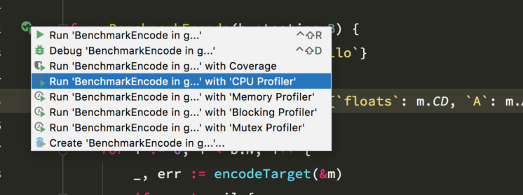
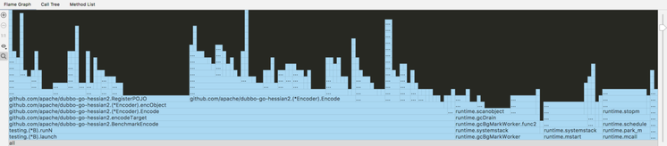
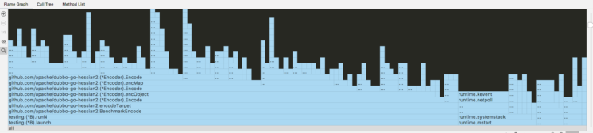
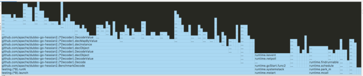
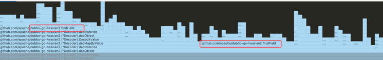
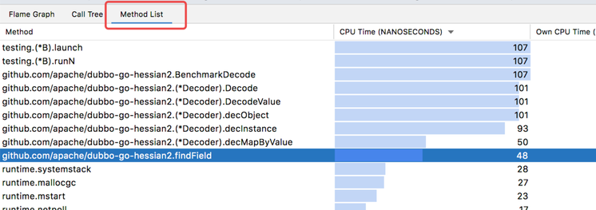
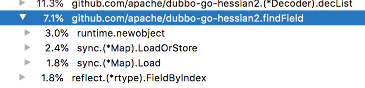

# 记一次对 dubbo-go-hessian2 的性能优化

2020年05月02日

目录

[dubbo-go-hessian2](https://github.com/apache/dubbo-go-hessian2) 是一个用 Go 实现的 hessian 协议 v2.0 版本的序列化库。从项目名称里可以看到主要用在 [dubbo-go](http://github.com/apache/dubbo-go) 这个项目里。hessian 协议作为 dubbo 的默认协议，因此对性能有比较高的要求。

## 立项

譬如有网文 [基于 Go 的马蜂窝旅游网分布式 IM 系统技术实践](https://my.oschina.net/u/4231722/blog/3168223) 把 dubbo-go 与其他 RPC 框架对比如下：



有鉴于此，社区便开始组织部分人力，启动了对 dubbo-go 性能优化【同时也欢迎上文作者到钉钉群 23331795 与我们社区交流】。考察 dubbo-go 的各个组件，大家不约而同地决定首先优化比较独立的 [dubbo-go-hessian2](https://github.com/apache/dubbo-go-hessian2)。

## 起步

在最开始的时候，并没有太想清楚需要做什么，改哪个地方，要优化到何种程度，所以最简单的办法就是看看现状。

首先，写了一个简单的例子，把常见的类型到一个结构体里，然后测一下耗时。

```go
type Mix struct {
    A  int
    B  string
    CA time.Time
    CB int64
    CC string
    CD []float64
    D  map[string]interface{}
}

m := Mix{A: int('a'), B: `hello`}
m.CD = []float64{1, 2, 3}
// 再加一层，使得数据显得复杂一些
m.D = map[string]interface{}{`floats`: m.CD, `A`: m.A, `m`: m} 
```

> 看起来这个结构体跟真实环境里可能不太一样，但是用来分析瓶颈应该是足够了。

然后直接靠 Go Test 写个测试用例：

```go
func BenchmarkEncode(b *testing.B) {
    for i := 0; i < b.N; i++ {
        _, _ = encodeTarget(&m)
    }
}

func BenchmarkDecode(b *testing.B) {
    for i := 0; i < b.N; i++ {
        _, _ = NewDecoder(bytes).Decode()
    }
}
```

> go test -benchmem -run=^$ github.com/apache/dubbo-go-hessian2 -bench "^B" -vet=off -v

得到下面结果：

```plain
BenchmarkEncode-8 89461 11485 ns/op 3168 B/op 122 allocs/op
BenchmarkDecode-8 64914 19595 ns/op 7448 B/op 224 allocs/op
```

**_注：基于 MacBook Pro 2018【主频 Intel Core i7 2.6 GHz】测试。_**

不与同类库作横向比较，仅仅从这个测试结果里的数字上无法得出任何结论。对我们来说更重要的是：它到底慢在哪里。首先想到的手段便是：借助 pprof 生成火焰图，定位 CPU 消耗。

pprof 工具的用法可以参考官网文档。本文测试时直接使用了 Goland 内置 `CPU Profiler` 的测试工具：测试函数左边的 `Run xx with 'CPU Profiler'`。



测试跑完后， Goland 直接显示火焰图如下：



从这个图里可以看到，测试代码大概占用了左边的 70%，右边 30% 是运行时的一些消耗，运行时部分一般包括 gc、schedule 两大块，一般不能直接优化。图上左边可以清晰地看到 `encObject` 里 `RegisterPOJO` 和 `Encode` 各占了小一半。

完成序列化功能的 `Encode` 消耗 CPU 如此之多尚可理解，而直觉上，把类对象进行解析和注册 `RegisterPOJO` 是不应该成为消耗大户的。所以猜测这个地方要么注册有问题，要么有重复注册。

下一步分析，用了一个简单的办法：在这个函数里加日志。然后继续再跑一下 benchmark，可以看到性能瓶颈处：容器读写的地方。

既然知道这里做了许多重复的无用功，就很容易明确优化方法：加缓存。把已经解析过的结果缓存下来，下次需要的时候直接取出使用。改进后的代码简单如下：

```go
if goName, ok := pojoRegistry.j2g[o.JavaClassName()]; ok {
    return pojoRegistry.registry[goName].index
}
```

这里刚开始有个疑问，为什么要分两步先取 `JavaClassName` 再取 `GoName` 而不直接取后者？看起来好像是多此一举了，但其实 `JavaClassName` 是类直接定义的，而 `GoName` 却依赖一次反射。相较之下两次转换的消耗可以忽略了。改完之后再跑一下 benchmark：

```plain
BenchmarkEncode-8 197593   5601 ns/op   1771 B/op   51 allocs/op
```

非常惊讶地看到，吞吐量大概是原来的 200%。与上面的火焰图对比，可以粗略的计算，`RegiserPOJO` 大概占了整体的 30%，改进后应该也只有原来的 `1 / 0.7 * 100% = 140%` 才对。答案也可以在火焰图里找到：



除了 `RegisterPOJO` 被干掉以外，与上图对比，还有哪些区别呢？可以看到，原来占用将近 20% 的 `GC` 也几乎看不到了。所以真实的 CPU 利用率也要加上这部分的增长，大约 `1 / 0.5 * 100% = 200%`。

> 需要提醒的是，benchmark 跑出来的结果并不算稳定，所以你自己压出来的结果跟我的可能不太一致，甚至多跑几次的结果也不完全一样。对于上面的数字你只要理解原因就好，上下浮动 10% 也都是正常范围。 反过来看，这也算是 GC 优化的一个角度。碰到 GC 占用 CPU 过高，除了去一个个换对象池，也可以重点看看那些被频繁调用的模块。当然更科学的方法是看 `pprof heap` / `memory profiler` 。

针对这个结果，可以看到 `encObject` 以上都被切割成了不同的小格子，不再有像 `RegisterPOJO` 那样的大块占用，一般情况下，优化到这里就可以了。

看完了 `Encode` ，再来看看 `Decode` ，方法类似，直接看 Goland 生成的火焰图：



这个图有点迷惑性，好像也被分成差不多的小格子了。可以点开 `decObject` 这一层：



这个时候原来小的 `...` 会显示具体内容，需要注意的是里面有两个 `findField` ，在复杂的调用里经常会遇到这种情况：一个耗资源的函数被分到了许多函数里，导致在看火焰图时并不能直观地看到它就是瓶颈。比较常见的有序列化、日志、网络请求等每个模块都会干一点却又没有一个全局的函数只干他一件事。这个时候除了肉眼去找以外也可以借助于另外一个工具：



在这个 `Method List` 里可以明显看到 `findField` 已经被合并到一起了，总占用接近 CPU 的一半，看到这里你大概就知道它应该是个优化点了。

## 进一步

函数 `func findField(name string, typ reflect.Type) ([]int, error)` 的作用是在一个类型里寻找指定属性的位置（Index，反射包里用它来表示是第几个字段）。很容易想到，对于一个结构体来说，每个字段的位置从一开始就确定了，所以用缓存一样可以解决这个问题。一个简单的优化如下：

```go
func findField(name string, typ reflect.Type) (indexes []int, err error) {
    typCache, _ := _findFieldCache.LoadOrStore(typ, &sync.Map{})
    indexes, _ := typCache.(*sync.Map).Load(name)
    if len(indexes.([]int)) == 0 {
        err = perrors.Errorf("failed to find field %s", name)
    }

    return indexes.([]int), err

    // ...
}
```

```plain
- BenchmarkDecode-8 57723   17987 ns/op 7448 B/op   224 allocs/op
+ BenchmarkDecode-8 82995   12272 ns/op 7224 B/op   126 allocs/op
```

可以看到，结果并不如预期的那样提升一倍效果。这个代码乍看起来，好像除了有一些啰嗦的断言，好像也没别的东西了，为什么只有 60% 的提升呢，我们还是借助下工具



可以看到：读缓存耗费了 7% 的资源。其中，`sync.(*Map)` 不便优化，但 `newobejct` 是哪里来的呢？代码里可以看到，唯一定义新对象的地方就是函数第一行的 `&sync.Map` ，我抱着试一试的心态把 `LoadOrStore` 拆成了两步

```go
typCache, ok := _findFieldCache.Load(typ)
if !ok {
    typCache = &sync.Map{}
    _findFieldCache.Store(typ, typCache)
}
```

```plain
- BenchmarkDecode-8        82995         12272 ns/op        7224 B/op        126 allocs/op
+BenchmarkDecode-8        103876         12385 ns/op        6568 B/op        112 allocs/op
```

看结果，着实出乎意料。想起来以前看 Java 代码时经常碰到这样的代码：

```go
if ( logLevel == `info` ) { 
    log.Info(...) 
}
```

以前一直觉得这个 `if` 真是浪费感情，现在想来，别是一番认知了。如果能提供一个 `LoadOrStore(key, func() interface{})` 的方法， 会不会更好一些？ 到这里的话，我们做了两个比较大的优化，整体性能大约提升了一倍。如果仔细看火焰图，还会发现有很多小的优化点，但是由于没有什么特别质的飞跃，这里不再赘述。有兴趣的小伙伴可以到 [PR Imp: cache in reflection](https://github.com/apache/dubbo-go-hessian2/pull/179) 里阅读相关的讨论。

## 更进一步

优化到此，依然藏着一个更深层次的问题：找一个可靠的参考基准，以衡量目前的工作结果【毕竟没有对比就没有伤害】。一个很容易想到的比较对象是 Go 语言官方的 `json` 标准库。

把 [dubbo-go-hessian2](https://github.com/apache/dubbo-go-hessian2) 与 `json` 标准库做比较如下：

```shell
$ go test -benchmem -run=^$ github.com/apache/dubbo-go-hessian2 -bench "^B" -vet=off -v -count=5
goos: darwin
goarch: amd64
pkg: github.com/apache/dubbo-go-hessian2
BenchmarkJsonEncode
BenchmarkJsonEncode-8  249114   4719 ns/op  832 B/op  15 allocs/op
BenchmarkJsonEncode-8  252224   4862 ns/op  832 B/op  15 allocs/op
BenchmarkJsonEncode-8  240582   4739 ns/op  832 B/op  15 allocs/op
BenchmarkJsonEncode-8  213283   4784 ns/op  832 B/op  15 allocs/op
BenchmarkJsonEncode-8  227101   4665 ns/op  832 B/op  15 allocs/op
BenchmarkEncode
BenchmarkEncode-8  182184   5615 ns/op  1771 B/op  51 allocs/op
BenchmarkEncode-8  183007   5565 ns/op  1771 B/op  51 allocs/op
BenchmarkEncode-8  218664   5593 ns/op  1771 B/op  51 allocs/op
BenchmarkEncode-8  214704   5886 ns/op  1770 B/op  51 allocs/op
BenchmarkEncode-8  181861   5605 ns/op  1770 B/op  51 allocs/op
BenchmarkJsonDecode
BenchmarkJsonDecode-8 123667    8412 ns/op  1776 B/op  51 allocs/op
BenchmarkJsonDecode-8 122796    8497 ns/op  1776 B/op  51 allocs/op
BenchmarkJsonDecode-8 132103    8471 ns/op  1776 B/op  51 allocs/op
BenchmarkJsonDecode-8 130687    8492 ns/op  1776 B/op  51 allocs/op
BenchmarkJsonDecode-8 127668    8476 ns/op  1776 B/op  51 allocs/op
BenchmarkDecode
BenchmarkDecode-8 107775    10092 ns/op  6424 B/op  98 allocs/op
BenchmarkDecode-8 110996    9950 ns/op   6424 B/op  98 allocs/op
BenchmarkDecode-8 111036    10760 ns/op  6424 B/op  98 allocs/op
BenchmarkDecode-8 113151    10063 ns/op  6424 B/op  98 allocs/op
BenchmarkDecode-8 109197    10002 ns/op  6424 B/op  98 allocs/op
PASS
ok      github.com/apache/dubbo-go-hessian2 28.680s
```

虽然每次的结果不稳定，但就整体而言，目前的序列化和反序列化性能大概都是 JSON 标准库的 85% 左右。这个成绩并不能说好，但短期内能花 20 分的精力得到一个 80 分的结果，应该也是可以接受的。至于剩下的 20%，就不是靠改几行代码就能搞定了。内存分配是否合理、执行流程是否有冗余，都是需要一点一滴地去改进。

## 总结

最后，我们来总结一下本文主要的优化步骤：

*   利用火焰图 快速定位消耗 CPU 较高的模块；
*   利用缓存机制，快速消除重复的计算；
*   利用 CallTree、MethodList 等多种工具分析小段代码的精确消耗；
*   遵循二八定律，以最小的成本做出一个效果显著的收益。

### 欢迎加入 dubbo-go 社区

目前 dubbo-go 已经到了一个比较稳定成熟的状态。在接下来的版本里面，我们将集中精力在云原生上。下一个版本，我们将首先实现应用维度的服务注册，这是一个和现有注册模型完全不同的新的注册模型。也是我们朝着云原生努力的一个关键版本。

dubbo-go 钉钉群 **23331795** 欢迎你的加入。

## 作者信息

张慧仁，github id micln，任职 得到 APP 后端开发。