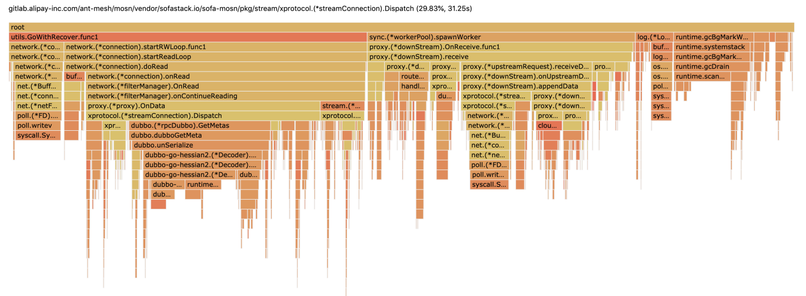
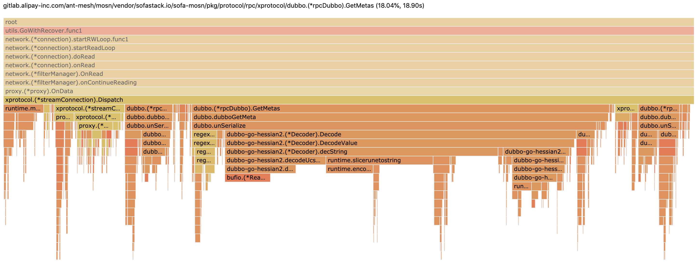
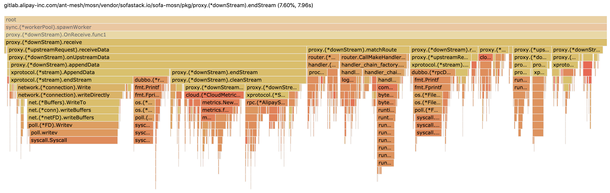
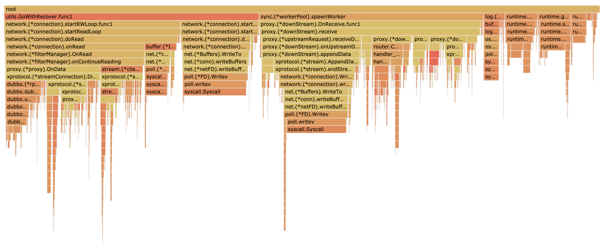

# [记一次在 mosn 对 dubbo、dubbo-go-hessian2 的性能优化](https://gocn.vip/topics/10492)

### 背景

蚂蚁内部对 Service Mesh 的稳定性和性能要求是比较高的，内部 mosn 广泛用于生产环境。在云上和开源社区，RPC 领域 dubbo 和 spring cloud 同样广泛用于生产环境，我们在 mosn 基础上，支持了 dubbo 和 spring cloud 流量代理。我们发现在支持 dubbo 协议过程中，经过 Mesh 流量代理后，性能有非常大的性能损耗，在大商户落地 Mesh 中也对性能有较高要求，因此本文会重点描述在基于 Go 语言库 [dubbo-go-hessian2](https://github.com/apache/dubbo-go-hessian2) 、dubbo 协议中对 [mosn](https://github.com/mosn/mosn) 所做的性能优化。

### 性能优化概述

根据实际业务部署场景，并没有选用高性能机器，使用普通 linux 机器，配置和压测参数如下：

- Intel(R) Xeon(R) Platinum 8163 CPU @ 2.50GHz 4 核 16G 。
- pod 配置 `2c、1g`，JVM 参数 `-server -Xms1024m -Xmx1024m`。
- 网络延迟 0.23 ms, 2 台 linux 机器，分别部署 server + mosn, 压测程序 [rpc-perfomance](https://github.com/zonghaishang/rpc-performance)。

经过 3 轮性能优化后，使用优化版本 mosn 将会获得以下性能收益（框架随机 512 和 1k 字节压测）：

- 512 字节数据：mosn + dubbo 服务调用 TPS 整体提升 55-82.8%，RT 降低 45% 左右，内存占用 40M，
- 1k 数据：mosn + dubbo 服务调用 TPS 整体提升 51.1-69.3%，RT 降低 41%左右, 内存占用 41M。

### 性能优化工具 pprof

磨刀不误砍柴工，在性能优化前首先要找到性能卡点，找到性能卡点后，另一个难点就是如何用高效代码优化替代 slow code。因为蚂蚁 Service Mesh 是基于 go 语言实现的，我们首选 go 自带的 pprof 性能工具，我们简要介绍这个工具如何使用。如果我们 go 库自带 http.Server 时并且在 main 头部导入`import _ "net/http/pprof"`，go 会帮我们挂载对应的 handler , 详细可以参考 [godoc](https://pkg.go.dev/net/http/pprof?tab=doc) 。

因为 mosn 默认会在`34902`端口暴露 http 服务，通过以下命令轻松获取 mosn 的性能诊断文件：

```
go tool pprof -seconds 60 http://benchmark-server-ip:34902/debug/pprof/profile
# 会生成类似以下文件，该命令采样cpu 60秒
# pprof.mosn.samples.cpu.001.pb.gz
```

然后继续用 pprof 打开诊断文件，方便在浏览器查看，在图 1-1 给出压测后 profiler 火焰图：

```
# http=:8000代表pprof打开8000端口然后用于web浏览器分析
# mosnd代表mosn的二进制可执行文件，用于分析代码符号
# pprof.mosn.samples.cpu.001.pb.gz是cpu诊断文件
go tool pprof -http=:8000 mosnd pprof.mosn.samples.cpu.001.pb.gz
```



<center>图 1-1 mosn 性能压测火焰图</center>

在获得诊断数据后，可以切到浏览器 Flame Graph（火焰图，go 1.11 以上版本自带），火焰图的 x 轴坐标代表 CPU 消耗情况， y 轴代码方法调用堆栈。在优化开始之前，我们借助 go 工具 pprof 可以诊断出大致的性能卡点在以下几个方面（直接压 server 端 mosn）：

- mosn 在接收 dubbo 请求，CPU 卡点在 streamConnection.Dispatch
- mosn 在转发 dubbo 请求，CPU 卡点在 downStream.Receive

可以点击火焰图任意横条，进去查看长方块耗时和堆栈明细（请参考图 1-2 和 1-3 所示）：

)

<center>图 1-2 Dispatch 火焰图明细 </center>



<center>图 1-3 Receive 火焰图明细 </center>

### 性能优化思路

本文重点记录优化了哪些 case 才能提升 50%以上的吞吐量和降低 RT，因此后面直接分析当前优化了哪些 case。在此之前，我们以 Dispatch 为例，看下它为甚么那么吃性能 。在 terminal 中通过以下命令可以查看代码行耗费 CPU 数据（代码有删减）：

```go
go tool pprof mosnd pprof.mosn.samples.cpu.001.pb.gz
(pprof) list Dispatch
Total: 1.75mins
     370ms     37.15s (flat, cum) 35.46% of Total
      10ms       10ms    123:func (conn *streamConnection) Dispatch(buffer types.IoBuffer) {
      40ms      630ms    125:	log.DefaultLogger.Tracef("stream connection dispatch data string = %v", buffer.String())
         .          .    126:
         .          .    127:	// get sub protocol codec
         .      250ms    128:	requestList := conn.codec.SplitFrame(buffer.Bytes())
      20ms       20ms    129:	for _, request := range requestList {
      10ms      160ms    134:		headers := make(map[string]string)
         .          .    135:		// support dynamic route
      50ms      920ms    136:		headers[strings.ToLower(protocol.MosnHeaderHostKey)] = conn.connection.RemoteAddr().String()
         .          .    149:
         .          .    150:		// get stream id
      10ms      440ms    151:		streamID := conn.codec.GetStreamID(request)
         .          .    156:		// request route
         .       50ms    157:		requestRouteCodec, ok := conn.codec.(xprotocol.RequestRouting)
         .          .    158:		if ok {
         .     20.11s    159:			routeHeaders := requestRouteCodec.GetMetas(request)
         .          .    165:		}
         .          .    166:
         .          .    167:		// tracing
      10ms       80ms    168:		tracingCodec, ok := conn.codec.(xprotocol.Tracing)
         .          .    169:		var span types.Span
         .          .    170:		if ok {
      10ms      1.91s    171:			serviceName := tracingCodec.GetServiceName(request)
         .      2.17s    172:			methodName := tracingCodec.GetMethodName(request)
         .          .    176:
         .          .    177:			if trace.IsEnabled() {
         .       50ms    179:				tracer := trace.Tracer(protocol.Xprotocol)
         .          .    180:				if tracer != nil {
      20ms      1.66s    181:					span = tracer.Start(conn.context, headers, time.Now())
         .          .    182:				}
         .          .    183:			}
         .          .    184:		}
         .          .    185:
         .      110ms    186:		reqBuf := networkbuffer.NewIoBufferBytes(request)
         .          .    188:		// append sub protocol header
      10ms      950ms    189:		headers[types.HeaderXprotocolSubProtocol] = string(conn.subProtocol)
      10ms      4.96s    190:		conn.OnReceive(ctx, streamID, protocol.CommonHeader(headers), reqBuf, span, isHearbeat)
      30ms       60ms    191:		buffer.Drain(requestLen)
         .          .    192:	}
         .          .    193:}
```

通过上面 `list Dispatch` 命令，性能卡点主要分布在 `159` 、 `171` 、`172` 、 `181` 、和 `190` 等行，主要卡点在解码 dubbo 参数、重复解参数、tracer、发序列化和 log 等。

#### 1. 优化 dubbo 解码 GetMetas

我们通过解码 dubbo 的 body 可以获得以下信息，调用的目标接口（ interface ）和调用方法的服务分组（ group ）等信息，但是需要跳过所有业务方法参数，目前使用开源的 [dubbo-go-hessian2](https://github.com/apache/dubbo-go-hessian2) 库，解析 string 和 map 性能较差, 提升 hessian 库解码性能，会在本文后面讲解。

**优化思路：**

在 mosn 的 ingress 端（ mosn 直接转发请求给本地 java server 进程）, 我们根据请求的 path 和 version 窥探用户使用的 interface 和 group , 构建正确的 dataID 可以进行无脑转发，无需解码 body，榨取性能提升。

我们可以在服务注册时，构建服务发布的 path 、version 和 group 到 interface 、group 映射。在 mosn 转发 dubbo 请求时可以通过读锁查 cache + 跳过解码 body，加速 mosn 性能。

因此我们构建以下 cache 实现（数组 + 链表数据结构）, 可参见 [优化代码 diff](https://github.com/mosn/mosn/pull/1174/commits/9020ee9995cd15a7a4321a375a9506cf94dc70a8#diff-f5ff30debd68b8318c8236a0b5ccde07R6) ：

```go
// metadata.go
// DubboPubMetadata dubbo pub cache metadata
var DubboPubMetadata = &Metadata{}

// DubboSubMetadata dubbo sub cache metadata
var DubboSubMetadata = &Metadata{}

// Metadata cache service pub or sub metadata.
// speed up for decode or encode dubbo peformance.
// please do not use outside of the dubbo framwork.
type Metadata struct {
	data map[string]*Node
	mu   sync.RWMutex // protect data internal
}

// Find cached pub or sub metatada.
// caller should be check match is true
func (m *Metadata) Find(path, version string) (node *Node, matched bool) {
	// we found nothing
	if m.data == nil {
		return nil, false
	}

	m.mu.RLocker().Lock()
	// for performance
	// m.mu.RLocker().Unlock() should be called.

	// we check head node first
	head := m.data[path]
	if head == nil || head.count <= 0 {
		m.mu.RLocker().Unlock()
		return nil, false
	}

	node = head.Next
	// just only once, just return
	// for dubbo framwork, that's what we're expected.
	if head.count == 1 {
		m.mu.RLocker().Unlock()
		return node, true
	}

	var count int
	var found *Node

	for ; node != nil; node = node.Next {
		if node.Version == version {
			if found == nil {
				found = node
			}
			count++
		}
	}

	m.mu.RLocker().Unlock()
	return found, count == 1
}

// Register pub or sub metadata
func (m *Metadata) Register(path string, node *Node) {
	m.mu.Lock()
	// for performance
	// m.mu.Unlock() should be called.

	if m.data == nil {
		m.data = make(map[string]*Node, 4)
	}

	// we check head node first
	head := m.data[path]
	if head == nil {
		head = &Node{
			count: 1,
		}
		// update head
		m.data[path] = head
	}

	insert := &Node{
		Service: node.Service,
		Version: node.Version,
		Group:   node.Group,
	}

	next := head.Next
	if next == nil {
		// fist insert, just insert to head
		head.Next = insert
		// record last element
		head.last = insert
		m.mu.Unlock()
		return
	}

	// we check already exist first
	for ; next != nil; next = next.Next {
		// we found it
		if next.Version == node.Version && next.Group == node.Group {
			// release lock and no nothing
			m.mu.Unlock()
			return
		}
	}

	head.count++
	// append node to the end of the list
	head.last.Next = insert
	// update last element
	head.last = insert
	m.mu.Unlock()
}
```

通过服务注册时构建好的 cache，可以在 mosn 的 stream 做解码时命中 cache , 无需解码参数获取接口和 group 信息，可参见[优化代码 diff](https://github.com/mosn/mosn/pull/1174/commits/9020ee9995cd15a7a4321a375a9506cf94dc70a8#diff-73d1153005841c788c91116915f460a5R188) :

```go
// decoder.go
// for better performance.
// If the ingress scenario is not using group,
// we can skip parsing attachment to improve performance
if listener == IngressDubbo {
	if node, matched = DubboPubMetadata.Find(path, version); matched {
		meta[ServiceNameHeader] = node.Service
		meta[GroupNameHeader] = node.Group
	}
} else if listener == EgressDubbo {
	// for better performance.
	// If the egress scenario is not using group,
	// we can skip parsing attachment to improve performance
	if node, matched = DubboSubMetadata.Find(path, version); matched {
		meta[ServiceNameHeader] = node.Service
		meta[GroupNameHeader] = node.Group
	}
}
```

在 mosn 的 egress 端（ mosn 直接转发请求给本地 java client 进程）, 我们采用类似的思路, 我们根据请求的 path 和 version 去窥探用户使用的 interface 和 group , 构建正确的 dataID 可以进行无脑转发，无需解码 body，榨取性能提升。

#### 2. 优化 dubbo 解码参数

在 dubbo 解码参数值的时候 ，mosn 采用的是 hessian 的正则表达式查找，非常耗费性能。我们先看下优化前后 benchmark 对比, 性能提升 50 倍。

```go
go test -bench=BenchmarkCountArgCount -run=^$ -benchmem
BenchmarkCountArgCountByRegex-12	200000	6236 ns/op	1472 B/op	24 allocs/op
BenchmarkCountArgCountOptimized-12	10000000	124 ns/op	0 B/op	0 allocs/op
```

**优化思路：**

可以消除正则表达式，采用简单字符串解析识别参数类型个数， [dubbo 编码参数个数字符串实现](https://github.com/zonghaishang/dubbo/blob/e0fd702825a274379fb609229bdb06ca0586122e/dubbo-common/src/main/java/org/apache/dubbo/common/utils/ReflectUtils.java#L370) 并不复杂, 主要给对象加 L 前缀、数组加[、primitive 类型有单字符代替。采用 go 可以实现同等解析, 可以参考[优化代码 diff](https://github.com/mosn/mosn/pull/1174/commits/9020ee9995cd15a7a4321a375a9506cf94dc70a8#diff-73d1153005841c788c91116915f460a5R245) ：

```
func getArgumentCount(desc string) int {
	len := len(desc)
	if len == 0 {
		return 0
	}

	var args, next = 0, false
	for _, ch := range desc {

		// is array ?
		if ch == '[' {
			continue
		}

		// is object ?
		if next && ch != ';' {
			continue
		}

		switch ch {
		case 'V', // void
			'Z', // boolean
			'B', // byte
			'C', // char
			'D', // double
			'F', // float
			'I', // int
			'J', // long
			'S': // short
			args++
		default:
			// we found object
			if ch == 'L' {
				args++
				next = true
				// end of object ?
			} else if ch == ';' {
				next = false
			}
		}

	}
	return args
}
```

#### 3. 优化 dubbo hessian go 解码 string 性能

在图 1-2 中可以看到 dubbo hessian go 在解码 string 占比 CPU 采样较高，我们在解码 dubbo 请求时，会解析 dubbo 框架版本、调用 path 、接口版本和方法名，这些都是 string 类型，dubbo hessian go 解析 string 会影响 RPC 性能。

我们首先跑一下 benchmar k 前后解码 string 性能对比，性能提升 56.11%， 对应到 RPC 中有 5% 左右提升。

```
BenchmarkDecodeStringOriginal-12     1967202     613 ns/op     272 B/op     6 allocs/op
BenchmarkDecodeStringOptimized-12     4477216     269 ns/op     224 B/op     5 allocs/op
```

**优化思路：**

直接使用 UTF-8 byte 解码，性能最高，之前先解码 byte 成 rune , 对 rune 解码成 string ，及其耗费性能。增加批量 string chunk copy ，降低 read 调用，并且使用 unsafe 转换 string （避免一些校验），因为代码优化 diff 较多，这里给出[优化代码 PR](https://github.com/apache/dubbo-go-hessian2/pull/188) 。

go SDK 代码`runtime/string.go#slicerunetostring`（ rune 转换成 string ）， 同样是把 rune 转成 byte 数组，这里给了我优化思路启发。

#### 4. 优化 hessian 库编解码对象

虽然消除了 dubbo 的 body 解码部分，但是 mosn 在处理 dubbo 请求时，必须要借助 hessian 去 decode 请求头部的框架版本、请求 path 和接口版本值。但是每次在解码的时候都会创建序列化对象，开销非常高，因为 hessian 每次在创建 reader 的时候会 allocate 4k 数据并 reset。

```
      10ms       10ms     75:func unSerialize(serializeId int, data []byte, parseCtl unserializeCtl) *dubboAttr {
      10ms      140ms     82:	attr := &dubboAttr{}
      80ms      2.56s     83:	decoder := hessian.NewDecoderWithSkip(data[:])
ROUTINE ======================== bufio.NewReaderSize in /usr/local/go/src/bufio/bufio.go
      50ms      2.44s (flat, cum)  2.33% of Total
         .      220ms     55:	r := new(Reader)
      50ms      2.22s     56:	r.reset(make([]byte, size), rd)
         .          .     57:	return r
         .          .     58:}
```

我们可以写个池化内存前后性能对比, 性能提升 85.4% , [benchmark 用例](https://github.com/zonghaishang/dubbo-go-hessian2/blob/9b418c4e2700964f244e6b982855b4e89b45990d/string_test.go#L161) ：

```go
BenchmarkNewDecoder-12	1487685	803 ns/op	4528 B/op	9 allocs/op
BenchmarkNewDecoderOptimized-12	10564024	117 ns/op	128 B/op	3 allocs/op
```

**优化思路：**

在每次编解码时，池化 hessian 的 decoder 对象，新增 NewCheapDecoderWithSkip 并支持 reset 复用 decoder 。

```
var decodePool = &sync.Pool{
    New: func() interface{} {
        return hessian.NewCheapDecoderWithSkip([]byte{})
    },
}

// 在解码时按照如下方法调用
decoder := decodePool.Get().(*hessian.Decoder)
// fill decode data
decoder.Reset(data[:])
hessianPool.Put(decoder)
```

#### 5. 优化重复解码 service 和 methodName 值

xprotocol 在实现 xprotocol.Tracing 获取服务名称和方法时，会触发调用并解析 2 次，调用开销比较大。

```
      10ms      1.91s    171:			serviceName := tracingCodec.GetServiceName(request)
         .      2.17s    172:			methodName := tracingCodec.GetMethodName(request)
```

**优化思路：**

因为在 GetMetas 里面已经解析过一次了，可以把解析过的 headers 传进去，如果 headers 有了就不用再去解析了，并且重构接口名称为一个，返回值为二元组，消除一次调用。

#### 6. 优化 streamID 类型转换

在 go 中将 byte 数组和 streamID 进行互转的时候，比较费性能。

**优化思路：**

生产代码中, 尽量不要使用 fmt.Sprintf 和 fmt.Printf 去做类型转换和打印信息。可以使用 strconv 去转换。

```
   .      430ms    147: reqIDStr := fmt.Sprintf("%d", reqID)
60ms      4.10s    168: fmt.Printf("src=%s, len=%d, reqid:%v\n", streamID, reqIDStrLen, reqIDStr)
```

#### 7. 优化昂贵的系统调用

mosn 在解码 dubbo 的请求时，会在 header 中塞一份远程 host 的地址，并且在 for 循环中获取 remote IP，系统调用开销比较高。

**优化思路：**

```
     50ms      920ms    136:		headers[strings.ToLower(protocol.MosnHeaderHostKey)] = conn.connection.RemoteAddr().String()
```

在获取远程地址时，尽可能在 streamConnection 中 cache 远程 IP 值，不要每次都去调用 RemoteAddr。

#### 8. 优化 slice 和 map 触发扩容和 rehash

在 mosn 处理 dubbo 请求时，会根据接口、版本和分组去构建 dataID ，然后匹配 cluster , 会创建默认 slice 和 map 对象，经过性能诊断，导致不断 allocate slice 和 grow map 容量比较费性能。

**优化思路：**

使用 slice 和 map 时，尽可能预估容量大小，使用 make(type, capacity) 去指定初始大小。

#### 9. 优化 trace 日志级别输出

mosn 中不少代码在处理逻辑时，会打很多 trace 级别的日志，并且会传递不少参数值。

**优化思路：**

调用 trace 输出前，尽量判断一下日志级别，如果有多个 trace 调用，尽可能把所有字符串写到 buf 中，然后把 buf 内容写到日志中，并且尽可能少的调用 trace 日志方法。

#### 10. 优化 tracer、log 和 metrics

在大促期间，对机器的性能要求较高，经过性能诊断，tracer、mosn log 和 cloud metrics 写日志（ IO 操作）非常耗费性能。

**优化思路：**

通过配置中心下发配置或者增加大促开关，允许 API 调用这些 feature 的开关。

```
/api/v1/downgrade/on
/api/v1/downgrade/off
```

#### 11. 优化 route header 解析

mosn 中在做路由前，需要做大量的 header 的 map 访问，比如 IDC、antvip 等逻辑判断，商业版或者开源 mosn 不需要这些逻辑，这些也会占用一些开销。

**优化思路：**

如果是云上逻辑，主站的逻辑都不走。

#### 12. 优化 featuregate 调用

在 mosn 中处理请求时，为了区分主站和商业版路由逻辑，会通过 featuregate 判断逻辑走哪部分。通过 featuregate 调用开销较大，需要频繁的做类型转换和多层 map 去获取。

**优化思路：**

通过一个 bool 变量记录 featuregate 对应开关，如果没有初始化过，就主动调用一下 featuregate。

### 未来性能优化思考

经过几轮性能优化 ，目前看火焰图，卡点都在 connection 的 read 和 write ，可以优化的空间比较小了。但是可能从以下场景中获得收益：

- 减少 connection 的 read 和 write 次数 (syscall) 。
- 优化 IO 线程模型，减少携程和上下文切换等。

作为结束，给出了最终优化后的火焰图 ，大部分卡点都在系统调用和网络读写, 请参考图 1-4。



<center>图 1-4 优化版本 mosn + dubbo 火线图</center>

### 其他

pprof 工具异常强大，可以诊断 CPU、memory、go 协程、tracer 和死锁等，该工具可以参考 [godoc](https://blog.golang.org/pprof)，性能优化参考：

- https://blog.golang.org/pprof

- https://www.cnblogs.com/Dr-wei/p/11742414.html

- https://www.youtube.com/watch?v=N3PWzBeLX2M

### 关于作者

诣极，github ID zonghaishang，Apache Dubbo PMC，目前就职于蚂蚁金服中间件团队，主攻 RPC 和 Service Mesh 方向。 《深入理解 Apache Dubbo 与实战》一书作者。
