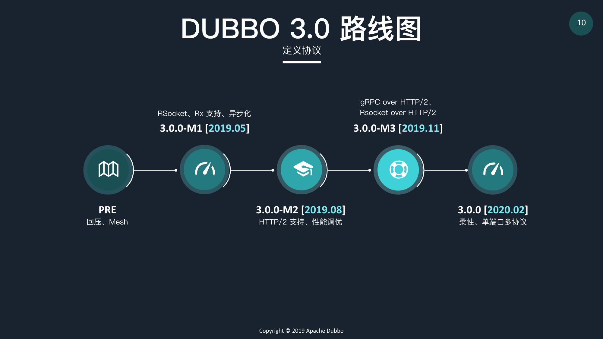
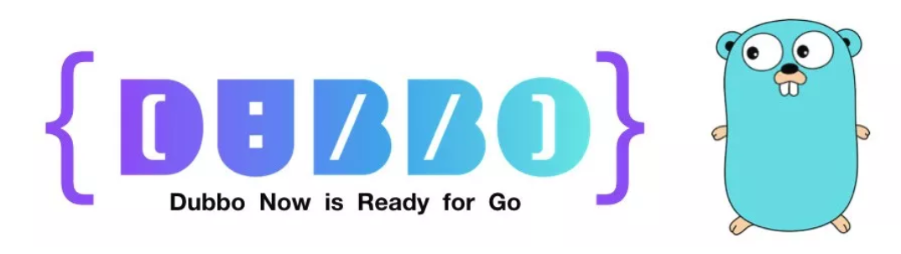

# [冲上云原生，Dubbo 发布 Go 版本](https://www.oschina.net/question/3820517_2306822)

[h4cd](https://my.oschina.net/u/3820517) 发布于 2019/06/02 22:36

5 月 21 日，经过一年多的孵化，Apache Dubbo 从 Apache 软件基金会毕业，成为 Apache 顶级项目。

Dubbo 是阿里于 2011 年开源的一款高性能 RPC 框架，在 Java 生态中具有不小的影响力。当初经历过一段被外界诟病的“停止维护”灰暗时光，后来在 2017 年 Dubbo 浪子回头，官方宣布重新重点维护。

重新启航的 Dubbo 将首要目标定位于重新激活社区，赢回开发者的信任，并且逐渐将 Dubbo 打造成一个国际化与现代化的项目，目前距离宣布重启已经过了一年半的时间。

在这个过程中，Dubbo 发布了多个版本，并逐渐从一个 RPC 框架向微服务生态系统转变，18 年年初 Dubbo 入驻 Apache 软件基金会孵化器，开始以 Apache 之道发展社区。

一年之后，Dubbo 在 Apache 孵化器中发布了重启维护以来的首个里程碑版本 2.7.0，添加了社区呼声很高的异步化支持，以及注册中心与配置中心分离等特性。

这期间 Dubbo 3.0 的开发工作也被提上了日程，今年 4 月中旬，官方正式公布了 Dubbo 3.0 的进度，此版本新特性包括支持 Filter 链的异步化、响应式编程、云原生/Service Mesh 方向的探索，以及与阿里内外融合。

然后，Dubbo 毕业了。**毕业后的 Dubbo 近期有什么消息呢？**生态还在发展，Dubbo 社区在前几日公开了 [Dubbo Roadmap 2019](https://github.com/dubbo/awesome-dubbo/blob/master/slides/meetup/201905@beijing/DUBBO%20ROADMAP%202019.pdf)，计划在 2020 年 2 月份发布 Dubbo 3.0 正式版，感兴趣的同学可以详细查阅。

而最近官方又**宣布 Go 语言加入 Dubbo 生态**，发布了 [dubbo-go 项目](https://github.com/dubbo/go-for-apache-dubbo)。

在此之前 Dubbo 的**跨语言可扩展性**已经有一些实现，支持的语言包括 PHP、Node.js 与 Python，同时也基于标准 Java REST API - JAX-RS 2.0 实现了 REST 的调用支持，具体情况如下：

*   **PHP**：php-for-apache-dubbo，by 乐信，提供客户端和服务端
*   **Node.js**：dubbo2.js，by 千米网，提供客户端
*   **Node.js**：egg-dubbo-rpc，by 蚂蚁金服 egg 团队，提供客户端和服务端
*   **Python** ：py-client-for-apache-dubbo，by 千米网，提供客户端

现在加入了 dubbo-go，Go 开发者也终于可以尝到 Dubbo 的滋味了。据悉，dubbo-go 项目将于**本周完成往 Apache 软件基金会的迁移**，作为 Apache Dubbo 顶级项目的子项目，届时 dubbo-go 项目的新地址也将变为：[https://github.com/apache/dubbo-go](https://github.com/apache/dubbo-go)。

关于项目的研发背景与具体技术细节等相关内容，我们第一时间采访了项目共同发起人，目前在携程基础中台研发部的**何鑫铭**。

**OSCHINA：**dubbo-go 是什么，定位是什么，为什么做这个项目？

**dubbo-go 何鑫铭：** 

**dubbo****\-****go 是** **D****ubbo 的完整 Go 语言实现。**

我们知道 Dubbo 本身基于 Java，很多公司也都以 Java 开发为主，并且使用 Dubbo 作 RPC 或微服务开发框架。

而最近 Go 语言生态发展比较迅速，因其语言优势，我们已经有部门开始尝试使用 Go 开发一些新的项目，就会存在亟需解决的问题：

*   如何实现 Go 项目和 Java & Dubbo 项目的互通？
*   另外，Go 项目本身也有对 RPC 与微服务开发框架的诉求，如何解决？

基于这两个问题，我们携程团队基于 dubbo-go 的早期项目，重构开发了更易于扩展且功能更加完善的 dubbo-go v1.0.0 版本，并贡献回了社区，它**首要目的就是解决 Go 项目与 Java & Dubbo 项目的互通问题，同时****也****为 Go 项目提供****了****一种 RPC** **与微服务开发****框架的选择**。

dubbo-go 提供客户端与服务器端，目前 dubbo-go 社区作为 Dubbo 生态最活跃的社区之一，后面的定位需要配合 Dubbo 官方的要求与社区用户的需求。

**OSCHINA：**我们知道 Dubbo 在 Java 生态上是有非常高的成就的，而目前 Go 生态本身也有一些知名的微服务框架，那 dubbo-go 之于 Go 生态，是否有与其它框架比拼的能力？

**dubbo-go 何鑫铭：**

我们最大的能力就是作为 Dubbo 的 Go 语言版本，打通了两种语言之间的 gap，**让 Dubbo 更加贴近云原生**，为开发者也提供了最大的灵活性，显著降低企业现有服务上云的成本，让企业在云原生时代多了一种选择。

**OSCHINA：**Go 的特性有没有在 dubbo-go 中得到相应的体现？（比如 Go 的高并发是怎么从基于 Java 的 Dubbo 中改造到 dubbo-go 中的？）

**dubbo****\-****go 何鑫铭：**

我对于 Go 语言的认知是，首先学习成本比较小，相比于 Java 的学习成本，Go 语言更容易学习和上手。

其次 Go 在语言层面上，比如其 CSP 编程模型在高并发处理上的简单高效、轻量级协程的优势，相比较基于 JVM 的 Java 程序来说，基于 runtime 的 Go 程序瞬时启动能力等特性都吸引着很多开发者，这里就不详细阐述了。

最后就是作为云原生语言的优势，随着 Docker、k8s 与 Istio 等优秀项目的出现，云原生底层基本被 Go 语言统一了，相信企业在云原生模式下开发的日子已经不远了。我觉得 Go 语言的生态应该会越来越好，也会有越来越多的人使用它。

将基于 Java 的 Dubbo 引入到 Go 中，像前边讲的，dubbo-go 带来的优势就是可以快速融入云原生的领域。要说 Go 语言特性体现的话，可以参考一下 **dubbo****\-****go** **中****异步网络 I/O 模型的设计，这部分将 Go 语言轻量级协程的优势体现了出来**。

这里也说一下 Go 语言不足的地方：

*   Go 相对 Java 来说还是很年轻的语言，没有模板库可用，所以社区在编写并维护Hessian 2 协议库上付出了很高的开发成本；
*   比起 Java 的 try/catch 错误处理方式，Go 的 error 处理能力偏弱；
*   总体生态还是不如 Java，如没有像 Netty 一样的强有力网络 I/O 库。

为什么提到这一点呢，因为 Dubbo 自身使用了 Netty 和 Hessian 2 协议官方 Java 库，而 dubbo-go 在开始做的时候这些都是没有的，这使得 **dubbo****\-****go** **一路走来非常艰辛，但是****社区****最终都****克服了，并且额外贡献了开源的 Getty 和** **H****essian2 项目。**

这里特别感谢 dubbo-go 社区早期的组织者于雨，项目的早期版本是 **2016 年**在其领导胡长城和同事刘畏三支持下开发的，他贡献的 Hessian2 和 Getty 项目，也为最新版本的 dubbo-go 打好了坚实的基础。

**OSCHINA：**前不久 Dubbo 才宣布之后会在 3.0 中强调 Service Mesh ，这就是语言无关的了，那 dubbo-go 还有必要在这时候加入生态吗？

**dubbo****\-****go 何鑫铭：**

Service Mesh 确实是微服务未来发展的的一个大方向，但是现阶段在国内大公司还没有看到非常成功的案例，很多中小公司自身微服务还未拆分完毕甚至于还未开始，目前 dubbo-go 社区优先解决这种类型企业微服务技术落地环节中遇到的问题，专注于补齐相关功能、优化整体性能和解决 bug。至于未来，我相信随着 Dubbo Mesh 在 Service Mesh 领域的探索，dubbo-go 肯定会跟进并扮演重要角色。

**OSCHINA：**dubbo-go 与 Dubbo 的更新关系是怎么样的？是同步更新特性还是有自己的一些创新？

**dubbo****\-****go 何鑫铭：**

我们现在发布的最新版本是 v1.0.0，我们在每一次 release 新的版本后，都会明确说明可以兼容的 Dubbo 版本。所以，dubbo-go 需要兼容对应 Dubbo 版本号的功能，会同步更新一些 Dubbo 特性。

**OSCHINA：**新发布版本带来什么值得关注的特性？

**dubbo****\-****go 何鑫铭：**

当前发布的 v1.0.0 版本支持的功能如下：

*   角色：Consumer(√)、Provider(√)
*   传输协议：HTTP(√)、TCP(√)
*   序列化协议：JsonRPC v2(√)、Hessian v2(√)
*   注册中心：ZooKeeper(√)
*   集群策略：Failover(√)
*   负载均衡：Random(√)
*   过滤器：Echo Health Check(√)
*   extension 扩展机制

dubbo-go v1.0.0 版本，主要由我和同在携程的同事[方银城](https://github.com/fangyincheng)维护，社区成员[周子庆](https://github.com/u0x01)与[高辛格](https://github.com/gaoxinge)参与贡献，该版本**沿用了** **D****ubbo 的代码分层解耦设计**。Dubbo 2.6.x 的主要功能都会逐渐在 dubbo-go 中实现，包括 Dubbo 基于 SPI 的代码拓展机制，dubbo-go 也有对应的 extension 扩展机制与之对应。

我们在未来将逐渐推出目前可扩展模块的更多实现，如补齐更多的 Loadbalance 负载均衡、Cluster Strategy 集群策略实现（目前这些任务由社区伙伴主动认领，希望更多的 Go 语言爱好者朋友可以加入社区贡献）；又如云原生领域非常流行的 k8s，我们也将同步 Dubbo 的 roadmap，跟进 k8s 作为注册中心的支持，目前由社区成员[张海彬](https://github.com/NameHaibinZhang)负责跟进。

当然广大开发者们也可以对这些模块接口进行新的实现，通过 extension 拓展，以完成自己的特殊需求而无需修改源代码。同时，我们非常欢迎开发者为社区贡献有用的拓展实现。

此版本解决了一大重点问题：**与 Dubbo Java 版本互通的解决方案。**我们将这部分提取出了 [Hessi](https://github.com/dubbogo/hessian2)[a](https://github.com/dubbogo/hessian2)[n2](https://github.com/dubbogo/hessian2) 项目，该项目源自社区[于雨](https://github.com/AlexStocks)的早期贡献，现在由社区成员[望哥](https://github.com/wongoo)负责维护，[周子庆](https://github.com/u0x01)与[高辛格](https://github.com/gaoxinge)参与贡献。目前该项目已经完成了对 Java 大部分类型的兼容支持。大家也可以单独将该项目集成到自己的项目中，它的开源协议是 Apache-2.0。

另外一个比较重要的就是 **dubbo****\-****go 现在使用的 TCP 异步网络 I/O 库**，该库也是基于[于雨](https://github.com/AlexStocks)早期写的 [Getty](https://github.com/dubbogo/getty) 项目，目前由社区的[望哥](https://github.com/wongoo)与[方银城](https://github.com/fangyincheng)负责维护，它同样也是 Apache-2.0 的开源协议。下一版本我们**会针对 dubbo****\-****go 和 Getty 的网络 I/O 与线程派发这一部分进行进一步优化****。**

除此之外，我们计划下一步支持 Dubbo 的另外几大重要功能，如：

*   routing rule 路由规则(dubbo v2.6.x)
*   dynamic configuration 动态配置中心(dubbo v2.7.x)
*   metrics 指标与监控(dubbo v2.7.x) 
*   trace 链路监控(dubbo ecos) 

**OSCHINA：**目前项目的应用情况如何？

**dubbo****\-****go 何鑫铭：**

dubbo-go 现在已经开始被一些企业尝试应用于 Go 语言应用融入企业已有 Java & Dubbo 技术栈，以及搭建全新 Go 语言分布式应用等场景。比如中通快递内部 Go 调用 Java Dubbo 服务；作为携程 Go 语言应用的服务框架以及 Go、Java 应用互通。

具体的应用情况可以查看：

*   [https://github.com/dubbo/go-for-apache-dubbo/issues/2](https://github.com/dubbo/go-for-apache-dubbo/issues/2)

**OSCHINA：**接下来的演进方向是怎么样的？

**dubbo****\-****go 何鑫铭：**

在 dubbo-go 迁往 Apache 软件基金会作为 Apache Dubbo 的子项目后，首先最重要的是**性能的进一步优化**，目前性能上虽然能够达到应用的生产级别要求，但我们觉得还没有发挥出 Go 语言的优势，还有比较大的优化空间。比如前边提到的 Getty，下一版本会针对 dubbo-go 应用 Getty 的网络 I/O 模型与线程派发做一些优化。

另外包含上面提到的我们近期需要补全一些重要功能，最大限度地在**功能完整性**上能够跟 Dubbo 兼容。关于未来 dubbo-go 的发展，也会向 Dubbo 2.7.x 版本这条线上的路线图演进。

**OSCHINA：**说到性能，当前性能情况具体如何？

**dubbo****\-****go 何鑫铭：**

我们有做一个 [**dubbo-go-****benchmark**](https://github.com/dubbogo/go-for-apache-dubbo-benchmark) 项目，在 CPU 型号为 Intel(R) Xeon(R) CPU E5-2609 0 @2.40GHz，CPU 核心数为 4\*8 的硬件水平下，发送 1k 并返回 1k 的数据，100 并发数，100w 总请求数，qps 可以达到 1.2 万左右。

CPU 性能换成比较高的配置如 Intel Core i9 2.9GHz，qps 可以到达 2 万左右。

我们后面会对 Hessian2 库和 Getty 库进行持续性能优化，以给广大使用者节约资源。

## **采访嘉宾介绍**

**何鑫铭**，携程基础中台研发部技术专家，dubbo-go 主要作者。目前专注于 Golang & Java、中台架构、中间件与区块链等技术。