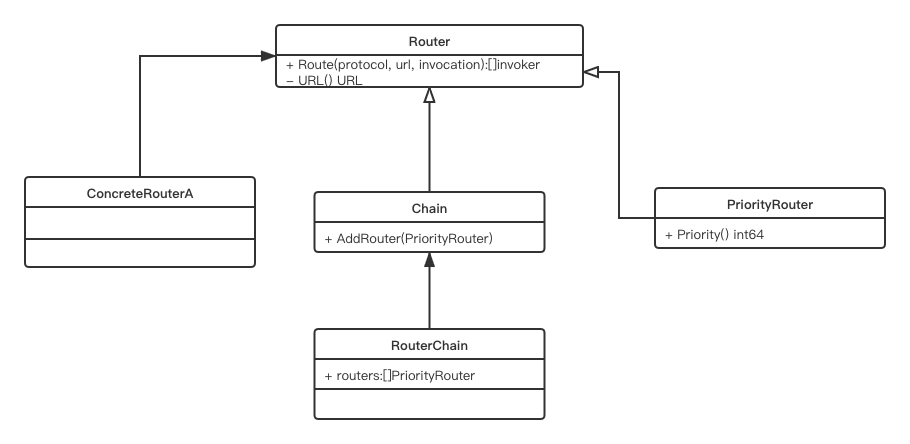
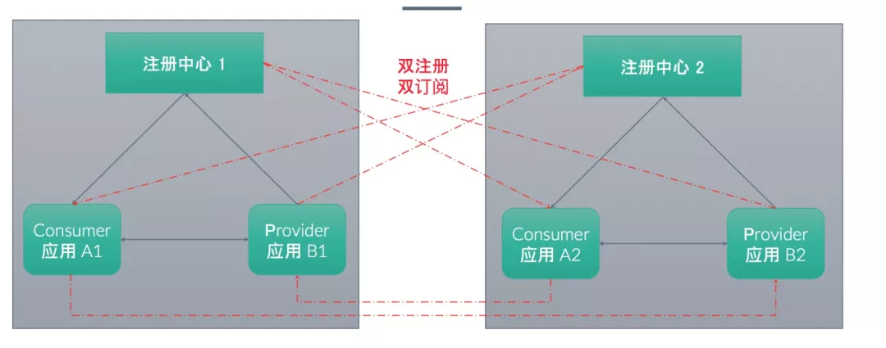
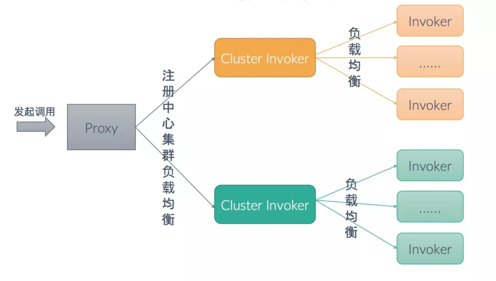

# [Dubbo-go 发布 1.5 版，朝云原生迈出关键一步](https://mp.weixin.qq.com/s/zqRmQ3gsdKj47cO22Dwczw)

## 引语

计算机技术浪潮每 10 年都有一次技术颠覆，相关知识体系最迟每 5 年都会革新一次，大概每两年贬值一半，在应用服务通信框架领域亦然。凡是有长期生命的通信框架，大概有 5 年的成长期和 5 年的稳定成熟期。每个时代都有其匹配的应用通信框架，在 20 年前的 2G 时代，强跨语言跨平台而弱性能的 gRPC 是不会被采用的。

每个通信框架，不同的人从不同角度看出不同的结论：初学者看重易用易学，性能测评者注重性能，应用架构师考虑其维护成本，老板则考虑则综合成本。一个应用通信框架的性能固然重要，其稳定性和进化能力更重要，得到有效维护的框架可在长时间单位内降低其综合成本：学习成本、维护成本、升级成本和更换成本。

什么是 Dubbo-go？第一，它是 Dubbo 的 Go 语言版本，全面兼容 Dubbo 是其第一要义。第二，它是一个 Go 语言应用通信框架，会充分利用作为云原生时代第一语言---Go 语言的优势，扩展 dubbo 的能力。

2008 年诞生的 Dubbo 已有十多年历史，依靠阿里和其社区，历久弥新。2016 年发布的 Dubbo-go 也已进入第五个年头，如今全面兼容 Dubbo v2.7.x 的 Dubbo-go v1.5 终于发布了。

回首过往，Dubbo-go 已经具备如下能力：

- 互联互通：打通了 gRPC 和 Spring Cloud 生态；

- 可观测性：基于 OpenTracing 和 Prometheus，使得其在 Logging、Tracing 和 Metrics 方面有了长足进步；

- 云原生：Dubbo-go 实现了基于 Kubernetes API Server 为注册中心的通信能力，做到了升级成本最低。

毋庸讳言，相较于现有成绩，发展阶段的 Dubbo-go 对未来有更多的期待之处：

- 易用性：Dubbo-go 的入门成本并不低，把很多感兴趣者挡在了门外。但好消息是，随着 Dubbo-go 在阿里内部的逐步推开，阿里中间件团队对其进行了进一步的封装，经生产环境检验后会开放给社区使用。

- 云原生：目前的 Dubbo-go 的基于 kubernetes 的方案，从技术分层角度来看， Kubernetes API Server 终究是系统的运维态组件，不应该暴露给应用层，否则会造成 APIServer 自身通信压力过大，且系统整体风险很高：应用层使用不当，或者框架自身的流量方面的 bug，可能会把 APiServer 打垮，后果就是造成整体后端服务能力的瘫痪！所以应用层需要感知的是 kubernetes 提供给应用层的 Operator，不断进化的 Dubbo-go 计划在 v1.6 版本中发布 Dubbo-go Operator。

雄关漫道真如铁，而今迈步从头越。Dubbo-go 社区【钉钉群 23331795】与 Dubbo-go 同在。

## 应用维度注册模型

经过一段时间的努力之后，我们终于完成了应用维度的服务注册与发现。和原本已有的接口维度的注册模型比起来，新的注册模型有两个突出特点：

- 1.和主流的注册模型保持一致。目前的主流做法都是按照应用为基本单位来进行注册的，如 Spring Cloud。在支持应用维度注册之后，对于接下来的云原生支持，奠定了基础；

- 2.大幅度减轻对注册中心的压力。在该模型之下，从注册中心的视角看过去，集群规模只和实例数量成正比，而不是现有的和服务数量成正比；

当然，我们在设计的时候就考虑到了用户的迁移成本。要迁移到新的注册模型，只需要将现有使用的注册中心换成新的 `ServiceDiscoveryRegistry` 就可以。

ServiceDiscoveryRegistry 是支持多种实现的。目前来说，我们支持：

- nacos;

- etcd;

- zookeeper;

我们提倡新上线的业务尽量使用 nacos 和 etcd 这种更可靠稳定的注册中心。

## Metadata Report 元数据中心

v1.5 版本在支持应用维度注册模型时，有很重要的一个问题需要解决，即接口维度的元数据存储。服务维度的注册模型和应用维度的注册模型，本质的区别是往注册中心注册的数据维度的不一致。虽然我们在应用维度注册模型中，将接口维度的数据从注册中心中剔除了，但是在 rpc 的框架中，一个 consumer 要想真正找到想要调用的服务地址，就必须得到 provider 端开放的服务信息。这部分数据，在 v1.5 版本中，我们将它们存储到了元数据中心中。

元数据中心，是一个接口定义。泛指一块存储区域，可以对接口级别的元数据进行存储、读取，provider 端调用存储，consumer 端调用读取。元数据中心中的数据需要保持准确性、实时性。

目前元数据中心，有两个父类（Go 中没有继承，此处说的父子类，单纯指子类对父类的组合关系）实现，一个是 local 实现，一个是 remote 实现。local 实现是将 provider 的内存作为虚拟元数据中心，remote 实现是指依赖 ZooKeeper、etcd、nacos 等注册中心作为元数据中心。目前 remote 有 zookeeper、nacos、etcd 和 consul 的子类实现。即用户可以将元数据信息，通过以上的第三方注册中心进行数据存储和分发。

## Invocation 接口支持 attribute 属性

invocation 结构中新增 attribute 属性支持，用于流程内部的属性存储。和 attachment 不同点在于，attachment 会从 consumer 传递到 provider，但 attribute 属性不会。

## k8s 注册中心

在 v1.5 版本之前，k8s 注册中心的实现是通过直接使用 k8s client 中 Pod 对象的 List&&Watch 接口。在本次迭代中引入了 k8s informer。这样做的原因在于两点，首先一定的程度上来讲 dubbo-go 的 k8s 注册中心也是一个 k8s controller，使用 informer 的模式更加 k8s native。更重要的是社区计划后续向 CRD+Operator 的模式演进，informer 模式是对后续的演进的探索。除了这个铺垫之外，本次迭代还对跨 namespace 的服务发现做了支持。再有就是为了减少对 kube-apiserver List&&Watch 的压力，对 provider 和 consumer 的行为进行了区分，provider 不再进行 Watch 而仅对 kube-apiserver 进行写操作。

## 优化路由模型

在 1.5 版本之前，Router 模型中属性是包含：优先级与路由属性，Router Chain 只包含路由属性。从中能识别出其实 Router Chain 也是一种特殊 Router。1.5 版本之后，使 Router 更抽象，分离出其优先级属性，新增 Priority Router、Chain 继承 Router 使其变为特殊的 Router，使关系上看起来更加清晰。如下图：

## 回顾与展望

Dubbo-go 处于一个比较稳定成熟的状态。目前新版本正处于往云原生方向的尝试，应用服务维度注册是首先推出的功能，这是一个和之前模型完全不一样的新注册模型。该版本是我们朝云原生迈进新一步的关键版本。除此之外，包含在该版本也有一些之前提到的优化。

下一个版本 v1.5.1，虽然仍是以兼容 Dubbo 2.7.x 为主要任务，但在分布式能力的增强上，也是我们关注的重点。

在分布式事务方面，有一个重要的基于 Seata 扩展实现。通过增加过滤器，在服务端接收 xid 并结合 seata-golang[2] 达到支持分布式事务的目的。 从而使 Dubbo-go 在分布式场景下，让用户有更多的选择，能适应更多的个性化场景。

与此同时，在传输链路安全性上，TLS 安全传输链路是该版本重要功能之一。通过提供统一入口，未来能引入更多的与传输链路安全性相关的功能，适应用户不一样的使用场景。

注册中心模型上，支持多注册中心集群负载均衡。业务部署假设是双注册中心（图 1 ），从原来双注册中心中所有 Provider 一起选址。优化成选址时的多了一层注册中心集群间的负载均衡（图 2 ）。

（图 1 ）

（图 2 ）

以前的 dubbo-go RPC 层直接复用了 getty 框架 的 RPC[3]，未能实现协议和应用通信地址的隔离。阿里中间件展图同学重构了 dubbo-go RPC 层，实现了连接复用：可以实现 consumer 与 provider 端的同一个 TCP 连接上进行多协议通信。相关 PR 业已合并，会在 dubbo-go v1.5.1 中发布。

目前下一个版本正在紧锣密鼓的开发中，具体规划及任务清单[1] ，都已经在 Github 上体现。

[1] : https://github.com/apache/dubbo-go/projects/8

[2] : https://github.com/seata-golang/seata-golang

[3]: https://github.com/AlexStocks/getty/tree/master/rpc
