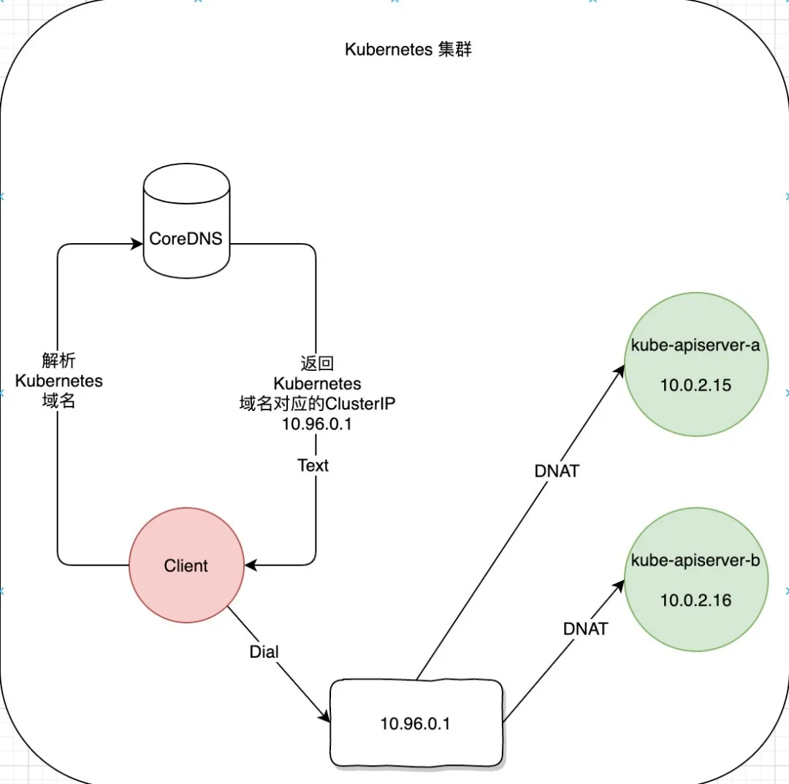
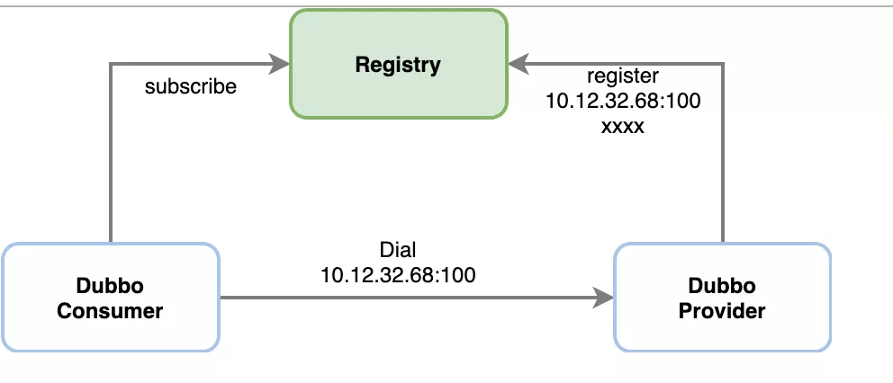
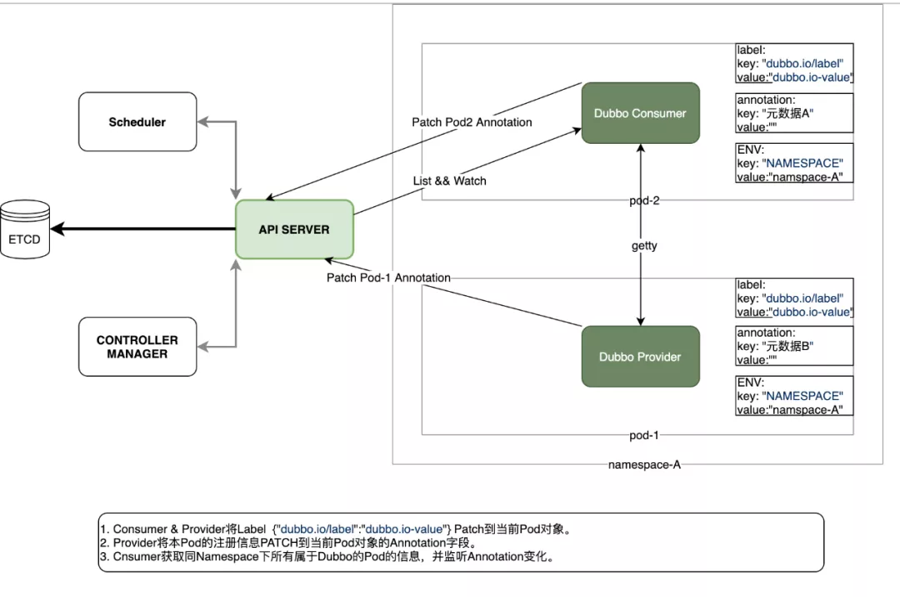

# [dubbo-go K8s 注册中心的设计方案与实现](https://mp.weixin.qq.com/s/j6CIZpMrSk4VO27viUlDrg)

> 随着云原生的推广，越来越多的公司或组织将服务容器化，并将容器化后的服务部署在 K8s 集群中。

- 今天这篇文章将会介绍 dubbo-go 将 K8s 作为服务注册中心的方案设计，以及具体实现。到目前为止该方案的实现已经被合并到 dubbo-go 的 master 分支。具体实现为关于 Kubernetes 的 PullRequest 。
  Kubernetes 的 PullRequest：
  https://github.com/apache/dubbo-go/pull/400

## K8s 管理资源的哲学

K8s 作为容器集群化管理方案可以将管理资源的维度可主观的分为服务实例管理和服务接入管理。

1. 服务实例管理，主要体现方式为 Pod 设计模式加控制器模式。控制器保证具有特定标签（Label）的 Pod 保持在恒定的数量（多删，少补）。

2. 服务接入管理，主要为 Service ，该 Service 默认为具有特定标签（Label）的一批 Pod 提供一个 VIP（ClusterIP）作为服务的接入点，默认会按照 round-robin 的负载均衡策略将请求转发到真正提供服务的 Pod 。并且 CoreDNS 为该 Service 提供集群内唯一的域名。

## K8s 服务发现模型

为了明确 K8s 在服务接入管理提供的解决方案，我们以 kube-apiserver 提供的 API(HTTPS) 服务为例。K8s 集群为该服务分配了一个集群内有效的 ClusterIP ，并通过 CoreDNS 为其分配了唯一的域名 kubernetes 。如果集群内的 Pod 需要访问该服务时直接通过 https://kubernetes:443 即可完成。



具体流程如上图所示(红色为客户端，绿色为 kube-apiserver )：

1. 首先客户端通过 CoreDNS 解析域名为 Kubernetes 的服务获得对应的 ClusterIP 为 10.96.0.1 。

2. 客户端向 10.96.0.1 发起 HTTPS 请求。

3. HTTPS 之下的 TCP 连接被 kube-proxy 创建的 iptables 的 PREROUTING 链拦截并 DNAT 为 10.0.2.16 或 10.0.2.15 。

4. Client 与最终提供服务的 Pod 建立连接并交互。

由此可见，K8s 提供的服务发现为域名解析级别。

## Dubbo 服务发现模型

同样为了明确 Dubbo 服务发现的模型，以一个简单的 Dubbo-Consumer 发现并访问 Provider 的具体流程为例。

具体流程如上图所示：

1.Provider 将本进程的元数据注册到 Registry 中，包括 IP，Port，以及服务名称等。
2.Consumer 通过 Registry 获取 Provider 的接入信息，直接发起请求。

由此可见，Dubbo 当前的服务发现模型是针对 Endpoint 级别的，并且注册的信息不只 IP 和端口还包括其他的一些元数据。

## K8s service vs dubbo-go 服务

通过上述两个小节，答案基本已经比较清晰了。总结一下，无法直接使用 K8s 的服务发现模型的原因主要为以下几点:

1.K8s 的 Service 标准的资源对象具有的服务描述字段 中并未提供完整的 Dubbo 进程元数据字段因此，无法直接使用该标准对象进行服务注册与发现。
2.dubbo-go 的服务注册是基于每个进程的，每个 Dubbo 进程均需进行独立的注册。
3.K8s 的 Service 默认为服务创建 VIP ，提供 round-robin 的负载策略也与 Dubbo-go 自有的 Cluster 模块的负载策略形成了冲突。

## Dubbo-go 当前的方案

### 服务注册

K8s 基于 Service 对象实现服务注册/发现。可是 dubbo 现有方案为每个 dubbo-go 进程独立注册，因此 dubbo-go 选择将该进程具有的独有的元数据写入运行该 dubbo-go 进程的 Pod 在 K8s 中的 Pod 资源对象的描述信息中。

每个运行 dubbo 进程的 Pod 将本进程的元数据写入 Pod 的 Annotations 字段。为了避免与其他使用 Annotations 字段的 Operator 或者其他类型的控制器（istio）的字段冲突。

dubbo-go 使用 Key 为 dubbo.io/annotation value 为具体存储的 K/V 对的数组的 json 编码后的 base64 编码。

样例为：

```yaml
apiVersion: v1
kind: Pod
metadata:
  annotations:
    dubbo.io/annotation: W3siayI6Ii9kdWJibyIsInYiOiIifSx7ImsiOiIvZHViYm8vY29tLmlrdXJlbnRvLnVzZXIuVXNlclByb3ZpZGVyIiwidiI6IiJ9LHsiayI6Ii9kdWJiby9jb20uaWt1cmVudG8udXNlci5Vc2VyUHJvdmlkZXIvY29uc3VtZXJzIiwidiI6IiJ9LHsiayI6Ii9kdWJibyIsInYiOiIifSx7ImsiOiIvZHViYm8vY29tLmlrdXJlbnRvLnVzZXIuVXNlclByb3ZpZGVyIiwidiI6IiJ9LHsiayI6Ii9kdWJiby9jb20uaWt1cmVudG8udXNlci5Vc2VyUHJvdmlkZXIvcHJvdmlkZXJzIiwidiI6IiJ9LHsiayI6Ii9kdWJiby9jb20uaWt1cmVudG8udXNlci5Vc2VyUHJvdmlkZXIvY29uc3VtZXJzL2NvbnN1bWVyJTNBJTJGJTJGMTcyLjE3LjAuOCUyRlVzZXJQcm92aWRlciUzRmNhdGVnb3J5JTNEY29uc3VtZXJzJTI2ZHViYm8lM0RkdWJib2dvLWNvbnN1bWVyLTIuNi4wJTI2cHJvdG9jb2wlM0RkdWJibyIsInYiOiIifV0=
```

### 服务发现

依赖 kube-apiserver 提供了 WATCH 的功能。可以观察特定 namespace 内各 Pod 对象的变化。dubbo-go 为了避免 dubbo-go 进程 WATCH 到与 dubbo-go 进程无关的 Pod 的变化， dubbo-go 将 WATCH 的条件限制在当前 Pod 所在的 namespace ，以及仅 WATCH 具有 Key 为 dubbo.io/label Value 为 dubbo.io-value 的 Pod 。在 WATCH 到对应 Pod 的变化后实时更新本地 Cache ，并通过 Registry 提供的 Subscribe 接口通知建立在注册中心之上的服务集群管理其他模块。

### 总体设计图


具体流程如上图所示：

1.启动 dubbo-go 的 Deployment 或其他类型控制器使用 K8s Downward-Api 将本 Pod 所在 namespace 通过环境变量的形式注入 dubbo-go 进程。

2.Consumer/Provider 进程所在的 Pod 启动后通过环境变量获得当前的 namespace 以及该 Pod 名称， 调用 kube-apiserver PATCH 功能为本 Pod 添加 Key 为 dubbo.io/label Value 为 dubbo.io-value 的 label。

3.Consumer/Provider 进程所在的 Pod 启动后调用 kube-apiserver 将本进程的元数据通过 PATCH 接口写入当前 Pod 的 Annotations 字段。

4.Consumer 进程通过 kube-apiserver LIST 当前 namespace 下其他具有同样标签的 Pod ，并解码对应的 Annotations 字段获取 Provider 的信息。

5.Consumer 进程通过 kube-apiserver WATCH 当前 namespace 下其他具有同样 label 的 Pod 的 Annotations 的字段变化，动态更新本地 Cache 。

## 总结

K8s 已经为其承载的服务提供了一套服务发现，服务注册，以及服务集群管理机制。而 dubbo-go 的同时也拥有自成体系的服务集群管理。这两个功能点形成了冲突，在无法调谐两者的情况， dubbo-go 团队决定保持 dubbo 自有的服务集群管理系，而选择性的放弃了 Service 功能，将元数据直接写入到 Pod 对象的 Annotations 中。

当然这只是 dubbo-go 在将 K8s 作为服务注册中心的方案之一，后续社区会以更加“云原生”的形式对接 K8s ，让我们拭目以待吧。

dubbo-go 社区钉钉群 :23331795 ,欢迎你的加入。

- 作者信息：

  王翔，GithubID: sxllwx，就职于成都达闼科技有限公司，golang 开发工程师。
