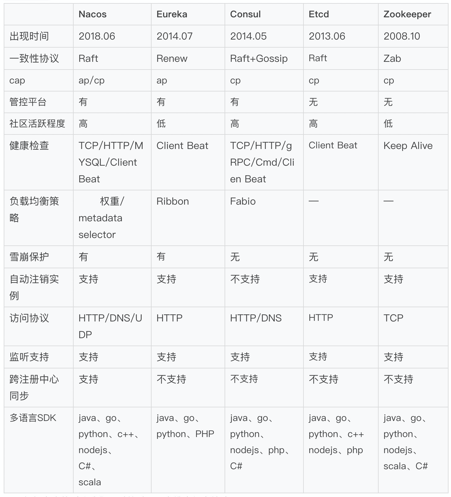
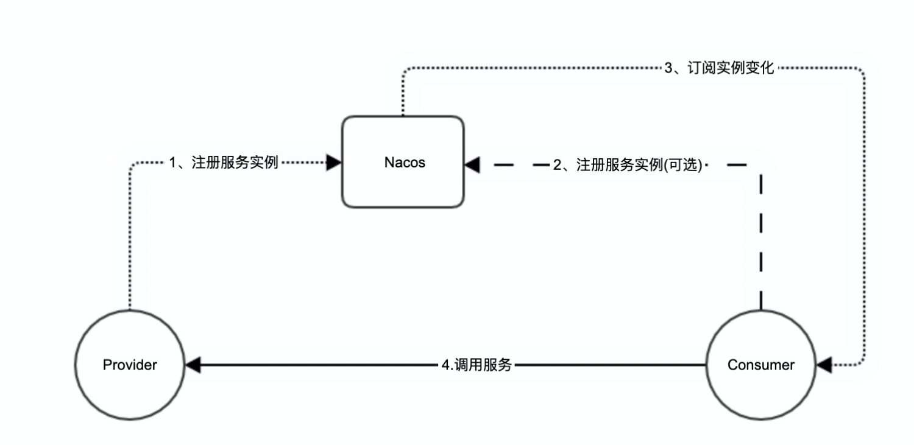
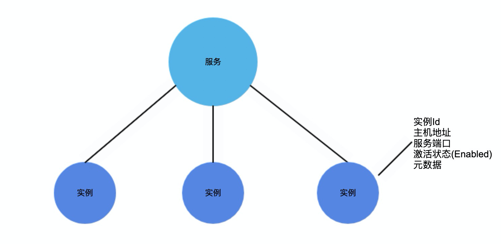
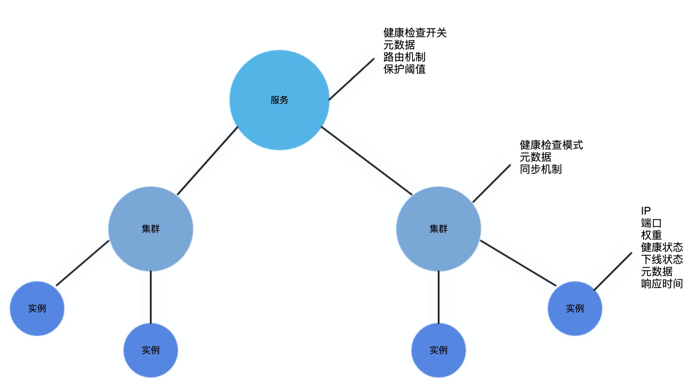
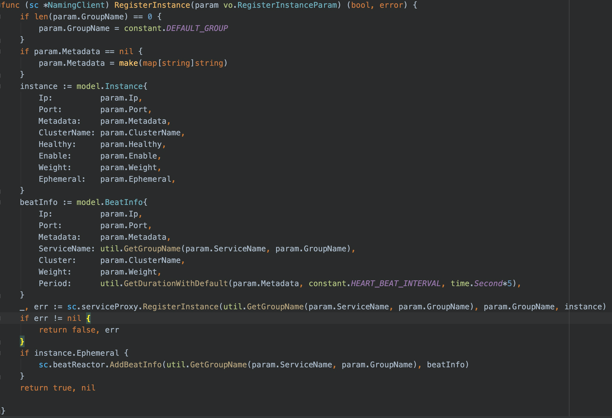
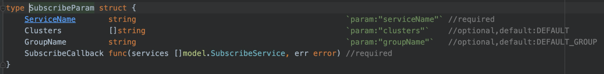
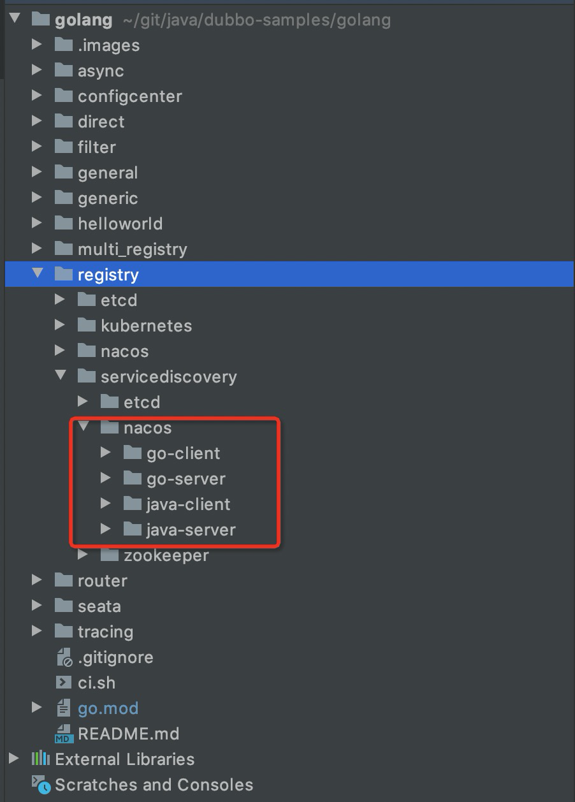
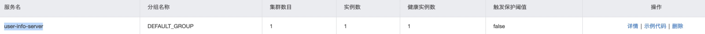
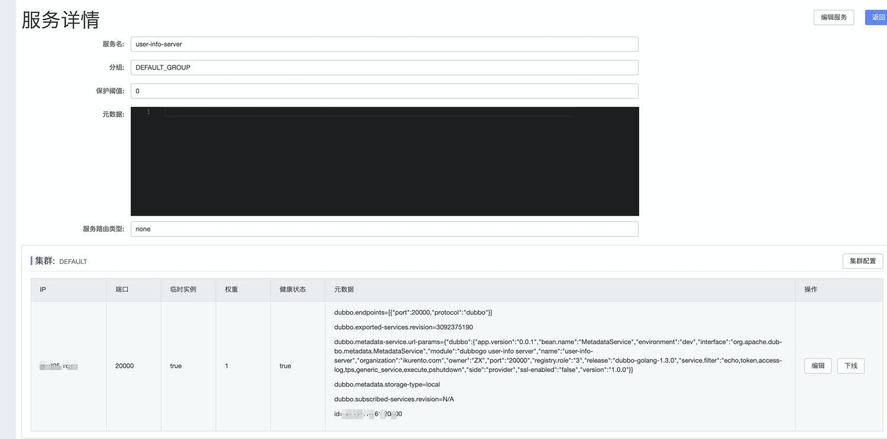
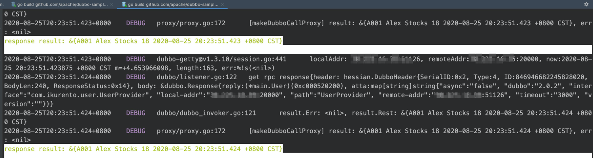

# [解构 Dubbo-go 的核心注册引擎 Nacos](https://my.oschina.net/dubbogo/blog/4608576)

近几年，随着Go语言社区逐渐发展和壮大，越来越多的公司开始尝试采用Go搭建微服务体系，也涌现了一批Go的微服务框架，如go-micro、go-kit、Dubbo-go等，跟微服务治理相关的组件也逐渐开始在Go生态发力，如Sentinel、Hystrix等都推出了Go语言版本，而作为微服务框架的核心引擎--注册中心，也是必不可缺少的组件，市面已经有多款注册中心支持Go语言，应该如何选择呢？我们可以对目前主流的支持Go语言的注册中心做个对比。



根据上表的对比我们可以从以下几个维度得出结论：

*   生态:各注册中心对Go语言都有支持，但是Nacos、 Consul、Etcd 社区活跃，zookeeper和Eureka社区活跃度较低；
*   易用性：Nacos、Eureka、Consul都有现成的管控平台，Etcd、zookeeper本身作为kv存储，没有相应的管控平台，Nacos支持中文界面，比较符合国人使用习惯；
*   场景支持：CP模型主要针对强一致场景，如金融类，AP模型适用于高可用场景，Nacos可以同时满足两种场景，Eureka主要满足高可用场景，Consul、Zookeepr、Etcd主要满足强一致场景，此外Nacos支持从其它注册中心同步数据，方便用户注册中心迁移；
*   功能完整性：所有注册中心都支持健康检查，Nacos、Consul支持的检查方式较多，满足不同应用场景，Zookeeper通过keep alive方式，能实时感知实例变化；Nacos、Consul和Eureka都支持负载均衡策略，Nacos通过Metadata selector支持更灵活的策略；此外，Nacos、Eureka都支持雪崩保护，避免因为过多的实例不健康对健康的实例造成雪崩效应。

综合上面各维度的对比，可以了解到Nacos作为注册中心有一定的优势，那么它对Go微服务生态的集成做得如何？接下来我们首先探索下Nacos是如何与Dubbo-go集成。

# 引言

Dubbo-go目前是Dubbo多语言生态中最火热的一个项目，从2016年发布至今，已经走过5个年头。最近，Dubbo-go发布了v1.5版本，全面兼容Dubbo 2.7.x版本，支持了应用维度的服务注册与发现，和主流的注册模型保持一致，标志着Dubbo-go向云原生迈出了关键的一步。作为驱动服务运转的核心引擎--注册中心，在切换到应用维度的注册模型后，也需要做相应的适配，本文将解析如何以Nacos为核心引擎实现应用维度的服务注册与发现，并且给出相应的实践案例。此外，本文代码基于Dubbo-go v1.5.1，Nacos-SDK-go v1.0.0和Nacos v1.3.2。

# 服务注册与发现架构

从架构中，我们可以看到，与接口级别的服务注册发现不同的是，Dubbo-go的provider启动后会调用Nacos-go-sdk的RegisterInstance接口向Nacos注册服务实例，注册的服务名即为应用名称，而不是接口名称。Conusmer启动后则会调用Subscribe接口订阅该应用的服务实例变化，并对的实例发起服务调用。



# 服务模型

图3是我们Dubbo-go的应用维度服务发现模型，主要有服务和实例两个层级关系，服务实例的属性主要包含实例Id、主机地址、服务端口、激活状态和元数据。图4为Nacos的服务分级存储模型，包含服务、集群和实例三个层次。两者对比，多了一个集群维度的层级，而且实例属性信息能够完全匹配。所以在Dubbo-go将应用服务实例注册到Nacos时，我们只需要将集群设置为默认集群，再填充服务和实例的相关属性，即可完成服务模型上的匹配。此外Nacos可以将服务注册到不同的Namespace下，实现多租户的隔离。 



# 服务实例心跳维持

Dubbo-go的Provider在向Nacos注册应用服务实例信息后，需要主动上报心跳，让Nacos服务端感知实例的存活与否，以判断是否将该节点从实例列表中移除。维护心跳的工作是在Nacos-SDK-go完成的，从图5代码中可以看到，当Dubbo-go调用RegisterInstance注册一个服务实例时，SDK除了调用Nacos的Register API之外，还会调用AddBeatInfo，将服务实例信息添加到本地缓存，通过后台协程定期向Nacos发送服务实例信息，保持心跳。当服务下线时，可以通过调用DeRegisterInstance执行反注册，并移除本地的心跳保持任务，Nacos实例列表中也会将该实例移除。



# 订阅服务实例变化

Dubbo-go的Consumer在启动的时候会调用Nacos-SDK-go的Subscribe接口，该接口入参如图6，订阅的时候只需要传递ServiceName即应用名和回调函数SubscribeCallback，Nacos在服务实例发生变化的时候即可通过回调函数通知Dubbo-go。Nacos-SDK-go是如何感知Nacos的服务实例变化的呢？主要有两种方式：

*   Nacos服务端主动推送，Nacos-SDK-go在启动的时候会监听一个UDP端口，该端口在调用Nacos Register API的时候作为参数传递，Nacos会记录Ip和端口，当服务实例发生变化时，Nacos会对所有监听该服务的Ip和端口发送UDP请求，推送变化后的服务实例信息。
    
*   Nacos-SDK-go定期查询，SDK会对订阅的服务实例定时调用查询接口，如果查询有变化则通过回调接口通知Dubbo-go。作为兜底策略保证Nacos服务端推送失败后，仍能感知到变化。
    
    
    

此外Nacos-SDK-go还支持推空保护，当Nacos推送的实例列表为空时，不更新本地缓存，也不通知Dubbo-go变更，避免Consumer无可用实例调用，造成故障。同时，SDK还支持服务实例信息本地持久化存储，可以保证在Nacos服务故障过程中，Consumer重启也能获取到可用实例，具备容灾效果。

# 范例实践

## 环境准备

dubbo-go samples代码下载：[https://github.com/apache/dubbo-samples/tree/master/golang，基于Nacos注册中心的应用级服务发现的hello](https://github.com/apache/dubbo-samples/tree/master/golang%EF%BC%8C%E5%9F%BA%E4%BA%8ENacos%E6%B3%A8%E5%86%8C%E4%B8%AD%E5%BF%83%E7%9A%84%E5%BA%94%E7%94%A8%E7%BA%A7%E6%9C%8D%E5%8A%A1%E5%8F%91%E7%8E%B0%E7%9A%84hello) world代码目录在 registry/servicediscovery/nacos。



Nacos服务端搭建，参考官方文档：[https://nacos.io/zh-cn/docs/quick-start.html，或者使用官方提供的公共Nacos服务：http://console.nacos.io/nacos(账号密码:nacos，仅供测试)，或者购买阿里云服务：https://help.aliyun.com/document\_detail/139460.html?spm=a2c4g.11186623.6.559.d7e264b7bLpZIs](https://nacos.io/zh-cn/docs/quick-start.html%EF%BC%8C%E6%88%96%E8%80%85%E4%BD%BF%E7%94%A8%E5%AE%98%E6%96%B9%E6%8F%90%E4%BE%9B%E7%9A%84%E5%85%AC%E5%85%B1Nacos%E6%9C%8D%E5%8A%A1%EF%BC%9Ahttp://console.nacos.io/nacos(%E8%B4%A6%E5%8F%B7%E5%AF%86%E7%A0%81:nacos%EF%BC%8C%E4%BB%85%E4%BE%9B%E6%B5%8B%E8%AF%95)%EF%BC%8C%E6%88%96%E8%80%85%E8%B4%AD%E4%B9%B0%E9%98%BF%E9%87%8C%E4%BA%91%E6%9C%8D%E5%8A%A1%EF%BC%9Ahttps://help.aliyun.com/document_detail/139460.html?spm=a2c4g.11186623.6.559.d7e264b7bLpZIs)

## Server端搭建

进入registry/servicediscovery/nacos/go-server/profiles文件，可以看到有dev、release和test三个文件夹，分别对应开发、测试和生产配置。我们使用dev配置来搭建开发环境，dev文件下有log.yml和server.yml文件，下面对server.yml配置进行修改。

remote配置，这里使用公共的Nacos服务，address支持配置多个地址，用逗号分割。params参数配置nacos-sdk的日志目录。

```Yaml
remote:
  nacos:
    address: "console.nacos.io:80"
    timeout: "5s"
    params:
        logDir: "/data/nacos-sdk/log"
configCenter配置
config_center:
  protocol: "nacos"
  address: "console.nacos.io:80"
```

配置server端环境变量

```Bash
export CONF_PROVIDER_FILE_PATH=server端的server.yml文件路径
export APP_LOG_CONF_FILE=server端的log.yml文件路径
```

进入registry/servicediscovery/nacos/go-server/app，运行server.go的main方法，可以从Nacos的控制台（[http://console.nacos.io/nacos/#/serviceManagement?dataId=&group=&appName=&namespace=）](http://console.nacos.io/nacos/#/serviceManagement?dataId=&group=&appName=&namespace=%EF%BC%89)

看到，应用user-info-server已经注册成功。





## Client端搭建

client的配置文件在registry/servicediscovery/nacos/go-server/profiles目录下，需要修改的地方跟server端一样，这里不赘述。

配置client端环境变量

```Bash
export CONF_CONSUMER_FILE_PATH=client端的server.yml文件路径
export APP_LOG_CONF_FILE=client端的log.yml文件路径
```

进入registry/servicediscovery/nacos/go-client/app，运行client.go的main方法，看到如下日志输出，表示调用server端成功。



作者：李志鹏

Github账号：Lzp0412，Nacos-SDK-go作者，Apache/Dubbo-go Contributor。现就职于阿里云云原生应用平台，主要参与服务发现、CoreDNS、ServiceMesh相关工作，负责推动Nacos Go微服务生态建设。

相关链接 Nacos-SDK-go项目地址：[https://github.com/nacos-group/nacos-sdk-go](https://github.com/nacos-group/nacos-sdk-go) Nacos golang生态交流群：23191211 Nacos项目地址：[https://nacos.io/](https://nacos.io/) Nacos社区交流群：30438813

Dubbo-go 项目地址：[https://github.com/apache/dubbo-go](https://github.com/apache/dubbo-go) Dubbo-go社区交流群：23331795