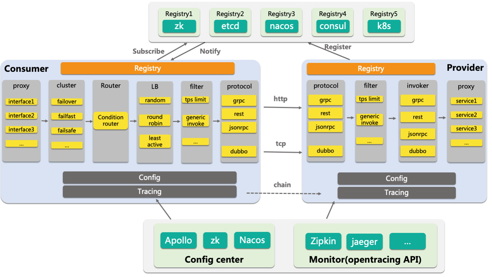
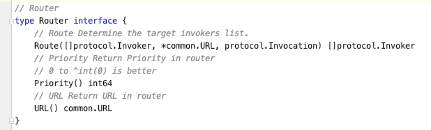
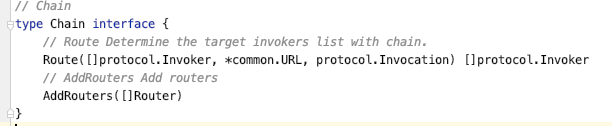
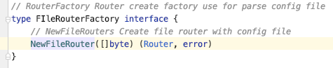
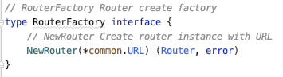
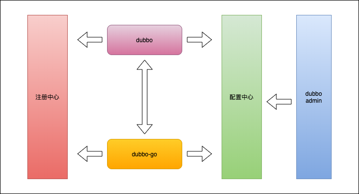
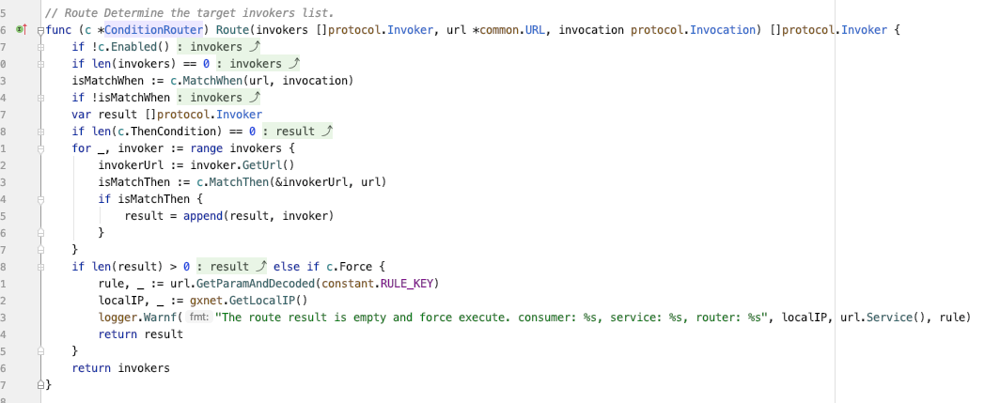
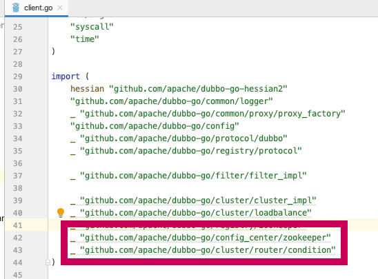
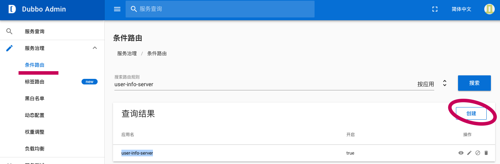
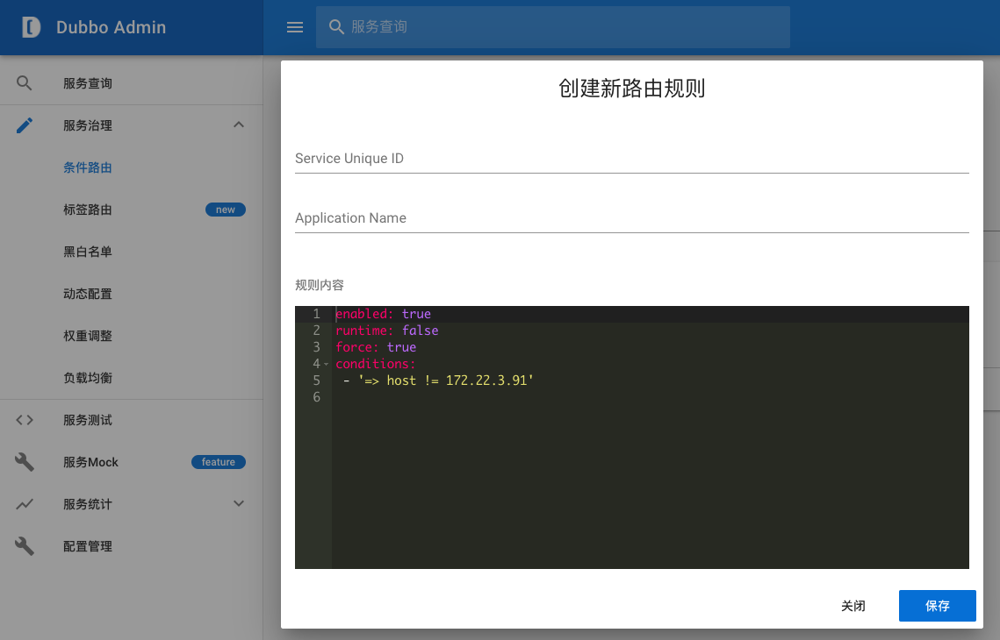

# [dubbo-go 中如何实现路由规则功能](https://zouyx.github.io/posts/2020/03/30/dubbo-go%20%E4%B8%AD%E5%A6%82%E4%BD%95%E5%AE%9E%E7%8E%B0%E8%B7%AF%E7%94%B1%E8%A7%84%E5%88%99%E5%8A%9F%E8%83%BD.html)

dubbo-go 中如何实现路由规则功能

# Let‘s Go!

* * *

最近在 Apache/dubbo-go（以下简称 dubbo-go ）社区中，路由规则突然成了呼声最高的功能之一。那到底为什么需要路由规则？

先路由规则需要实现的功能：

路由规则（ routing rule ）是为了改变网络流量所经过的途径而修改路由信息的技术，主要通过改变路由属性（包括可达性）来实现。在发起一次 RPC 调用前起到过滤目标服务器地址的作用，过滤后的地址列表，将作为消费端最终发起 RPC 调用的备选地址。

试想该下场景：使用 dubbo-go 在生产环境上，排除预发布机。使用路由规则实现不是很合适吗？

虽然知道了路由规则需要实现什么功能，但还不足以实现一个完整的路由规则功能。除此之外，还需要知道如何方便的管理路由规则。

# 目标

综上所述，可以总结出以下 **目标**

*   支持方便扩展路由规则的配置；
*   可以方便的管理路由规则配置，如支持本地与远程配置中心管理；
*   与 Dubbo 现有的配置中心内的路由规则配置文件兼容，降低在新增语言栈的学习及使用成本；

# 路由规则设计

在设计之初，首先要考虑的是路由规则应该放在整个服务治理周期的哪个阶段呢？

有些读者可能会有点困惑，我连架构图都不知道，如何考虑在哪个阶段？不怕，下图马上给你解惑。



可以看到图中的 Router 就是路由规则插入的位置，目前路由规则主要用于控制 Consumer 到 Provider 之间的网络流量的路由路径。

除此之外，还有几个问题是需要优先考虑：

1.需要什么功能？

*   通过配置信息生成路由规则，包括：读取并解析本地配置文件，读取并解析配置中心的配置。以责任链模式串联起来。
*   通过路由规则，匹配本地信息与远端服务信息，过滤出可以调用的远端节点，再进行负载均衡。

2.如何设计接口？

通过第一点，我们能设计出以下接口来实现所需的功能。

*   路由规则接口：用于路由规则过滤出可以调用的远端节点。
    
*   路由规则责任链接口：允许执行多个路由规则。
    
*   配置信息生成路由规则接口：解析内部配置信息（common.URL）生成对应的路由规则。
    
*   配置文件生成路由规则接口：解析配置文件生成对应的路由规则。
    

3.如何实现本地与远程路由规则配置加载？

*   本地路由规则配置：在原配置加载阶段，新增读取路由配置文件。使用 `FIleRouterFactory` 解析后，生成对应路由规则，放置到内存中备用。
*   远程路由规则配置：在 zookeeper 注册并监听静态资源目录后。读取静态资源，筛选符合路由规则配置信息，通过 `RouterFactory` 生成对应路由规则，放置到内存中备用。

## Router

匹配及过滤远程实例的路由规则。  目前已有实现类包括：

*   listenableRouter:
*   AppRouter：
*   ConditionRouter：
*   HealthCheckRouter:
*   FileConditionRouter:

## RouterChain

执行多个路由规则的责任链。 

## FIleRouterFactory

生成解析配置文件生成路由规则的工厂类。 

## RouterFactory

通过配置信息生成路由规则的工厂类。 

# 实现



实现路由规则以兼容 dubbo 为首要目标，降低使用者的学习成本为辅助目标。与配置中心模块相结合，实现路由规则远程统一管理与下发。

## 规则类型

下面先来介绍一下有哪些具体的路由规则实现。

### **条件路由**

dubbo-go 中第一个支持的路由规则，允许用户通过配置文件及配置中心管理路由规则。

与之相似的一个概念是 dubbo-go 里面的 group 概念，但是条件路由提供了更加细粒度的控制手段和更加丰富的表达语义。比较典型的使用场景是黑白名单设置，灰度以及测试等。

### **健康检查路由**

在 RPC 调用中，我们希望尽可能地将请求命中到那些处理能力快、处于健康状态的实例，该路由的功能就是通过某种策略断定某个实例不健康，并将其排除在候选调用列表，优先调用那些健康的实例。这里的”健康”可以是我们自己定义的状态，默认实现即当错误比例到达某一个阈值时或者请求活跃数大于上限则认为其不健康，允许用户扩展健康检测策略。

在我们服务治理里面，核心的问题其实就在于如何判断一个实例是否可用。无论是负载均衡、

熔断还是限流，都是对这个问题的解答。所以，这个 feature 是一个很好的尝试。因为我们接下来计划提供的特性，基于规则的限流以及动态限流，都是要解决 “如何断定一个实例是否可用” 这么一个问题。

所以欢迎大家使用这个特性，并向社区反馈各自设定的健康指标。这对我们接下来的工作会有很大的帮助。

### **标签路由**

以 Provider 为维度，通过将某一个或多个服务的提供者划分到同一个分组，约束流量只在指定分组中流转，从而实现流量隔离的目的，可以作为蓝绿发布、灰度发布等场景的能力基础。

*   静态打标：根据配置文件所配置的标签，固定给 Provider 设置标签。
*   动态打标：基于健康检查路由，根据服务不同时刻，不同状态，动态在 Provider 设置适合的标签。

## 分析

接着，以条件路由在 zookeeper 实现为例，对服务提供者与服务消费者进行整体流程分析。

### 如何配置条件路由规则

配置条件路由规则既可以通过本地配置文件也能通过远程配置中心进行配置，配置生效流程都是：配置文件 => dubbo 内部协议 => 缓存至应用级内存 => 过滤出可调用节点。

**dubbo-admin** 【服务治理/条件路由】增加路由规则配置，zookeeper 中会自动生成其对应配置节点，内容均为 **dubbo-admin** 中设置的配置。

**_全局配置_**

对应应用级全局路由规则配置。

```plain
/dubbo/config/dubbo/user-info-server（应用名）.condition-router
```

应用名：只对 user-info-server 应用生效 .condition-router: 路由类型。除此之外，还有 .tag-router 表示标签路由。

**_服务配置_**

对应服务级所有路由规则配置。

```plain
/dubbo/ com.ikurento.user.UserProvider（服务名） /routers
```

服务名：只对 com.ikurento.user.UserProvider 服务生效。

## 实现 Router



以下为必须实现的方法，以下方法用于获取过滤服务端节点配置。

*   Route: 根据配置，调用节点与被调用节点，过滤出可调用节点。
*   Priority: 路由规则优先级，需要是个正整数。
*   URL: 通过路由规则转换出来的 dubbo 内部协议。

更多实现参考：

路由规则：[https://github.com/apache/dubbo-go/tree/master/cluster/router/condition](https://github.com/apache/dubbo-go/tree/master/cluster/router/condition)

其中包含监听配置中心实现：[https://github.com/apache/dubbo-go/blob/master/cluster/router/condition/listenable\_router.go](https://github.com/apache/dubbo-go/blob/master/cluster/router/condition/listenable_router.go)

# 使用方法

经过上面设计与实现的分析，大概也能猜测到如何使用：



如图所示，使用路由规则并不复杂，只需要把对应的依赖引入进来。在包初始化的时候，会创建出来对应的路由规则的实现。比如说加载条件路由、健康检测路由或者标签作为路由规则：

## 本地路由规则配置

```plain
_ "github.com/apache/dubbo-go/cluster/router/condition"
```

仅仅引用依赖包还不直接使用，还需要配置指定的配置文件： **_router\_config.yml_** ，内容如下:

```plain
# dubbo router yaml configure file
priority: 1
force: true
conditions : ["host = 1.1.1.1 => host = 192.168.199.214"]
```

更多配置方式：[条件路由配置](http://dubbo.apache.org/zh-cn/docs/user/demos/routing-rule.html)

## 配置中心配置

```plain
_ "github.com/apache/dubbo-go/config_center/zookeeper"
```

目前仅支持 zookeeper 配置中心，与 dubbo-admin 结合即可使用。配置方式如下：





# 总结

更加具体的实现，我就不详细论述，大家可以去看源码，欢迎大家持续关注，或者贡献代码。

整个路由规则功能，已经能跟上 dubbo 2.7.x 版本，已经支持本地及远端路由规则配置管理。从扩展性来说，是比较便利。目前已经支持条件路由、标签路由与健康检测路由，虽然能满足基本使用场景，距离完善还有还长远的路。

未来计划：

1.  更多的配置中心支持，理论上已经支持，但还没测试。
2.  service-router（未支持）
3.  标签路由-配置中心（未支持）
4.  目前路由与配置中心结合的代码，对新增路由规则并不友好，有一定接入成本。

欢迎大家关注或者贡献代码，[https://github.com/apache/dubbo-go](https://github.com/apache/dubbo-go)

Written on March 31, 2020