# [无缝衔接 gRPC 与 dubbo-go](https://developer.aliyun.com/article/742946)

[中间件小哥](https://developer.aliyun.com/profile/g6g63f3lanvck) 2020-01-19 1530浏览量

**简介：**

最近我们 dubbo-go 社区里面，呼声很大的一个 feature 就是对 gRPC 的支持。在某位大佬的不懈努力之下，终于弄出来了。

今天我就给大家分析一下大佬是怎么连接 dubbo-go 和 gRPC 。

## gRPC

先来简单介绍一下 gRPC 。它是 Google 推出来的一个 RPC 框架。gRPC是通过 IDL ( Interface Definition Language )——接口定义语言——编译成不同语言的客户端来实现的。可以说是RPC理论的一个非常非常标准的实现。

因而 gRPC 天然就支持多语言。这几年，它几乎成为了跨语言 RPC 框架的标准实现方式了，很多优秀的rpc框架，如 Spring Cloud 和 dubbo ，都支持 gRPC 。

server 端

在 Go 里面，server 端的用法是：  
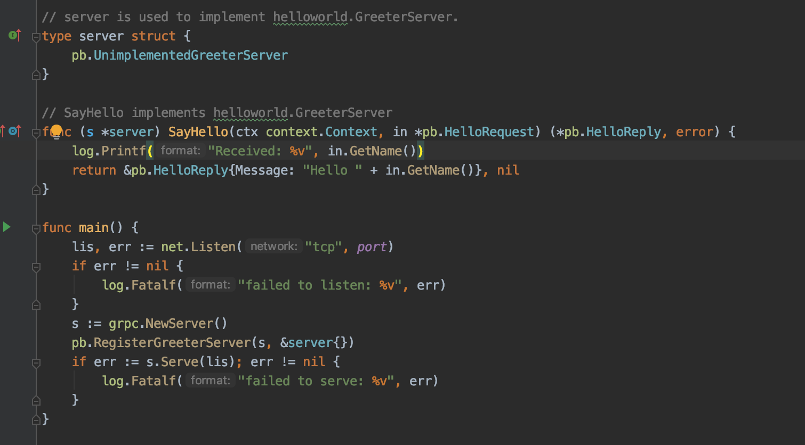

它的关键部分是：`s := grpc.NewServer()`和`pb.RegisterGreeterServer(s, &server{})`两个步骤。第一个步骤很容易，唯独第二个步骤`RegisterGreeterServer`有点麻烦。为什么呢？

因为`pb.RegisterGreeterServer(s, &server{})`这个方法是通过用户定义的`protobuf`编译出来的。

好在，这个编译出来的方法，本质上是：

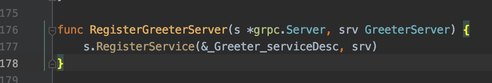

也就是说，如果我们在 dubbo-go 里面拿到这个 \_Greeter\_serviceDesc ，就可以实现这个 server 的注册。因此，可以看到，在 dubbo-go 里面，要解决的一个关键问题就是如何拿到这个 serviceDesc 。

## Client 端

Client 端的用法是：  
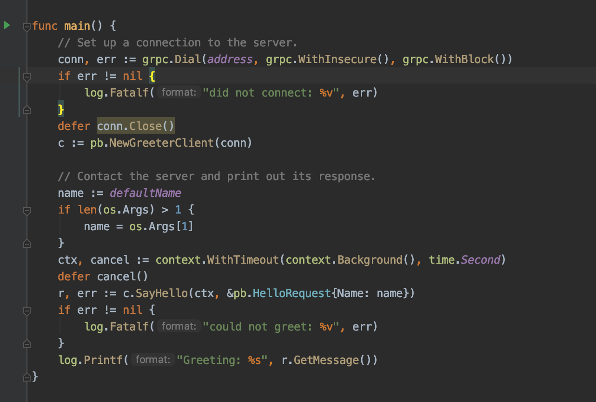

这个东西要复杂一点：  
1、创建连接：conn, err := grpc.Dial(address)  
2、创建client：c := pb.NewGreeterClient(conn)  
3、调用方法：r, err := c.SayHello(ctx, &pb.HelloRequest{Name: name})

第一个问题其实挺好解决的，毕竟我们可以从用户的配置里面读出 address ；

第二个问题就是最难的地方了。如同 RegisterGreeterServer 是被编译出来的那样，这个 NewGreeterClient 也是被编译出来的。

而第三个问题，乍一看是用反射就能解决，但是我们打开 SayHello 就能看到：  
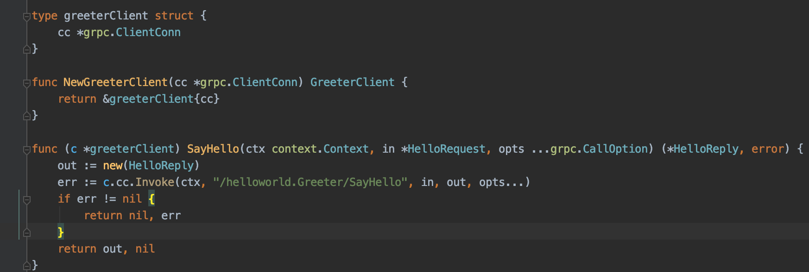

结合 greetClient 的定义，很容易看到，我们的关键就在于 err := c.cc.Invoke ( ctx, "/helloworld.Greeter/SayHello", in, out, opts... )。换言之，我们只需要创建出来连接，并且拿到方法、参数就能通过类似的调用来模拟出 c.SayHello 。

通过对 gRPC 的简单分析，我们大概知道要怎么弄了。还剩下一个问题，就是我们的解决方案怎么和 dubbo-go 结合起来呢？

## 设计

我们先来看一下 dubbo-go 的整体设计，思考一下，如果我们要做 gRPC 的适配，应该是在哪个层次上做适配。  
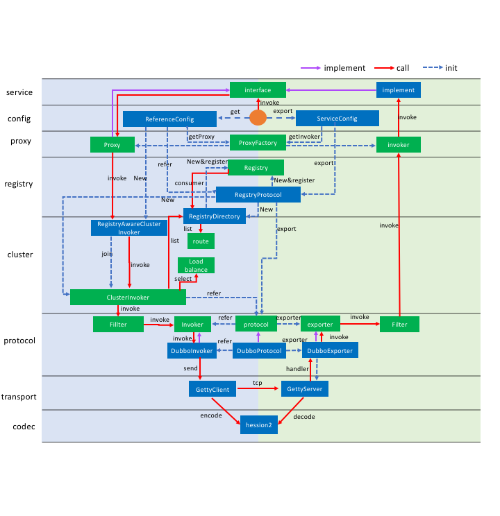

我们根据前面介绍的 gRPC 的相关特性可以看出来，gRPC 已经解决了 codec 和 transport 两层的问题。

而从 cluster 往上，显然 gRPC 没有涉及。于是，从这个图里面我们就可以看出来，要做这种适配，那么 protocol 这一层是最合适的。即，我们可以如同 dubbo protocol 那般，扩展出来一个 grpc protocol 。

这个 gRPC protocol 大体上相当于一个适配器，将底层的 gRPC 的实现和我们自身的 dubbo-go 连接在一起。

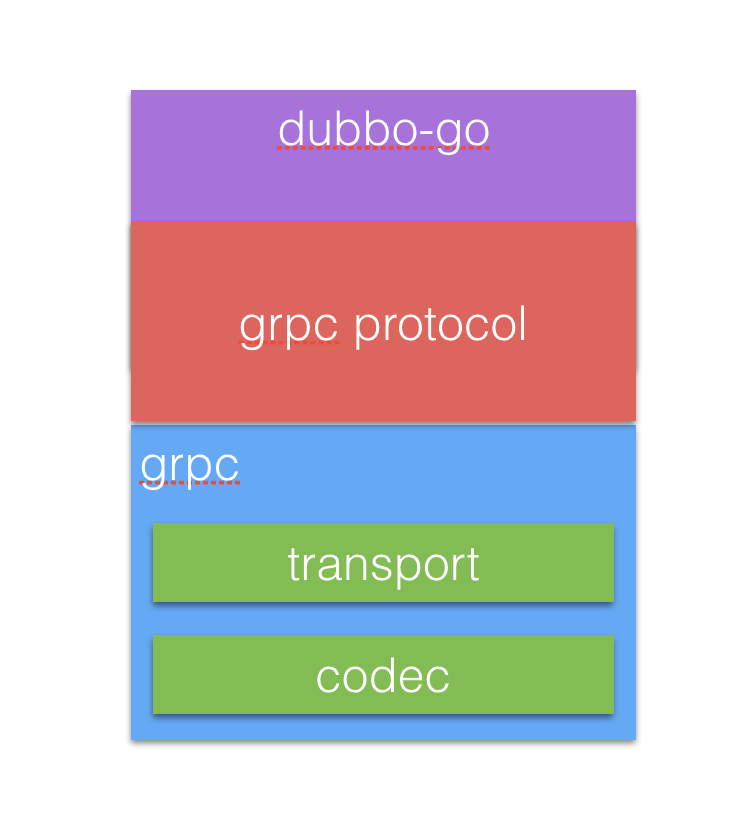

## 实现

在 dubbo-go 里面，和 gRPC 相关的主要是：

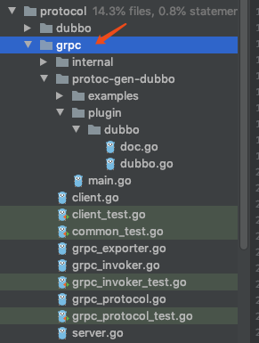

我们直接进去看看在 gRPC 小节里面提到的要点是如何实现的。

### server端

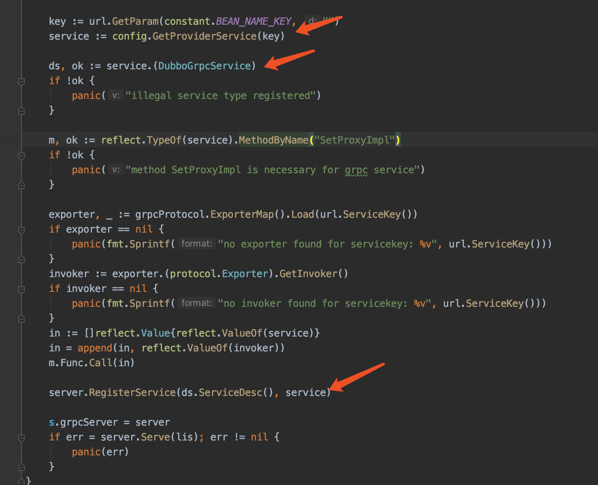

这样看起来，还是很清晰的。如同 dubbo- go 其它的 protocol 一样，先拿到 service ，而后通过 service 来拿到 serviceDesc ，完成服务的注册。

注意一下上图我红线标准的 ds, ok := service.(DubboGrpcService) 这一句。

为什么我说这个地方有点奇怪呢？是因为理论上来说，我们这里注册的这个 service 实际上就是 protobuf 编译之后生成的 gRPC 服务端的那个 service ——很显然，单纯的编译一个 protobuf 接口，它肯定不会实现 DubboGrpcService 接口：

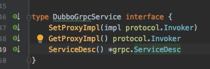

那么 ds, ok := service.(DubboGrpcService) 这一句，究竟怎么才能让它能够执行成功呢？

我会在后面给大家揭晓这个谜底。

## Client端

dubbo-go 设计了自身的 Client ，作为对 gRPC 里面 Client 的一种模拟与封装：  
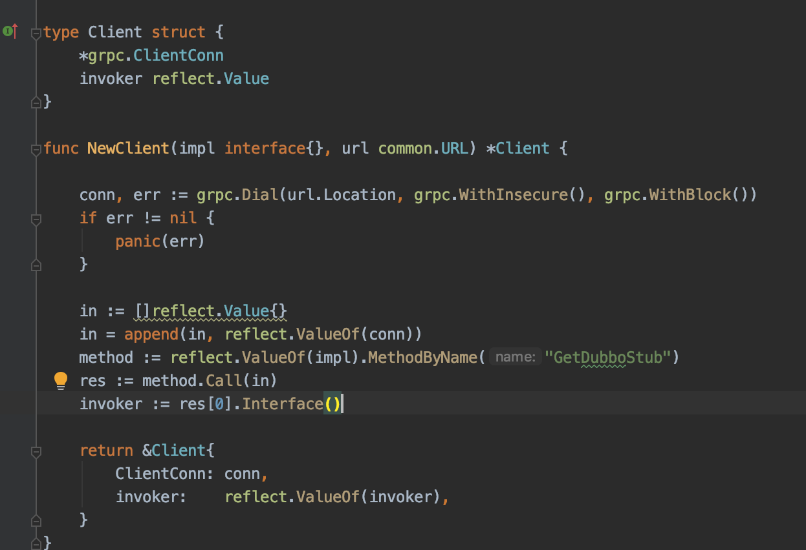

注意看，这个 Client 的定义与前面 greetClient 的定义及其相似。再看下面的 NewClient 方法，里面也无非就是创建了连接 conn ，而后利用 conn 里创建了一个 Client 实例。

注意的是，这里面维护的 invoker 实际上是一个 stub 。

当真正发起调用的时候：

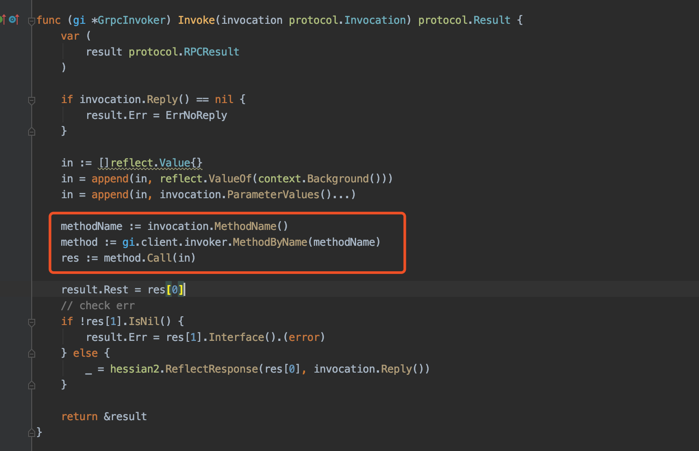

红色框框框住的就是关键步骤。利用反射从 invoker ——也就是 stub ——里面拿到调用的方法，而后通过反射调用。

### 代码生成

前面提到过 ds, ok := service.(DubboGrpcService) 这一句，面临的问题是如何让 protobuf 编译生成的代码能够实现 DubboGrpcService 接口呢？

有些小伙伴可能也注意到，在我贴出来的一些代码里面，反射操作会根据名字来获取method实例，比如NewClient方法里面的method := reflect.ValueOf(impl).MethodByName("GetDubboStub")这一句。这一句的impl，即指服务的实现，也是 protobuf 里面编译出来的，怎么让 protobuf 编译出来的代码里面含有这个 GetDubboStub 方法呢？

到这里，答案已经呼之欲出了：修改 protobuf 编译生成代码的逻辑！

庆幸的是，在 protobuf 里面允许我们通过插件的形式扩展我们自己的代码生成的逻辑。

所以我们只需要注册一个我们自己的插件：  
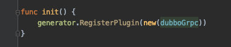

然后这个插件会把我们所需要的代码给嵌入进去。比如说嵌入`GetDubboStub`方法：  
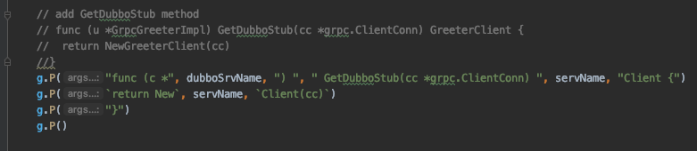

还有`DubboGrpcService`接口：

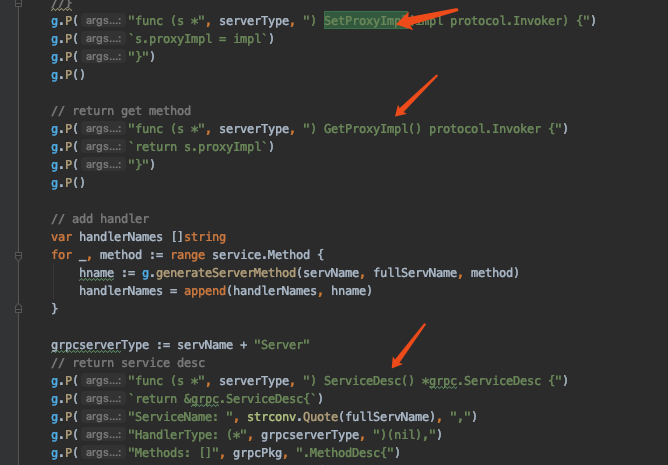

这个东西，属于难者不会会者不难。就是如果你不知道可以通过`plugin`的形式来修改生成的代码，那就是真难；但是如果知道了，这个东西就很简单了——无非就是水磨工夫罢了。

**作者信息：**邓明，毕业于南京大学，就职于 eBay Payment 部门，负责退款业务开发。

编解码 自然语言处理 Dubbo Java 应用服务中间件 Go Spring