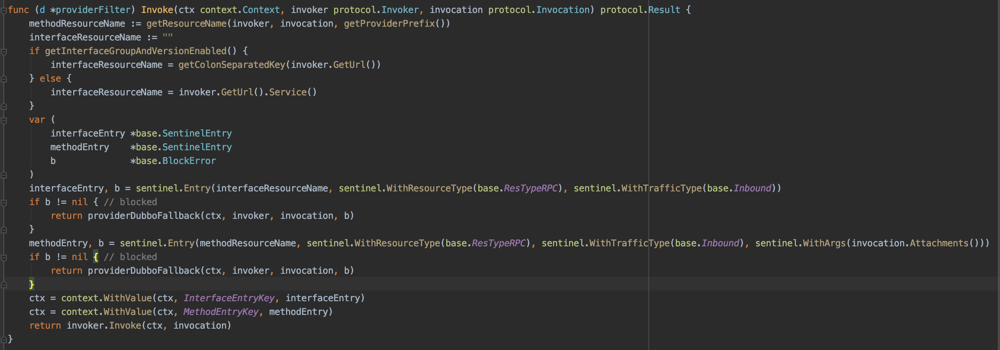
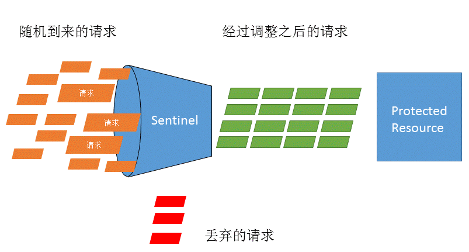

# [在dubbo-go中使用sentinel](https://dubbogo.github.io/dubbo-go-website/zh-cn/blog/dubbo-go-sentinel.html)

时至今日，Apache/dubbo-go（以下简称 dubbo-go ）项目在功能上已经逐步对齐java版本，稳定性也在不同的生产环境得到了验证。社区便开始再服务治理、监控等方向发力。随着 1.2和1.3 版本发布， dubbo-go 新增了大量此类新feature。

今天我们聊一聊限流相关话题，此前dubbo-go已经支持了[tps limit](https://github.com/apache/dubbo-go/pull/237)、[execute limit](https://github.com/apache/dubbo-go/pull/246) 、[hystrix](https://github.com/apache/dubbo-go/pull/133) 的内置filter，用户只要简单配置就能马上用上。但我们知道，在 java 的 dubbo 生态中，有一项限流工具被广泛使用，那就是sentinel。sentinel因为强大的动态规划配置、优秀的dashboard以及对dubbo的良好适配，成为众多使用dubbo的企业选用限流工具的不二之选。

就在前些日子，社区非常高兴得知 Sentinel Golang 首个版本 0.1.0 正式发布，这使得 dubbo-go也可以使用 sentinel 作为工具进行一些服务治理、监控的工作了。随着sentinel golang的健壮，我们相信用户马上可以像sentinel管理java dubbo服务那样管理dubbo-go的服务了。

完成sentinel golang的dubbo-adapter其实非常简单，这得益于dubbo-go早就完成了filter链的构造，用户可以自定义filter，并且灵活的安排其执行顺序。在1.3发布后，增加了filter中的context传递，构建sentinel/adapter/dubbo更为方便。

我们以其中的provider filter适配为例:



此 filter 实现了 dubbo-go的filter接口，只要用户在服务启动时将此filter加载到dubbo-go中，即可使用此filter。 
sentinel实现原理与其他限流、熔断库大同小异，底层是用的滑动窗口算法。与hystrix等框架相比不同点是设计理念，Sentinel 的设计理念是让您自由选择控制的角度，并进行灵活组合，从而达到想要的效果。

下面我整理了完整的使用流程：(注意：dubbo-go版本请使用1.3.0-rc3及其以上版本)

在dubbo-go中使用sentinel主要分为以下几步：

1.初始化sentinel

2.将sentinel注入dubbo-go的filter

3.初始化dubbo-go

4.配置规划

## 初始化sentinel

示例代码：

```go
import (
	sentinel "github.com/alibaba/sentinel-golang/api"
)

func initSentinel() {
	err := sentinel.InitWithLogDir(confPath, logDir)
	if err != nil {
		// 初始化 Sentinel 失败
	}
}
```

## 将sentinel注入dubbo-go的filter

你可以通过import包的形式执行，执行其中的init()来注入filter

```go
import (
	_ "github.com/alibaba/sentinel-golang/adapter/dubbo"
)
```

也可以手动执行，给你的filter取上自己想要的名字

```go
import (
  "github.com/apache/dubbo-go/common/extension"
  sd "github.com/alibaba/sentinel-golang/adapter/dubbo"
)

func main(){
  extension.SetFilter("myConsumerFilter",sd.GetConsumerFilter())
  extension.SetFilter("myProviderFilter",sd.GetConsumerFilter())
}
```

完成以上步骤，你就可以在需要的dubbo接口配置里写入sentinel的filterName,构建起接口的filter链条。比如以下以consumer.yml配置文件为例

```yml
references:
  "UserProvider":
    registry: "hangzhouzk"
    protocol : "dubbo"
    interface : "com.ikurento.user.UserProvider"
    cluster: "failover"
    filter: "myConsumerFilter"
    methods :
    - name: "GetUser"
      retries: 3
```

## 初始化dubbo-go

到这一步，你只需要正常启动dubbo-go程序就完成了服务启动。用以下代码做一个较为完整举例

```go
import (
	hessian "github.com/apache/dubbo-go-hessian2"
	sd "github.com/alibaba/sentinel-golang/adapter/dubbo"
)

import (
	"github.com/apache/dubbo-go/common/logger"
	_ "github.com/apache/dubbo-go/common/proxy/proxy_factory"
	"github.com/apache/dubbo-go/config"
	_ "github.com/apache/dubbo-go/filter/impl"
	_ "github.com/apache/dubbo-go/protocol/dubbo"
	_ "github.com/apache/dubbo-go/registry/protocol"

	_ "github.com/apache/dubbo-go/cluster/cluster_impl"
	_ "github.com/apache/dubbo-go/cluster/loadbalance"
	_ "github.com/apache/dubbo-go/registry/zookeeper"
	"github.com/apache/dubbo-go/common/extension"
)

func main() {

	hessian.RegisterPOJO(&User{})
  extension.SetFilter("myConsumerFilter",sd.GetConsumerFilter())
  extension.SetFilter("myProviderFilter",sd.GetConsumerFilter())
	config.Load()

	// init finish, do your work
	test()
}
```

## 规划配置

sentinel以强大的规划配置吸引了很多使用者，其提供动态数据源接口进行扩展，用户可以通过动态文件或 etcd 等配置中心来动态地配置规则。但目前sentinel-golang作为破蛋版本，动态配置还在开发中

### 动态数据源

（开发中）Sentinel 提供动态数据源接口进行扩展，用户可以通过动态文件或 etcd 等配置中心来动态地配置规则。

### 硬编码方式

Sentinel 也支持原始的硬编码方式加载规则，可以通过各个模块的 `LoadRules(rules)` 方法加载规则。以下是硬编码方式对某个method在consumer端的QPS流控：

```go
_, err := flow.LoadRules([]*flow.FlowRule{
	{
		ID:                666,
		Resource:         "dubbo:consumer:com.ikurento.user.UserProvider:myGroup:1.0.0:hello()",
		MetricType:        flow.QPS,
		Count:             10,
		ControlBehavior:   flow.Reject,
	},
})
if err != nil {
	// 加载规则失败，进行相关处理
}
```

# 总结

更加具体的实现，我就不详细论述，大家可以去看源码进一步了解。

最后，欢迎大家持续关注，或者贡献代码，期待dubbo-go在2020年在云原生领域继续突破。

dubbo-go仓库地址：[https://github.com/apache/dubbo-go](https://github.com/apache/dubbo-go)