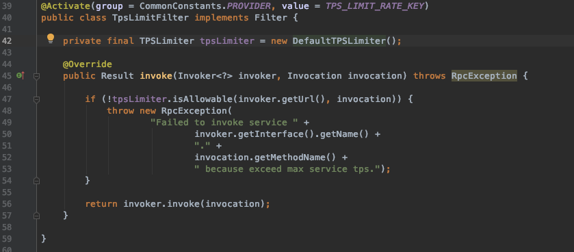
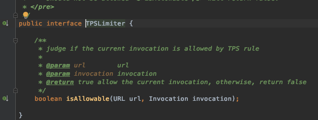
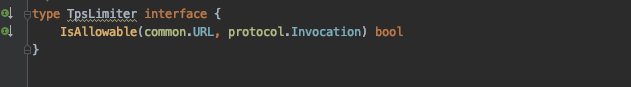
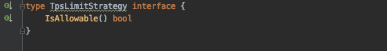
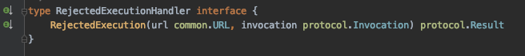
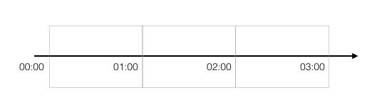
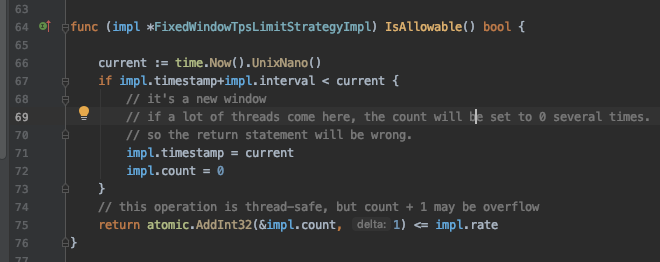
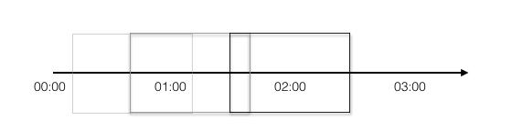
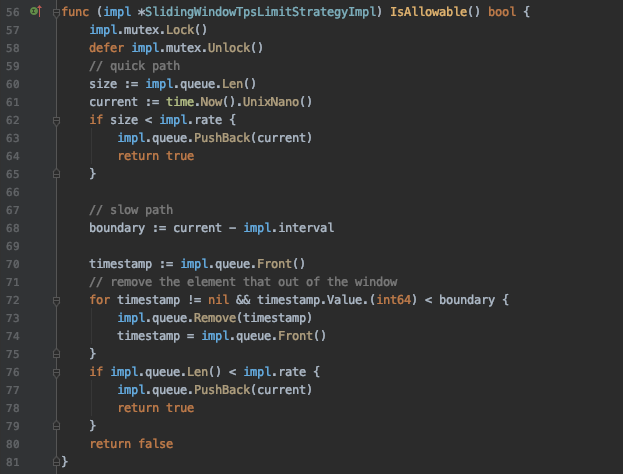
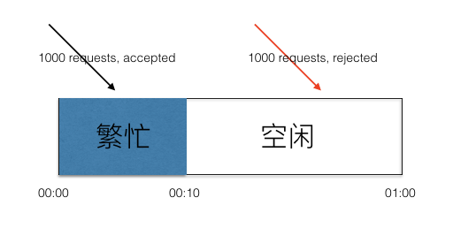

# [dubbogo中的TPS Limit设计与实现](https://developer.aliyun.com/article/726804)

# 前言

[Apache Dubbo](http://dubbo.apache.org)是由阿里开源的一个RPC框架，除了基本的RPC功能以外，还提供了一整套的服务治理相关功能。目前它已经是Apache基金会下的顶级项目。

而[dubbogo](https://github.com/apache/dubbo-go)则是dubbo的go语言实现。

最近在`dubbogo`的`todo list`上发现，它还没有实现`TPS Limit`的模块，于是就抽空实现了这个部分。

`TPS limit`实际上就是限流，比如说限制一分钟内某个接口只能访问200次，超过这个次数，则会被拒绝服务。在`Dubbo`的Java版本上，只有一个实现，就是`DefaultTPSLimiter`。

`DefaultTPSLimiter`是在服务级别上进行限流。虽然`dubbo`的官方文档里面声称可以在`method`级别上进行限流，但是我看了一下它的源码，实际上这个是做不到的。当然，如果自己通过实现`Filter`接口来实现`method`级别的限流，那么自然是可以的——这样暴露了`dubbo`Java版本实现的另外一个问题，就是`dubbo`的`TpsLimitFilter`实现，是不允许接入自己`TpsLimiter`的实现的。这从它的源码也可以看出来：

它直接写死了`TpsLimiter`的实现。

这个实现的目前只是合并到了`develop`上，等下次发布正式版本的时候才会发布出来。

Github: [https://github.com/apache/dubbo-go/pull/237](https://github.com/apache/dubbo-go/pull/237)

# 设计思路

于是我大概参考了一下`dubbo`已有的实现，做了一点改进。

`dubbo`里面的核心抽象是`TpsLimiter`接口。`TpsLimitFilter`只是简单调用了一下这个接口的方法而已：

这个抽象是很棒的。但是还欠缺了一些抽象。

实际上，一个TPS Limit就要解决三个问题：

1.  对什么东西进行`limit`。比如说，对服务进行限流，或者对某个方法进行限流，或者对IP进行限流，或者对用户进行限流；
2.  如何判断已经`over limitation`。这是从算法层面上考虑，即用什么算法来判断某个调用进来的时候，已经超过配置的上限了；
3.  被拒绝之后该如何处理。如果一个请求被断定为已经`over limititation`了，那么该怎么处理；

所以在`TpsLimiter`接口的基础上，我再加了两个抽象：

TpsLimiter

TpsLimitStrategy

RejectedExecutionHandler

`TpsLimiter`对应到Java的`TpsLimiter`，两者是差不多。在我的设想里面，它既是顶级入口，还需要承担解决第一个问题的职责。

而`TpsLimitStrategy`则是第二个问题的抽象的接口定义。它代表的是纯粹的算法。该接口完全没有参数，实际上，所有的实现需要维护自身的状态——对于大部分实现而言，它大概只需要获取一下系统时间戳，所以不需要参数。

最后一个接口`RejectedExecutionHandler`代表的是拒绝策略。在`TpsLimitFilter`里面，如果它调用`TpsLimiter`的实现，发现该请求被拒绝，那么就会使用该接口的实现来获取一个返回值，返回给客户端。

# 实现

其实实现没太多好谈的。不过有一些微妙的地方，我虽然在代码里面注释了，但是我觉得在这里再多说一点也是可以的。

首先提及的就是拒绝策略`RejectedExecutionHandler`，我就是提供了一种实现，就是随便log了一下，什么都没做。因为这个东西是强业务相关的，我也不能提供更加多的通用的实现。

## 方法与服务双重支持的TpsLimiter

`TpsLimiter`我只有一个实现，那就是`MethodServiceTpsLimiterImpl`。它就是根据配置，如果方法级别配置了参数，那么会在方法级别上进行限流。否则，如果在服务级别（ServiceKey）上有配置，那么会在服务级别进行限流。

举个最复杂的例子：服务A限制100，有四个方法，方法M1配置限制40，方法M2和方法M3无配置，方法M4配置限制-1：那么方法M1会单独限流40；M2和M3合并统计，被限制在100；方法M4则会被忽略。

用户可以配置具体的算法。比如说使用我接下来说的，我已经实现的三种实现。

## FixedWindow和ThreadSafeFixedWindow

`FixedWindow`直接对应到Java的`DefaultTpsLimiter`。它采用的是`fixed-window`算法：比如说配置了一分钟内只能调用100次。假如从00:00开始计时，那么00:00-01:00内，只能调用100次。只有到达01:00，才会开启新的窗口01:00-02:00。如图：

Fixed-Window图示

Fixed-Window实现

这里有一个很有意思的地方。就是这个实现，是一个几乎线程安全但是其实并不是线程安全的实现。

在所有的实现里面，它是最为简单，而且性能最高的。我在衡量了一番之后，还是没把它做成线程安全的。事实上，Java版本的也不是线程安全的。

它只会在多个线程通过第67行的检测之后，才会出现并发问题，这个时候就不是线程安全了。但是在最后的`return`语句中，那一整个是线程安全的。它因为不断计数往上加，所以多个线程同时跑到这里，其实不会有什么问题。

现在我要揭露一个最为奇诡的特性了：**并发越高，那么这个`raise condition`就越严重，也就是说越不安全。**

但是从实际使用角度而言，有极端TPS的还是比较少的。对于那些TPS只有几百每秒的，是没什么问题的。

**为了保持和dubbo一致的特性，我把它作为默认的实现。**

此外，我还为它搞了一个线程安全版本，也就是`ThreadSafeFixedWindowTpsLimitStrategyImpl`，只是简单的用`sync`封装了一下，可以看做是一个`Decorator`模式的应用。

如果强求线程安全，可以考虑使用这个。

## SlidingWindow

这是我比较喜欢的实现。它跟网络协议里面的滑动窗口算法在理念上是比较接近的。

Sliding-Window

具体来说，假如我设置的同样是一分钟1000次，它统计的永远是从当前时间点往前回溯一分钟内，已经被调用了多少次。如果这一分钟内，调用次数没超过1000，请求会被处理，如果已经超过，那么就会拒绝。

我再来描述一下，`SldingWindow`和`FixedWindow`两种算法的区别。这两者很多人会搞混。假如当前的时间戳是00:00，两个算法同时收到了第一个请求，开启第一个时间窗口。

那么`FixedWindow`就是00:00-01:00是第一个窗口，接下来依次是01:00-02:00, 02:00-03:00, ...。当然假如说01:00之后的三十秒内都没有请求，在01:31又来了一个请求，那么时间窗口就是01:31-02:31。

而`SildingWindow`则没有这种概念。假如在01:30收到一个请求，那么`SlidingWindow`统计的则是00:30-01:30内有没有达到1000次。**它永远计算的都是接收到请求的那一刻往前回溯一分钟的请求数量。**

如果还是觉得有困难，那么简单来说就是`FixedWindow`往后看一分钟，`SlidingWindow`回溯一分钟。

> 这个说法并不严谨，只是为了方便理解。

在真正写这个实现的时候，我稍微改了一点点：

我用了一个队列来保存每次访问的时间戳。一般的写法，都是请求进来，先把已经不在窗口时间内的时间戳删掉，然后统计剩下的数量，也就是后面的`slow path`的那一堆逻辑。

但是我改了的一点是，我进来直接统计队列里面的数量——也就是请求数量，如果都小于上限，那么我可以直接返回`true`。即`quick path`。

这种改进的核心就是：我只有在检测到当前队列里面有超过上限数量的请求数量时候，才会尝试删除已经不在窗口内的时间戳。

这其实就是，是每个请求过来，我都清理一下队列呢？还是只有队列元素超出数量了，我才清理呢？我选择的是后者。

我认为这是一种改进……当然从本质上来说，整体开销是没有减少的——因为`golang`语言里面`List`的实现，一次多删除几个，和每次删除一个，多删几次，并没有多大的区别。

### 算法总结

无论是`FixedWindow`算法还是`SlidingWindow`算法都有一个固有的缺陷，就是这个时间窗口难控制。

我们设想一下，假如说我们把时间窗口设置为一分钟，允许1000次调用。然而，在前十秒的时候就调用了1000次。在后面的五十秒，服务器虽然将所有的请求都处理完了，然是因为窗口还没到新窗口，所以这个时间段过来的请求，全部会被拒绝。

解决的方案就是调小时间窗口，比如调整到一秒。但是时间窗口的缩小，会导致`FixedWindow`算法的`raise condition`情况加剧。`SlidingWindow`也会受影响，但是影响要小很多。

## 那些没有实现的

### 基于特定业务对象的限流

举例来说，某些特殊业务用的针对用户ID进行限流和针对IP进行限流，我就没有在`dubbogo`里面实现。有需要的可以通过实现`TpsLimiter`接口来完成。

### 全局TPS limit

这篇文章之前讨论的都是单机限流。如果全局限流，比如说针对某个客户，它购买的服务是每分钟调用100次，那么就需要全局限流——虽然这种case都不会用`Filter`方案，而是另外做一个`API`接入控制。

比如说，很常用的使用Redis进行限流的。针对某个客户，一分钟只能访问100次，那我就用客户ID做key，value设置成List，每次调用过来，随便塞一个值进去，设置过期时间一分钟。那么每次统计只需要统计当前key的存活的值的数量就可以了。

这种我也没实现，因为好像没什么需求。国内讨论TPS limit都是讨论单机TPS limit比较多。

这个同样可以通过实现`TpsLimiter`接口来实现。

### Leaky Bucket算法

这个本来可以是`TpsLimitStrategy`的一种实现的。后来我觉得，它其实并没有特别大的优势——虽然号称可以做到均匀，但是其实并做不到真正的均匀。通过调整`SlidingWindow`的窗口大小，是可以接近它宣称的均匀消费的效果的。比如说调整到一秒，那其实就已经很均匀了。而这并不会带来多少额外的开销。