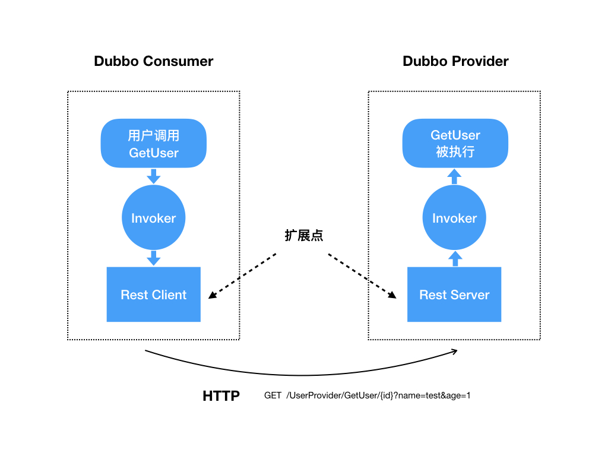

# [dubbo-go 中 REST 协议实现](https://mp.weixin.qq.com/s/9ngGYnkdcu14GkaPBjOBLg)

在社区小伙伴们的努力下，Apache/dubbo-go 在 v1.4.0 中支持 REST 协议了。

## 什么是 REST 协议

REST 是  **RE**presentational **S**tate **T**ransfer（表述性状态转移）的简写，是一种软件架构风格。虽然 REST 架构风格不是一定要基于 HTTP 协议进行传输，但是因为 HTTP 协议的通用性和易用性，现在越来越多的 web 服务采用基于 HTTP 协议实现 RESTful 架构。

在 dubbo-go 中的 REST 协议指的是一种基于 HTTP 协议的远程调用方式。简单的来讲，REST 协议就是把 dubbo 服务发布成 RESTful 风格的 HTTP 接口并且能够能像调用 dubbo 接口一样的方式调用 HTTP 接口。

## 为什么要支持 REST 协议

在没有 REST 协议之前，小伙伴们是否一直在苦恼这样几个问题：

1. 传统的 web 服务不能直接调用我们发布的 dubbo 服务
1. 前端不能直接调用 dubbo 服务
1. dubbo 服务不能发布 Open API

上述问题，就是 REST 协议解决的核心问题。现在我们很多应用场景都是需要与异构的系统进行交互，而 REST 采用的 HTTP 通信协议非常适合用来打通异构系统，如图：


## REST 协议没那么简单

REST 协议核心要解决一个问题：**Go 方法到 HTTP 接口的双向映射**。普通 HTTP 调用 dubbo-go 服务，考虑的是 HTTP 到 **Go** 方法的映射；而 dubbo-go 服务调用 HTTP 服务，则是 **Go** 方法到 HTTP 接口的映射。

下面是我们要与 **Go** 方法要做映射的 HTTP 请求协议内容：

```http
POST /path/{pathParam}?queryParam=1 HTTP/1.1
Accept: application/json
Content-Type: application/json
Host: http://localhost:8080

{"id":1111}
```

在服务提供方，当上面这种请求发送到服务器时，我们要把它路由到下面这个 **Go** 方法中，在服务消费方，我们也可以通过调用下面的 **Go** 方法把方法参数转化为上面的 HTTP 请求：

```go
type Provider struct {

    // 该方法应该对应上面的http请求
    GetResult func(pathParam string, queryParam string, body interface{}, host string) (*Result, error)

}
```

在消费方调用  `GetResult` 时，传入各个参数的值：

- 变量  pathParam 的内容应该是字符串 "pathParam"；
- 变量  queryParam 的内容应该是字符串  "1" ；
- 变量  body 应该是有以字符串 "id" 为 key ，1111 为 value 的一个 map；
- 当然  host 变量的内容应该是字符串 "[http://localhost:8080](http://localhost:8080)" 。

在服务端执行 `GetResult` 方法时，得到的参数会与消费方调用时传入的值相同。

总结下来，我们要建立以下这些映射关系

1. 路径映射
1. Header 处理（固定 Header 和 Header 值也是参数两种情况）
1. POST or GET or ...（HTTP  方法映射）
1. 参数映射

要完成这种映射，我们首先要解决的是，如何知道这种映射关系？

答案只有一个，通过用户配置。而用户配置所面临的困难是，复杂且琐碎。（解决思路是提供大量默认配置减轻配置的负担，自定义配置方式允许用户使用自己熟悉的配置形式）

另外一个难点在于，使用何种 web 框架的问题。有些公司内部使用的是自研的 web 框架，他们有成熟的技术基础和运维能力。于是就会考虑说，能不能让 dubbo-go 在支持 REST 协议的时候，能够让他们将 REST 协议使用的 web 框架替换成他们所期望的呢？

## 如何建立 HTTP 接口与方法的映射关系

下面我举一个 HTTP 接口与方法映射的具体例子：

**Go** 结构体定义如下：

```go
type UserProvider struct {

    GetUser func(id string, name string, age int) (*User, error)

}
```

要发布的 HTTP 接口形式是：
[http://127.0.0.1/UserProvider/GetUser/{id}?name=test&age=1](http://127.0.0.1/UserProvider/GetUser/%7Bid%7D?name=test&age=1)

服务端配置如下：

```yaml
services:
  "UserProvider":
    //注册中心
    registry: "zookeeper"
    //启用REST协议
    protocol : "rest"
    //DUBBO的接口名
    interface : "com.ikurento.user.UserProvider"
    // 服务接口路径
    rest_path: "/UserProvider"
    methods:
    - name: "GetUser"
      // 方法接口路径
      rest_path: "/GetUser/{id}"
      // HTTP方法
      rest_method: "GET"
      // HTTP查询参数
      rest_query_params: "1:name,2:age"
      // HTTP路径参数
      rest_path_params: "0:id"
      // 可以提供的内容类型
      rest_produces: "application/json;application/xml"
      // 可以接受的客户端参数类型
      rest_consumes: "application/json;charset=utf-8,*/*"
      // HTTP Body
      rest_body: -1
```

在配置文件中我们定义了方法的路径，HTTP 方法等接口参数，这里需要注意的是路径参数和查询参数的配置方式，0:name 的意思是查询参数 name 对应 `GetUser` 方法的第一个参数，还有 rest_body 配置的数字也是对应这方法的参数，这里没有 body 参数所有就配置了 `-1`。

## REST 协议的调用过程


上图展示了用户在 Consumer 端调用  `GetUser` 方法到 Provdier 端  `GetUser`  方法被执行的整个过程，在  `RestClient` 和  `RestServer` 中分别**实现了  Go  方法参数到  HTTP  请求的转换和 HTTP 请求到  Go  方法的转换，这是最为核心和复杂的部分。**换言之，我们在这里实现了前面提到的 Go 方法和 HTTP 请求的双向映射。

这里我们可以注意到  `RestClient` 和 `RestServer` 是可以用户自行扩展的，下面我将具体介绍一下在 REST 协议中有哪些扩展点设计。

## REST 协议的扩展点设计

基于 dubbo-go 良好的 extension 扩展设计，我们定义了多个扩展点，用户可以自定义功能实现。

### 自定义 HTTP 服务器

RestServer 的扩展接口：

```go
type RestServer interface {

    // sever启动函数
	Start(url common.URL)

    // 发布接口
	Deploy(restMethodConfig *rest_config.RestMethodConfig, routeFunc func(request RestServerRequest, response RestServerResponse))

    // 删除接口
	UnDeploy(restMethodConfig *rest_config.RestMethodConfig)

    // server关闭
	Destroy()

}
```

在 dubbo-go 的 v1.4.0 中默认使用 go-restful 作为 HTTP 服务器，如果用户想用其他 HTTP 容器可以实现上面的接口，并在配置文件中配置使用自己自定义的服务器。

这个接口中，最核心的方法是 Deploy，在 restMethodConfig 方法参数中有用户配置的接口路径等一系列参数，routeFunc 是 HTTP 接口需要被路由执行的函数。不同的 http 服务器会有不同的 request 和 response ，所以我们定义了 `RestServerRequest` 接口和 `RestServerResponse` 接口让用户进行适配。

### 自定义 HTTP 客户端

RestClient 的扩展接口：

```go
// RestOptions
type RestOptions struct {
	RequestTimeout time.Duration
	ConnectTimeout time.Duration
}

// RestClientRequest
type RestClientRequest struct {
	Header      http.Header
	Location    string
	Path        string
	Method      string
	PathParams  map[string]string
	QueryParams map[string]string
	Body        interface{}
}

// RestClient user can implement this client interface to send request
type RestClient interface {
	Do(request *RestClientRequest, res interface{}) error
}

```

最后的请求到客户端时，都会被封装为 `RestRequest`，用户可以非常简单快速的扩展自己的 Client 端。`RestOptions` 中有一些客户端的超时配置，在创建自己的客户端时需要根据这些配置初始化客户端。

### 自定义 REST 配置形式

前面提到，REST 协议一个很麻烦的地方在于，配置很繁琐很琐碎。Go 不同于 Java，可以通过注解的形式来简化配置。

所以我们考虑到用户不同的使用习惯和公司的配置风格，提供了这个扩展点。

ConfigReader 的扩展接口：

```go
type ConfigReader interface {

    // Consumer配置读取
	ReadConsumerConfig(reader *bytes.Buffer) error

    // Provider配置读取
	ReadProviderConfig(reader *bytes.Buffer) error

}
```

`ReadConsumerConfig` 和 `ReadProviderConfig` 方法的参数是配置文件的文件流，在实现方法中可以再次解析，也可以使用二次编译或者硬编码方式等其他方式读取配置。这是一个通用的配置读取接口，以后可以用来扩展 REST 配置之外的其他配置，所以需要在方法中调用方法设置配置，如下：

```go
// 设置Rest的消费者配置
config.SetRestConsumerServiceConfigMap(restConsumerServiceConfigMap)

// 设置Rest的提供者配置
config.SetRestProviderServiceConfigMap(restProviderServiceConfigMap)
```

## 如何添加 HTTP 过滤器

因为不同 HTTP 服务器的过滤器，拦截器或者是 middleware 添加方式都不同，所以我们很难定义一个接口满足所有服务器。因此我们单独为 go-restful 定义了一个添加 filter 的方法，这里我们需要注意的一点是必须在 REST 接口发布前添加 filter。

```go
server_impl.AddGoRestfulServerFilter(func(request *restful.Request, response *restful.Response, chain *restful.FilterChain) {
    // 鉴权等功能
    chain.ProcessFilter(request, response)
})

// 启动dubbo服务，发布rest等接口
config.Load()
```

## 展望

以上是关于 REST 协议的一些介绍，具体的实现我就不详细讲了，大家可以去参阅源码。

如果想看具体的 Example，请参考：
[https://github.com/dubbogo/dubbo-samples/tree/master/golang/general/rest](https://github.com/dubbogo/dubbo-samples/tree/master/golang/general/rest)

REST 未来需要支持 HTTPS 协议和基于 open tracing 标准 api 的链路追踪。REST 的配置信息未来也不是 REST 协议独有的，这些配置信息未来可以作为每个 dubbo 接口的元数据，存储到元数据中心，为网关提供 HTTP 协议与 dubbo 协议之间的映射关系。

- 作者信息：

  蒋超，github id Patrick0308，在 杭州贝安云科技有限公司 任职服务开发工程师。
