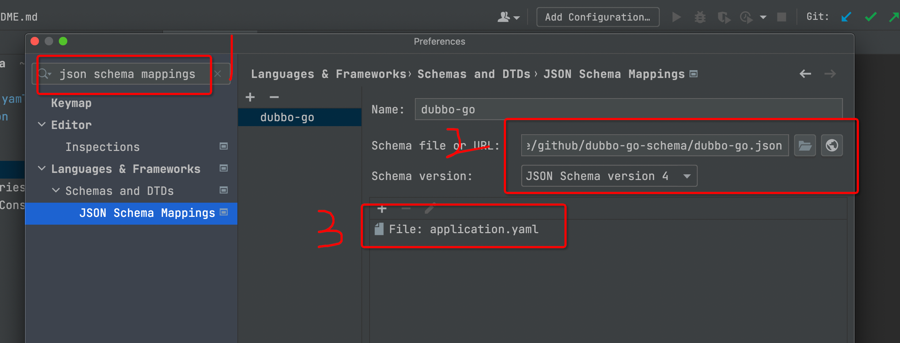
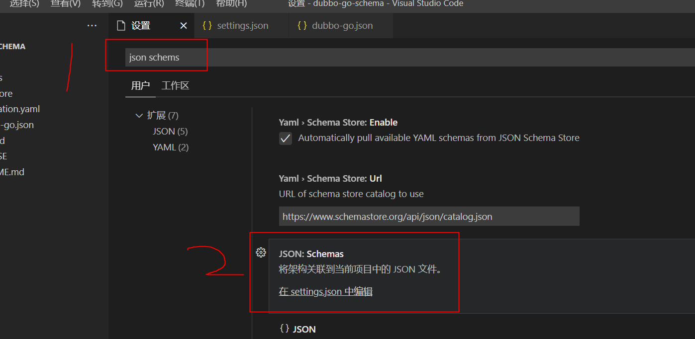

# dubbo-go-schema
这个项目为了便捷的编写dubbo-go配置文件

## 怎么使用

### golang

> [dubbo-go.json](./dubbo-go.json)



### vs code



在 settings.json 文件添加
```json
{
  "yaml.schemas": {
    "https://dubbogo.github.io/dubbo-go-schema/dubbo-go.json": [
      "dubbo.yaml",
      "application.yaml",
      "dubbogo.yaml"
    ]
  }
}

```
## 效果图


