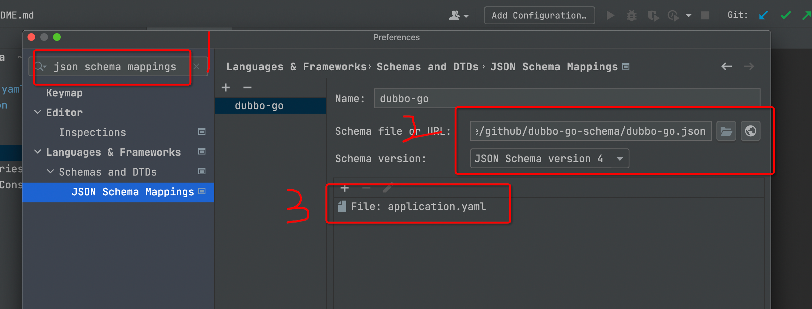
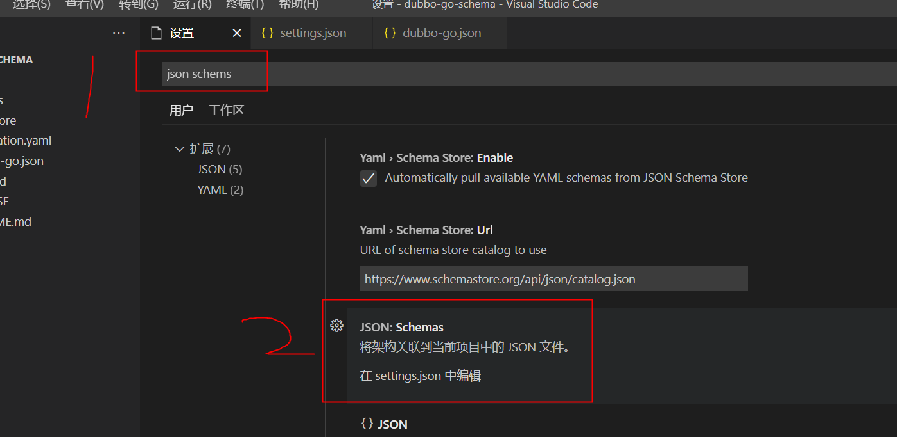
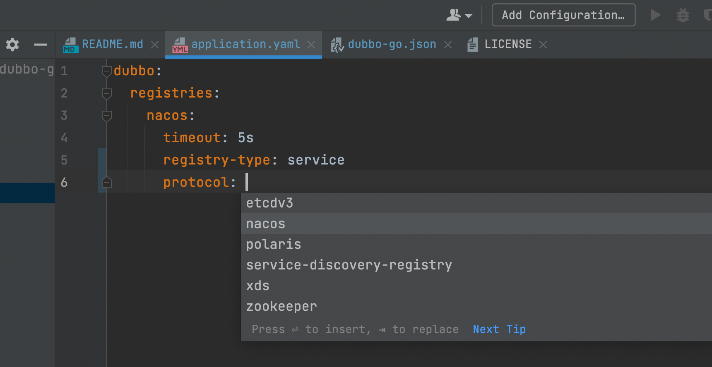

# dubbo-go-schema

[English](README.md) | 中文

`dubbo-go-schema` 提供 JSON Schema，用于让编辑器和 YAML Language Server 对 Apache dubbo-go 配置文件进行补全、提示和校验，例如 `dubbogo.yaml`、`dubbo.yaml`、`application.yaml`。

Schema 会根据当前 `global/*_config.go` 的 YAML tag 和常见 dubbo-go 配置示例维护。

## 文件

- `dubbo-go.json`：dubbo-go YAML 配置的 JSON Schema。
- `application.yaml`：覆盖 provider、consumer、Triple、metrics、tracing、logger、shutdown 等常用配置的示例。
- `images/`：README 使用的截图。

## VS Code

安装 YAML Language Server 扩展，例如 Red Hat YAML 扩展，然后在 `settings.json` 中添加：

```json
{
  "yaml.schemas": {
    "https://raw.githubusercontent.com/apache/dubbo-go/develop/tools/dubbo-go-schema/dubbo-go.json": [
      "dubbo.yaml",
      "dubbogo.yaml",
      "application.yaml"
    ]
  }
}
```

本地调试 schema 改动时，可以指向当前 checkout 中的文件：

```json
{
  "yaml.schemas": {
    "./tools/dubbo-go-schema/dubbo-go.json": [
      "dubbo.yaml",
      "dubbogo.yaml",
      "application.yaml"
    ]
  }
}
```

## IntelliJ IDEA / GoLand

打开 `Settings | Languages & Frameworks | Schemas and DTDs | JSON Schema Mappings`，添加 `dubbo-go.json`，并映射到你使用的配置文件名。

## 本地验证

至少先确认 schema 是合法 JSON：

```bash
node -e "JSON.parse(require('fs').readFileSync('tools/dubbo-go-schema/dubbo-go.json', 'utf8'))"
```

如需验证编辑器效果，可在 VS Code 或 GoLand 中启用本地 schema 映射后打开 `application.yaml`。该 schema 面向 dubbo-go v3 风格配置，要求配置位于 `dubbo:` 根节点下。

## 截图






